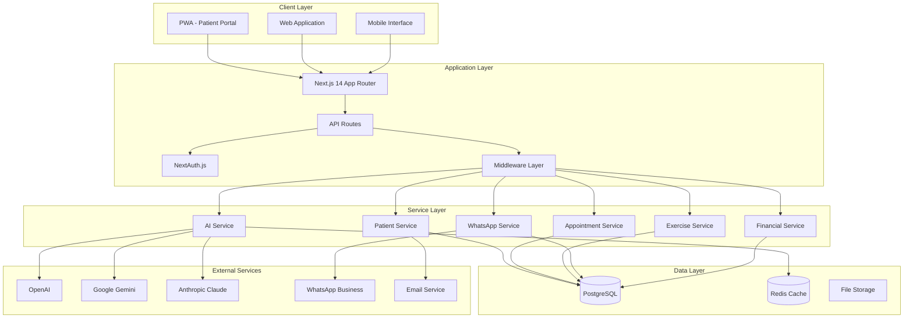
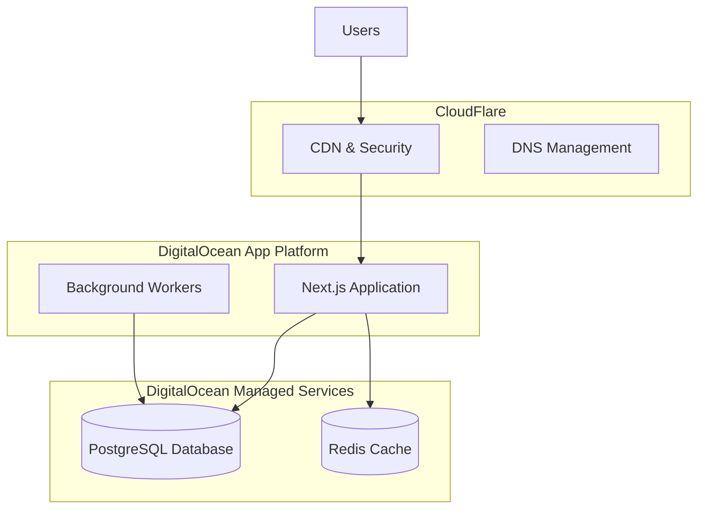

# Design Document - FisioFlow Complete System

## Overview

FisioFlow is a comprehensive physiotherapy clinic management system built on a modern, scalable architecture using Next.js 14, TypeScript, and PostgreSQL. The system is designed to provide superior performance, functionality, and cost-effectiveness compared to existing solutions like Vedius.

### Key Design Principles

- **Performance First**: Sub-2-second load times, optimized database queries
- **Scalability**: Horizontal scaling capabilities with DigitalOcean infrastructure
- **Security**: LGPD compliance, role-based access control, data encryption
- **User Experience**: Modern, accessible, mobile-first design
- **AI Integration**: Economic AI service with multiple provider support
- **Cost Efficiency**: Optimized infrastructure costs while maintaining performance

## Architecture

### High-Level Architecture



### Technology Stack

- **Frontend**: Next.js 14 with App Router, TypeScript, Tailwind CSS, Shadcn/UI
- **Backend**: Next.js API Routes, Prisma ORM, PostgreSQL
- **Authentication**: NextAuth.js v5 with session-based auth
- **Caching**: Redis for session and data caching
- **AI Integration**: Economic AI service with OpenAI, Gemini, Claude
- **Infrastructure**: DigitalOcean App Platform, Managed PostgreSQL
- **Monitoring**: Built-in health checks and logging system

## Components and Interfaces

### Core Components

#### 1. Patient Management System

**Interface**: `PatientService`
```typescript
interface PatientService {
  createPatient(data: CreatePatientData): Promise<Patient>
  updatePatient(id: string, data: UpdatePatientData): Promise<Patient>
  getPatient(id: string): Promise<Patient | null>
  searchPatients(query: SearchQuery): Promise<Patient[]>
  getPatientHistory(id: string): Promise<MedicalHistory[]>
  deletePatient(id: string): Promise<void>
}
```

**Key Features**:
- Comprehensive patient records with medical history
- Real-time search with filtering
- Audit trails and version history
- LGPD compliance with data encryption
- Allergy and medical alert management

#### 2. Appointment Scheduling System

**Interface**: `AppointmentService`
```typescript
interface AppointmentService {
  createAppointment(data: CreateAppointmentData): Promise<Appointment>
  updateAppointment(id: string, data: UpdateAppointmentData): Promise<Appointment>
  getAppointments(filters: AppointmentFilters): Promise<Appointment[]>
  checkAvailability(therapistId: string, timeSlot: TimeSlot): Promise<boolean>
  createRecurringAppointments(data: RecurringAppointmentData): Promise<Appointment[]>
  cancelAppointment(id: string, reason: string): Promise<void>
}
```

**Key Features**:
- Drag-and-drop calendar interface
- Real-time availability checking
- Conflict detection and resolution
- Recurring appointment support
- AI-powered no-show prediction

#### 3. Exercise Library System

**Interface**: `ExerciseService`
```typescript
interface ExerciseService {
  searchExercises(query: ExerciseSearchQuery): Promise<Exercise[]>
  getExercise(id: string): Promise<Exercise | null>
  createTreatmentProtocol(data: ProtocolData): Promise<TreatmentProtocol>
  prescribeExercises(patientId: string, exercises: ExercisePrescription[]): Promise<void>
  getPatientExercises(patientId: string): Promise<PatientExercise[]>
  trackProgress(patientId: string, exerciseId: string, progress: ProgressData): Promise<void>
}
```

**Key Features**:
- 25,000+ exercise library with video content
- AI-powered categorization and search
- Custom treatment protocol creation
- Patient-friendly mobile interface
- Progress tracking and analytics

#### 4. AI Analytics System

**Interface**: `AIService`
```typescript
interface AIService {
  processQuery(query: AIQuery): Promise<AIResponse>
  predictNoShow(appointmentId: string): Promise<NoShowPrediction>
  generateTreatmentSuggestions(patientId: string): Promise<TreatmentSuggestion[]>
  analyzePatientProgress(patientId: string): Promise<ProgressAnalysis>
  getInsights(filters: InsightFilters): Promise<Insight[]>
}
```

**Key Features**:
- Economic AI service with multiple providers
- No-show prediction with 85%+ accuracy
- Treatment outcome analytics
- Automated insights and recommendations
- Cost-optimized AI usage

#### 5. Financial Management System

**Interface**: `FinancialService`
```typescript
interface FinancialService {
  createTransaction(data: TransactionData): Promise<FinancialTransaction>
  processPayment(data: PaymentData): Promise<Payment>
  generateInvoice(data: InvoiceData): Promise<Invoice>
  getFinancialReports(filters: ReportFilters): Promise<FinancialReport>
  trackRevenue(period: TimePeriod): Promise<RevenueData>
  manageOverdueAccounts(): Promise<OverdueAccount[]>
}
```

**Key Features**:
- Multi-payment method support
- Automated invoice generation
- Real-time financial dashboards
- Overdue account management
- Tax calculation and compliance

#### 6. Communication Center

**Interface**: `CommunicationService`
```typescript
interface CommunicationService {
  sendWhatsAppMessage(patientId: string, message: string): Promise<void>
  sendAppointmentReminder(appointmentId: string): Promise<void>
  sendBulkMessages(recipients: string[], message: string): Promise<void>
  getMessageHistory(patientId: string): Promise<Message[]>
  configureAutomations(settings: AutomationSettings): Promise<void>
}
```

**Key Features**:
- Multi-channel communication (WhatsApp, SMS, Email)
- Automated appointment reminders
- Bulk messaging capabilities
- Message history and logging
- Patient preference management

## Data Models

### Core Entities

#### Patient Model
```typescript
interface Patient {
  id: string
  name: string
  cpf: string
  email?: string
  phone?: string
  birthDate?: Date
  address?: Address
  emergencyContact?: EmergencyContact
  status: PatientStatus
  allergies?: string
  medicalAlerts?: string
  consentGiven: boolean
  whatsappConsent: WhatsAppConsent
  createdAt: Date
  updatedAt: Date
}
```

#### Appointment Model
```typescript
interface Appointment {
  id: string
  patientId: string
  therapistId: string
  startTime: Date
  endTime: Date
  type: AppointmentType
  status: AppointmentStatus
  value?: number
  paymentStatus: PaymentStatus
  observations?: string
  seriesId?: string
  sessionNumber?: number
  totalSessions?: number
  createdAt: Date
}
```

#### Exercise Model
```typescript
interface Exercise {
  id: string
  name: string
  description?: string
  category?: string
  subcategory?: string
  bodyParts: string[]
  difficulty?: string
  equipment: string[]
  instructions: string[]
  videoUrl?: string
  thumbnailUrl?: string
  duration?: number
  indications: string[]
  contraindications: string[]
  status: ExerciseStatus
  aiCategorized: boolean
  aiConfidence?: number
  createdAt: Date
  updatedAt: Date
}
```

### Database Schema Highlights

The system uses a comprehensive PostgreSQL schema with:
- **33 main tables** covering all business domains
- **Full-text search** capabilities for exercises and patients
- **Audit trails** for all critical operations
- **Optimized indexes** for performance
- **Foreign key constraints** for data integrity
- **Enum types** for consistent data validation

## Error Handling

### Error Classification

1. **Client Errors (4xx)**
   - Validation errors
   - Authentication failures
   - Authorization denials
   - Resource not found

2. **Server Errors (5xx)**
   - Database connection failures
   - External service timeouts
   - Unexpected application errors
   - Infrastructure issues

### Error Handling Strategy

```typescript
interface ErrorResponse {
  error: {
    code: string
    message: string
    details?: any
    timestamp: string
    requestId: string
  }
}
```

**Implementation**:
- Centralized error handling middleware
- Structured error logging with correlation IDs
- User-friendly error messages
- Automatic retry mechanisms for transient failures
- Graceful degradation for non-critical features

### Monitoring and Alerting

- Real-time error tracking and alerting
- Performance monitoring with custom metrics
- Database query performance analysis
- AI service usage and cost tracking
- User experience monitoring

## Testing Strategy

### Testing Pyramid

1. **Unit Tests (70%)**
   - Service layer functions
   - Utility functions
   - Data validation
   - Business logic

2. **Integration Tests (20%)**
   - API endpoints
   - Database operations
   - External service integrations
   - Authentication flows

3. **End-to-End Tests (10%)**
   - Critical user journeys
   - Cross-browser compatibility
   - Mobile responsiveness
   - Performance benchmarks

### Testing Tools

- **Jest**: Unit and integration testing
- **Playwright**: End-to-end testing
- **Testing Library**: Component testing
- **Supertest**: API testing
- **Prisma Test Environment**: Database testing

### Quality Gates

- **Code Coverage**: Minimum 80% for critical paths
- **Performance**: All pages load under 2 seconds
- **Accessibility**: WCAG 2.1 AA compliance
- **Security**: Regular vulnerability scans
- **Type Safety**: 100% TypeScript coverage

## Security Architecture

### Authentication & Authorization

- **NextAuth.js v5** with session-based authentication
- **Role-based access control** (Admin, Fisioterapeuta, Paciente, EducadorFisico)
- **JWT tokens** with secure session management
- **Password hashing** with bcrypt
- **Session timeout** and automatic logout

### Data Protection

- **Encryption at rest** for sensitive data
- **TLS 1.3** for data in transit
- **Input validation** with Zod schemas
- **SQL injection protection** via Prisma ORM
- **XSS protection** with Content Security Policy
- **CSRF protection** with token validation

### LGPD Compliance

- **Data minimization** principles
- **Consent management** system
- **Right to erasure** implementation
- **Data portability** features
- **Audit logging** for all data access
- **Privacy by design** architecture

## Performance Optimization

### Frontend Optimization

- **Code splitting** with Next.js dynamic imports
- **Image optimization** with Next.js Image component
- **Bundle size optimization** with tree shaking
- **Caching strategies** with SWR and React Query
- **Progressive Web App** features for mobile

### Backend Optimization

- **Database query optimization** with proper indexing
- **Connection pooling** for database efficiency
- **Redis caching** for frequently accessed data
- **API response compression** with gzip
- **Rate limiting** to prevent abuse

### Infrastructure Optimization

- **CDN integration** with CloudFlare
- **Auto-scaling** with DigitalOcean App Platform
- **Database read replicas** for query distribution
- **Monitoring and alerting** for proactive optimization
- **Cost optimization** with resource right-sizing

## Deployment Architecture

### DigitalOcean Infrastructure



### Deployment Pipeline

1. **Development**: Local development with Docker
2. **Staging**: Automated deployment on feature branches
3. **Production**: Blue-green deployment with health checks
4. **Monitoring**: Real-time monitoring and alerting
5. **Rollback**: Automated rollback on failure detection

### Environment Configuration

- **Development**: Local PostgreSQL and Redis
- **Staging**: DigitalOcean managed services (smaller instances)
- **Production**: DigitalOcean managed services (optimized instances)
- **Environment variables**: Secure configuration management
- **Secrets management**: Encrypted environment variables

This design provides a robust, scalable, and maintainable foundation for the FisioFlow Complete System, ensuring superior performance and functionality while maintaining cost-effectiveness.