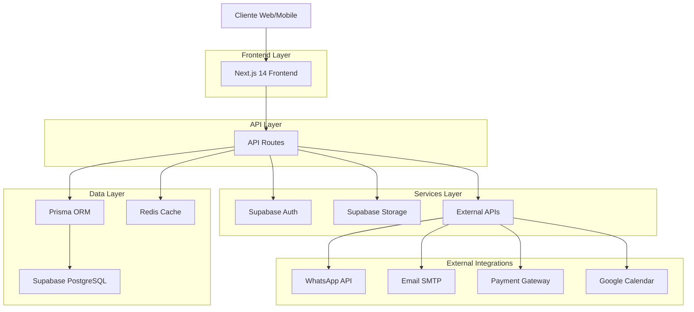
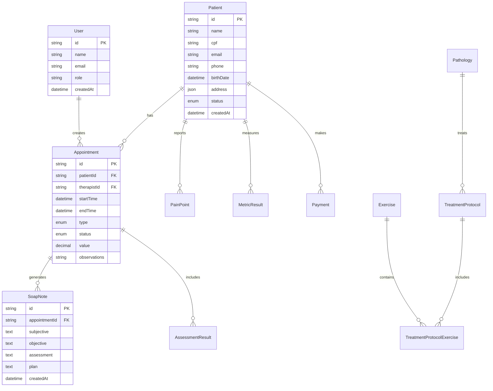

# 🏗️ Arquitetura Técnica Detalhada - FisioFlow

## 1. Arquitetura Geral do Sistema



## 2. Stack Tecnológico

### Frontend
- **Next.js 14** - Framework React com App Router
- **TypeScript** - Tipagem estática
- **Tailwind CSS** - Estilização utilitária
- **Framer Motion** - Animações
- **React Hook Form** - Gerenciamento de formulários
- **Zod** - Validação de schemas
- **SWR** - Cache e sincronização de dados
- **Lucide React** - Ícones

### Backend
- **Next.js API Routes** - Endpoints da API
- **Prisma ORM** - Mapeamento objeto-relacional
- **NextAuth.js** - Autenticação
- **Supabase** - Backend-as-a-Service

### Database
- **PostgreSQL** (via Supabase) - Banco principal
- **Redis** - Cache e sessões

### Infraestrutura
- **Digital Ocean App Platform** - Hospedagem
- **Supabase** - Banco e autenticação
- **Vercel** (alternativa) - Deploy frontend

## 3. Estrutura de Rotas da Aplicação

### 3.1 Rotas Frontend

| Rota | Propósito | Status |
|------|-----------|--------|
| `/` | Página inicial/Dashboard | ✅ Implementado |
| `/login` | Autenticação | ✅ Implementado |
| `/agenda` | Calendário de agendamentos | ⚠️ Parcial |
| `/pacientes` | Gestão de pacientes | ❌ Faltando |
| `/pacientes/[id]` | Perfil do paciente | ❌ Faltando |
| `/prontuario/[id]` | Prontuário eletrônico | ❌ Faltando |
| `/financeiro` | Controle financeiro | ⚠️ Parcial |
| `/exercicios` | Biblioteca de exercícios | ❌ Faltando |
| `/protocolos` | Protocolos de tratamento | ❌ Faltando |
| `/relatorios` | Relatórios e analytics | ⚠️ Parcial |
| `/configuracoes` | Configurações do sistema | ⚠️ Parcial |
| `/ai` | Assistente de IA | ✅ Implementado |
| `/events` | Eventos e workshops | ✅ Implementado |

### 3.2 Rotas da API

#### Autenticação
```
POST /api/auth/[...nextauth] - NextAuth endpoints
GET  /api/auth/session - Sessão atual
```

#### Agendamentos
```
GET    /api/appointments - Listar agendamentos
POST   /api/appointments - Criar agendamento
GET    /api/appointments/[id] - Buscar agendamento
PUT    /api/appointments/[id] - Atualizar agendamento
DELETE /api/appointments/[id] - Excluir agendamento
GET    /api/appointments/availability - Horários disponíveis
POST   /api/appointments/conflicts - Verificar conflitos
```

#### Pacientes
```
GET    /api/patients - Listar pacientes
POST   /api/patients - Criar paciente
GET    /api/patients/[id] - Buscar paciente
PUT    /api/patients/[id] - Atualizar paciente
DELETE /api/patients/[id] - Excluir paciente
GET    /api/patients/search - Buscar pacientes
```

#### Prontuário Médico
```
GET    /api/medical-records/[patientId] - Prontuário do paciente
POST   /api/medical-records/soap-notes - Criar evolução SOAP
GET    /api/medical-records/assessments - Listar avaliações
POST   /api/medical-records/assessments - Criar avaliação
```

#### Financeiro
```
GET    /api/financial/transactions - Transações financeiras
POST   /api/financial/transactions - Nova transação
GET    /api/financial/receipts - Recibos
POST   /api/financial/receipts - Gerar recibo
GET    /api/financial/reports - Relatórios financeiros
```

#### Exercícios
```
GET    /api/exercises - Biblioteca de exercícios
POST   /api/exercises - Criar exercício
GET    /api/exercises/[id] - Detalhes do exercício
POST   /api/exercises/prescriptions - Prescrever exercícios
```

#### Notificações
```
POST   /api/notifications/whatsapp - Enviar WhatsApp
POST   /api/notifications/email - Enviar email
POST   /api/notifications/sms - Enviar SMS
```

## 4. Modelos de Dados Principais

### 4.1 Diagrama de Relacionamentos



### 4.2 Tipos TypeScript Principais

```typescript
// Types para Agendamentos
interface Appointment {
  id: string
  patientId: string
  therapistId: string
  startTime: Date
  endTime: Date
  type: AppointmentType
  status: AppointmentStatus
  value?: number
  observations?: string
  seriesId?: string
  sessionNumber?: number
  totalSessions?: number
}

type AppointmentType = 
  | 'fisioterapia'
  | 'avaliacao'
  | 'retorno'
  | 'procedimento'
  | 'teleconsulta'

type AppointmentStatus = 
  | 'agendado'
  | 'confirmado'
  | 'em_andamento'
  | 'concluido'
  | 'cancelado'
  | 'faltou'

// Types para Pacientes
interface Patient {
  id: string
  name: string
  cpf: string
  email?: string
  phone?: string
  birthDate?: Date
  address?: Address
  emergencyContact?: EmergencyContact
  status: PatientStatus
  allergies?: string
  medicalAlerts?: string
  consentGiven: boolean
  whatsappConsent: WhatsAppConsent
}

interface Address {
  street: string
  number: string
  complement?: string
  neighborhood: string
  city: string
  state: string
  zipCode: string
}

// Types para Prontuário
interface SoapNote {
  id: string
  appointmentId: string
  subjective?: string
  objective?: string
  assessment?: string
  plan?: string
  createdAt: Date
}

interface AssessmentResult {
  id: string
  assessmentId: string
  patientId: string
  appointmentId?: string
  responses: Record<string, any>
  score?: number
  interpretation?: string
  notes?: string
  evaluatedAt: Date
}

// Types para Exercícios
interface Exercise {
  id: string
  name: string
  description?: string
  category: string
  subcategory?: string
  bodyParts: string[]
  difficulty: number
  equipment: string[]
  instructions: string[]
  videoUrl?: string
  thumbnailUrl?: string
  duration?: number
}

interface ExercisePrescription {
  exerciseId: string
  sets?: number
  repetitions?: string
  restTime?: string
  notes?: string
  order: number
}
```

## 5. Componentes de Interface Principais

### 5.1 Estrutura de Componentes

```
components/
├── layout/
│   ├── MainLayout.tsx - Layout principal
│   ├── Sidebar.tsx - Menu lateral
│   ├── PageHeader.tsx - Cabeçalho das páginas
│   └── AuthLayout.tsx - Layout de autenticação
├── agenda/
│   ├── CalendarView.tsx - Visualização do calendário
│   ├── WeekView.tsx - Visualização semanal
│   ├── DayView.tsx - Visualização diária
│   ├── MonthView.tsx - Visualização mensal
│   ├── TimeSlotGrid.tsx - Grade de horários
│   ├── AppointmentCard.tsx - Card de agendamento
│   ├── AppointmentForm.tsx - Formulário de agendamento
│   ├── DragDropProvider.tsx - Provider para drag & drop
│   └── ConflictResolver.tsx - Resolução de conflitos
├── patients/
│   ├── PatientList.tsx - Lista de pacientes
│   ├── PatientCard.tsx - Card do paciente
│   ├── PatientForm.tsx - Formulário do paciente
│   ├── PatientProfile.tsx - Perfil completo
│   ├── PatientSearch.tsx - Busca de pacientes
│   └── PatientHistory.tsx - Histórico do paciente
├── medical-record/
│   ├── MedicalRecord.tsx - Prontuário principal
│   ├── SoapNoteForm.tsx - Formulário SOAP
│   ├── AssessmentForm.tsx - Formulário de avaliação
│   ├── PainMap.tsx - Mapa de dor
│   ├── ProgressChart.tsx - Gráfico de evolução
│   └── AttachmentUpload.tsx - Upload de anexos
├── exercises/
│   ├── ExerciseLibrary.tsx - Biblioteca de exercícios
│   ├── ExerciseCard.tsx - Card do exercício
│   ├── ExerciseDetail.tsx - Detalhes do exercício
│   ├── PrescriptionBuilder.tsx - Construtor de prescrições
│   └── VideoPlayer.tsx - Player de vídeo
├── financial/
│   ├── FinancialDashboard.tsx - Dashboard financeiro
│   ├── TransactionList.tsx - Lista de transações
│   ├── PaymentForm.tsx - Formulário de pagamento
│   ├── ReceiptGenerator.tsx - Gerador de recibos
│   └── DelinquencyControl.tsx - Controle de inadimplência
└── ui/
    ├── Button.tsx - Botão customizado
    ├── Input.tsx - Input customizado
    ├── Modal.tsx - Modal reutilizável
    ├── Calendar.tsx - Componente de calendário
    ├── DatePicker.tsx - Seletor de data
    ├── TimePicker.tsx - Seletor de hora
    └── Toast.tsx - Notificações toast
```

### 5.2 Hooks Customizados

```typescript
// useAppointments - Gerenciamento de agendamentos
const useAppointments = (filters?: AppointmentFilters) => {
  const { data, error, mutate } = useSWR(
    `/api/appointments?${new URLSearchParams(filters)}`,
    fetcher
  )
  
  const createAppointment = async (appointment: CreateAppointmentData) => {
    // Lógica de criação
  }
  
  const updateAppointment = async (id: string, data: UpdateAppointmentData) => {
    // Lógica de atualização
  }
  
  return {
    appointments: data,
    isLoading: !error && !data,
    error,
    createAppointment,
    updateAppointment,
    refresh: mutate
  }
}

// usePatients - Gerenciamento de pacientes
const usePatients = (searchTerm?: string) => {
  // Similar ao useAppointments
}

// useCalendar - Estado do calendário
const useCalendar = () => {
  const [currentDate, setCurrentDate] = useState(new Date())
  const [viewMode, setViewMode] = useState<'day' | 'week' | 'month'>('week')
  const [selectedTimeSlot, setSelectedTimeSlot] = useState<TimeSlot | null>(null)
  
  return {
    currentDate,
    setCurrentDate,
    viewMode,
    setViewMode,
    selectedTimeSlot,
    setSelectedTimeSlot
  }
}

// useDragDrop - Funcionalidade de arrastar e soltar
const useDragDrop = () => {
  const [draggedItem, setDraggedItem] = useState<DraggedAppointment | null>(null)
  
  const handleDragStart = (appointment: Appointment) => {
    setDraggedItem({ appointment, originalSlot: getTimeSlot(appointment) })
  }
  
  const handleDrop = async (targetSlot: TimeSlot) => {
    if (!draggedItem) return
    
    // Validar conflitos
    const conflicts = await checkConflicts(draggedItem.appointment, targetSlot)
    if (conflicts.length > 0) {
      // Mostrar modal de resolução de conflitos
      return
    }
    
    // Atualizar agendamento
    await updateAppointment(draggedItem.appointment.id, {
      startTime: targetSlot.startTime,
      endTime: targetSlot.endTime
    })
    
    setDraggedItem(null)
  }
  
  return {
    draggedItem,
    handleDragStart,
    handleDrop,
    isDragging: !!draggedItem
  }
}
```

## 6. Integrações Externas

### 6.1 WhatsApp Business API

```typescript
// services/whatsappService.ts
class WhatsAppService {
  private apiUrl = process.env.WHATSAPP_API_URL
  private token = process.env.WHATSAPP_TOKEN
  
  async sendMessage(to: string, message: string) {
    const response = await fetch(`${this.apiUrl}/messages`, {
      method: 'POST',
      headers: {
        'Authorization': `Bearer ${this.token}`,
        'Content-Type': 'application/json'
      },
      body: JSON.stringify({
        messaging_product: 'whatsapp',
        to,
        type: 'text',
        text: { body: message }
      })
    })
    
    return response.json()
  }
  
  async sendAppointmentConfirmation(appointment: Appointment) {
    const patient = await getPatient(appointment.patientId)
    const message = `Olá ${patient.name}! Sua consulta foi agendada para ${format(appointment.startTime, 'dd/MM/yyyy às HH:mm')}. Confirme sua presença respondendo SIM.`
    
    return this.sendMessage(patient.phone, message)
  }
  
  async sendReminder(appointment: Appointment, hoursBefor: number) {
    const patient = await getPatient(appointment.patientId)
    const message = `Lembrete: Você tem consulta hoje às ${format(appointment.startTime, 'HH:mm')}. Nos vemos em breve!`
    
    return this.sendMessage(patient.phone, message)
  }
}
```

### 6.2 Sistema de Notificações

```typescript
// services/notificationService.ts
class NotificationService {
  private whatsapp = new WhatsAppService()
  private email = new EmailService()
  private sms = new SMSService()
  
  async sendAppointmentNotification(
    appointment: Appointment,
    type: 'confirmation' | 'reminder' | 'cancellation'
  ) {
    const patient = await getPatient(appointment.patientId)
    
    // Prioridade: WhatsApp > SMS > Email
    if (patient.whatsappConsent === 'opt_in' && patient.phone) {
      try {
        await this.whatsapp.sendAppointmentConfirmation(appointment)
        return { success: true, method: 'whatsapp' }
      } catch (error) {
        console.error('WhatsApp failed, trying SMS:', error)
      }
    }
    
    if (patient.phone) {
      try {
        await this.sms.sendAppointmentSMS(appointment, type)
        return { success: true, method: 'sms' }
      } catch (error) {
        console.error('SMS failed, trying email:', error)
      }
    }
    
    if (patient.email) {
      await this.email.sendAppointmentEmail(appointment, type)
      return { success: true, method: 'email' }
    }
    
    return { success: false, error: 'No contact method available' }
  }
}
```

### 6.3 Sistema de Pagamentos

```typescript
// services/paymentService.ts
class PaymentService {
  private stripe = new Stripe(process.env.STRIPE_SECRET_KEY!)
  
  async createPaymentIntent(amount: number, patientId: string) {
    const paymentIntent = await this.stripe.paymentIntents.create({
      amount: amount * 100, // Stripe usa centavos
      currency: 'brl',
      metadata: {
        patientId
      }
    })
    
    return paymentIntent
  }
  
  async processPayment(paymentIntentId: string) {
    const paymentIntent = await this.stripe.paymentIntents.retrieve(paymentIntentId)
    
    if (paymentIntent.status === 'succeeded') {
      // Atualizar status do pagamento no banco
      await updatePaymentStatus(paymentIntent.metadata.patientId, 'paid')
      
      // Enviar recibo
      await this.generateReceipt(paymentIntent)
    }
    
    return paymentIntent
  }
}
```

## 7. Otimizações de Performance

### 7.1 Cache Strategy

```typescript
// lib/cache.ts
class CacheManager {
  private redis = new Redis(process.env.REDIS_URL!)
  
  // Cache de agendamentos por semana
  async getWeekAppointments(weekStart: Date, therapistId?: string) {
    const key = `appointments:${format(weekStart, 'yyyy-MM-dd')}:${therapistId || 'all'}`
    const cached = await this.redis.get(key)
    
    if (cached) {
      return JSON.parse(cached)
    }
    
    const appointments = await fetchAppointmentsFromDB(weekStart, therapistId)
    await this.redis.setex(key, 300, JSON.stringify(appointments)) // 5 min cache
    
    return appointments
  }
  
  // Invalidar cache quando agendamento muda
  async invalidateAppointmentCache(appointmentDate: Date) {
    const weekStart = startOfWeek(appointmentDate, { weekStartsOn: 1 })
    const pattern = `appointments:${format(weekStart, 'yyyy-MM-dd')}:*`
    
    const keys = await this.redis.keys(pattern)
    if (keys.length > 0) {
      await this.redis.del(...keys)
    }
  }
}
```

### 7.2 Lazy Loading e Code Splitting

```typescript
// Lazy loading de componentes pesados
const CalendarView = lazy(() => import('./CalendarView'))
const ExerciseLibrary = lazy(() => import('./ExerciseLibrary'))
const FinancialReports = lazy(() => import('./FinancialReports'))

// Uso com Suspense
<Suspense fallback={<LoadingSpinner />}>
  <CalendarView />
</Suspense>
```

### 7.3 Otimização de Queries

```typescript
// Queries otimizadas com Prisma
const getAppointmentsWithDetails = async (startDate: Date, endDate: Date) => {
  return prisma.appointment.findMany({
    where: {
      startTime: {
        gte: startDate,
        lt: endDate
      }
    },
    include: {
      patient: {
        select: {
          id: true,
          name: true,
          phone: true,
          medicalAlerts: true
        }
      },
      therapist: {
        select: {
          id: true,
          name: true,
          avatarUrl: true
        }
      }
    },
    orderBy: {
      startTime: 'asc'
    }
  })
}
```

## 8. Segurança e Validações

### 8.1 Middleware de Autenticação

```typescript
// middleware/auth.ts
export async function authMiddleware(req: NextRequest) {
  const token = await getToken({ req })
  
  if (!token) {
    return NextResponse.redirect(new URL('/login', req.url))
  }
  
  // Verificar permissões por rota
  const pathname = req.nextUrl.pathname
  
  if (pathname.startsWith('/admin') && token.role !== 'admin') {
    return NextResponse.redirect(new URL('/unauthorized', req.url))
  }
  
  return NextResponse.next()
}
```

### 8.2 Validação de Dados

```typescript
// schemas/appointment.ts
import { z } from 'zod'

export const appointmentSchema = z.object({
  patientId: z.string().cuid(),
  therapistId: z.string().cuid(),
  startTime: z.date(),
  endTime: z.date(),
  type: z.enum(['fisioterapia', 'avaliacao', 'retorno', 'procedimento']),
  value: z.number().positive().optional(),
  observations: z.string().max(500).optional()
}).refine(data => data.endTime > data.startTime, {
  message: "End time must be after start time",
  path: ["endTime"]
})

// Uso na API
export async function POST(request: Request) {
  try {
    const body = await request.json()
    const validatedData = appointmentSchema.parse(body)
    
    // Verificar conflitos
    const conflicts = await checkAppointmentConflicts(validatedData)
    if (conflicts.length > 0) {
      return NextResponse.json(
        { error: 'Appointment conflicts detected', conflicts },
        { status: 409 }
      )
    }
    
    const appointment = await createAppointment(validatedData)
    return NextResponse.json(appointment)
    
  } catch (error) {
    if (error instanceof z.ZodError) {
      return NextResponse.json(
        { error: 'Validation failed', details: error.errors },
        { status: 400 }
      )
    }
    
    return NextResponse.json(
      { error: 'Internal server error' },
      { status: 500 }
    )
  }
}
```

## 9. Monitoramento e Logs

### 9.1 Sistema de Logs

```typescript
// lib/logger.ts
class Logger {
  private context: string
  
  constructor(context: string) {
    this.context = context
  }
  
  info(message: string, data?: any) {
    console.log(`[${this.context}] INFO: ${message}`, data)
    
    // Em produção, enviar para serviço de logs
    if (process.env.NODE_ENV === 'production') {
      this.sendToLogService('info', message, data)
    }
  }
  
  error(message: string, error?: Error, data?: any) {
    console.error(`[${this.context}] ERROR: ${message}`, error, data)
    
    // Enviar para Sentry ou similar
    if (process.env.NODE_ENV === 'production') {
      this.sendToErrorTracking(message, error, data)
    }
  }
  
  private async sendToLogService(level: string, message: string, data?: any) {
    // Implementar integração com serviço de logs
  }
  
  private async sendToErrorTracking(message: string, error?: Error, data?: any) {
    // Implementar integração com Sentry
  }
}
```

### 9.2 Health Checks

```typescript
// api/health/route.ts
export async function GET() {
  const checks = {
    database: false,
    redis: false,
    external_apis: false
  }
  
  try {
    // Verificar banco de dados
    await prisma.$queryRaw`SELECT 1`
    checks.database = true
  } catch (error) {
    console.error('Database health check failed:', error)
  }
  
  try {
    // Verificar Redis
    await redis.ping()
    checks.redis = true
  } catch (error) {
    console.error('Redis health check failed:', error)
  }
  
  try {
    // Verificar APIs externas
    const whatsappStatus = await checkWhatsAppAPI()
    checks.external_apis = whatsappStatus
  } catch (error) {
    console.error('External API health check failed:', error)
  }
  
  const isHealthy = Object.values(checks).every(Boolean)
  
  return NextResponse.json(
    {
      status: isHealthy ? 'healthy' : 'unhealthy',
      checks,
      timestamp: new Date().toISOString()
    },
    { status: isHealthy ? 200 : 503 }
  )
}
```

## 10. Deploy e CI/CD

### 10.1 GitHub Actions Workflow

```yaml
# .github/workflows/deploy.yml
name: Deploy FisioFlow

on:
  push:
    branches: [main]
  pull_request:
    branches: [main]

jobs:
  test:
    runs-on: ubuntu-latest
    steps:
      - uses: actions/checkout@v3
      - uses: actions/setup-node@v3
        with:
          node-version: '18'
          cache: 'npm'
      
      - run: npm ci
      - run: npm run lint
      - run: npm run type-check
      - run: npm run test
      
  build:
    needs: test
    runs-on: ubuntu-latest
    steps:
      - uses: actions/checkout@v3
      - uses: actions/setup-node@v3
        with:
          node-version: '18'
          cache: 'npm'
      
      - run: npm ci
      - run: npm run build
      
  deploy:
    needs: [test, build]
    runs-on: ubuntu-latest
    if: github.ref == 'refs/heads/main'
    steps:
      - uses: actions/checkout@v3
      
      - name: Deploy to Digital Ocean
        uses: digitalocean/app_action@v1
        with:
          app_name: fisioflow
          token: ${{ secrets.DIGITALOCEAN_ACCESS_TOKEN }}
```

### 10.2 Configuração de Ambiente

```bash
# .env.example
# Database
DATABASE_URL="postgresql://..."
DIRECT_URL="postgresql://..."

# Auth
NEXTAUTH_SECRET="..."
NEXTAUTH_URL="http://localhost:3000"

# Supabase
NEXT_PUBLIC_SUPABASE_URL="..."
NEXT_PUBLIC_SUPABASE_ANON_KEY="..."
SUPABASE_SERVICE_ROLE_KEY="..."

# Redis
REDIS_URL="redis://..."

# WhatsApp
WHATSAPP_API_URL="..."
WHATSAPP_TOKEN="..."

# Email
SMTP_HOST="..."
SMTP_PORT="587"
SMTP_USER="..."
SMTP_PASS="..."

# Payments
STRIPE_SECRET_KEY="..."
STRIPE_PUBLISHABLE_KEY="..."

# Monitoring
SENTRY_DSN="..."
```

---

**Status**: Arquitetura técnica completa ✅  
**Última atualização**: Janeiro 2024  
**Responsável**: Equipe de Desenvolvimento FisioFlow