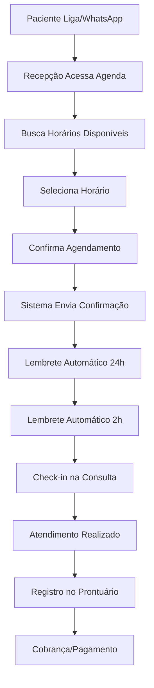
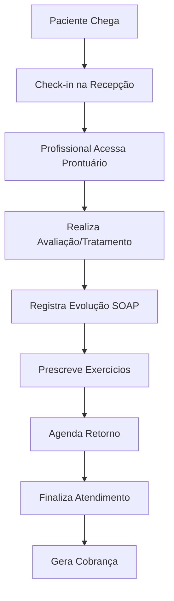
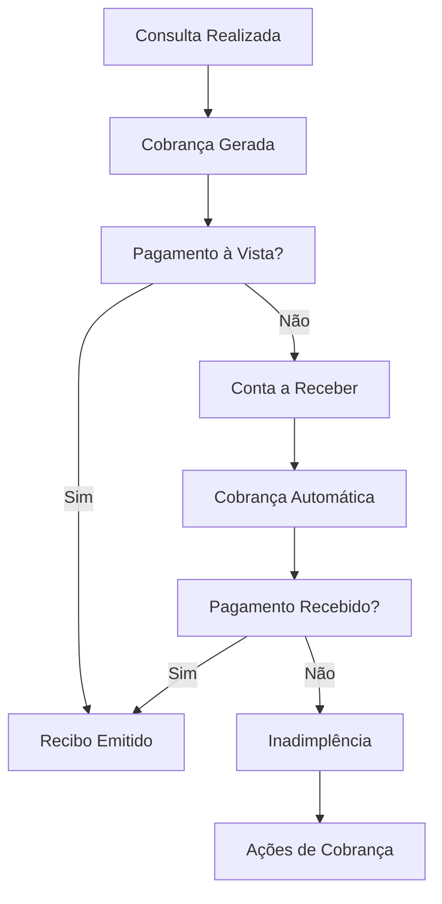

# 📋 Planejamento Completo - Sistema FisioFlow

## 1. Visão Geral do Projeto

O FisioFlow é um sistema completo de gestão de clínicas de fisioterapia que integra agendamento, prontuário eletrônico, controle financeiro e inteligência artificial. O sistema já possui uma base sólida implementada, mas necessita de finalização e aprimoramento de funcionalidades essenciais, especialmente na página de agenda que é o core do sistema.

**Objetivo**: Finalizar todas as funcionalidades essenciais para tornar o FisioFlow um sistema completo e competitivo no mercado de gestão de clínicas de fisioterapia.

## 2. Análise do Estado Atual

### 2.1 Páginas Existentes

✅ **Implementadas:**
- Login/Autenticação
- Dashboard principal
- Agenda (estrutura básica)
- Configurações
- Relatórios (estrutura)
- AI Assistant
- Events (eventos/workshops)

⚠️ **Parcialmente Implementadas:**
- Agenda (falta calendário funcional, drag & drop, visualizações)
- Relatórios (falta implementação completa)
- Configurações (falta funcionalidades avançadas)

❌ **Faltando:**
- Gestão de Pacientes (CRUD completo)
- Prontuário Eletrônico
- Controle Financeiro (completo)
- Biblioteca de Exercícios
- Protocolos de Tratamento
- Telemedicina
- Portal do Paciente

### 2.2 Funcionalidades do Banco de Dados

✅ **Modelos Implementados:**
- User, Patient, Appointment
- PainPoint, MetricResult, SoapNote
- Payment, FinancialTransaction
- Exercise, TreatmentProtocol
- AnalyticsEvent, SessionMetric
- Inventory, Event

## 3. Página de Agenda - Core do Sistema

### 3.1 Estado Atual da Agenda

**Implementado:**
- Estrutura básica de componentes
- Listagem simples de agendamentos
- Modal de detalhes
- Estados de loading

**Faltando:**
- Calendário visual interativo
- Drag & drop para reagendamento
- Visualizações (diária, semanal, mensal)
- Criação/edição de agendamentos
- Gestão de horários disponíveis
- Notificações automáticas
- Integração com WhatsApp
- Controle de conflitos
- Agendamento recorrente

### 3.2 Funcionalidades Essenciais da Agenda

#### 3.2.1 Visualização do Calendário
- **Visualização Semanal** (principal)
  - Grade de horários de 7h às 21h
  - Slots de 30 minutos
  - Múltiplos profissionais em colunas
  - Cores por tipo de consulta

- **Visualização Diária**
  - Foco em um dia específico
  - Mais detalhes por agendamento
  - Timeline vertical

- **Visualização Mensal**
  - Visão geral do mês
  - Indicadores de ocupação
  - Navegação rápida

#### 3.2.2 Gestão de Agendamentos
- **Criação de Agendamentos**
  - Seleção de paciente (busca inteligente)
  - Escolha de profissional
  - Definição de horário e duração
  - Tipo de consulta
  - Observações
  - Valor da consulta

- **Edição e Reagendamento**
  - Drag & drop para mover horários
  - Modal de edição completa
  - Histórico de alterações
  - Notificação automática de mudanças

- **Agendamento Recorrente**
  - Definição de frequência
  - Número de sessões
  - Exceções (feriados, férias)

#### 3.2.3 Controle de Disponibilidade
- **Horários de Funcionamento**
  - Configuração por profissional
  - Horários especiais
  - Bloqueios temporários

- **Gestão de Conflitos**
  - Detecção automática
  - Sugestões de horários alternativos
  - Validações em tempo real

#### 3.2.4 Notificações e Lembretes
- **WhatsApp Integration**
  - Confirmação de agendamento
  - Lembrete 24h antes
  - Lembrete 2h antes
  - Reagendamento via WhatsApp

- **Email e SMS**
  - Backup para WhatsApp
  - Relatórios para profissionais

## 4. Páginas Prioritárias para Implementação

### 4.1 Gestão de Pacientes (Alta Prioridade)

**Funcionalidades Necessárias:**
- Lista completa de pacientes com busca e filtros
- Formulário de cadastro/edição completo
- Histórico de consultas
- Dados de contato e emergência
- Status do paciente (ativo, inativo, inadimplente)
- Consentimentos e termos
- Integração com agenda

**Componentes a Criar:**
- `PatientList.tsx`
- `PatientForm.tsx`
- `PatientProfile.tsx`
- `PatientHistory.tsx`

### 4.2 Prontuário Eletrônico (Alta Prioridade)

**Funcionalidades Necessárias:**
- Evolução clínica (SOAP)
- Avaliações padronizadas
- Mapa de dor interativo
- Métricas e progressão
- Anexos (fotos, exames)
- Prescrições de exercícios
- Relatórios de evolução

**Componentes a Criar:**
- `MedicalRecord.tsx`
- `SoapNoteForm.tsx`
- `AssessmentForm.tsx`
- `ProgressChart.tsx`
- `PrescriptionForm.tsx`

### 4.3 Controle Financeiro (Média Prioridade)

**Funcionalidades Necessárias:**
- Dashboard financeiro
- Controle de recebimentos
- Gestão de inadimplência
- Relatórios financeiros
- Integração com agenda (valores)
- Emissão de recibos
- Controle de repasses

**Componentes a Criar:**
- `FinancialDashboard.tsx` (já existe, melhorar)
- `PaymentControl.tsx`
- `DelinquencyManagement.tsx`
- `FinancialReports.tsx`

### 4.4 Biblioteca de Exercícios (Média Prioridade)

**Funcionalidades Necessárias:**
- Catálogo de exercícios com vídeos
- Categorização por região corporal
- Níveis de dificuldade
- Prescrição personalizada
- Acompanhamento de execução
- Feedback do paciente

**Componentes a Criar:**
- `ExerciseLibrary.tsx`
- `ExerciseDetail.tsx`
- `PrescriptionBuilder.tsx`
- `PatientExercises.tsx`

### 4.5 Portal do Paciente (Baixa Prioridade)

**Funcionalidades Necessárias:**
- Login do paciente
- Visualização de agendamentos
- Histórico de consultas
- Exercícios prescritos
- Comunicação com clínica
- Avaliação de dor
- Pagamentos online

## 5. Fluxos de Trabalho Críticos

### 5.1 Fluxo de Agendamento Completo



### 5.2 Fluxo de Atendimento Clínico



### 5.3 Fluxo Financeiro



## 6. Regras de Negócio Essenciais

### 6.1 Regras de Agendamento

1. **Horários de Funcionamento**
   - Segunda a Sexta: 7h às 21h
   - Sábado: 7h às 12h
   - Domingo: Fechado

2. **Duração das Consultas**
   - Avaliação inicial: 60 minutos
   - Fisioterapia: 50 minutos
   - Retorno: 30 minutos
   - Procedimentos: 30-90 minutos

3. **Conflitos e Validações**
   - Um profissional não pode ter dois agendamentos simultâneos
   - Intervalo mínimo de 10 minutos entre consultas
   - Máximo 8 consultas por dia por profissional

4. **Cancelamentos e Reagendamentos**
   - Cancelamento até 2h antes: sem cobrança
   - Cancelamento com menos de 2h: cobrança de 50%
   - No-show: cobrança integral
   - Máximo 2 reagendamentos por consulta

### 6.2 Regras Financeiras

1. **Pagamentos**
   - À vista: desconto de 5%
   - Cartão: sem desconto
   - Parcelado: acréscimo de 3% ao mês

2. **Inadimplência**
   - Após 7 dias: cobrança automática
   - Após 15 dias: bloqueio de novos agendamentos
   - Após 30 dias: negativação

3. **Repasses Profissionais**
   - Funcionário: salário fixo
   - Parceiro: 60% do valor da consulta
   - Comissionado: 40% do valor da consulta

### 6.3 Regras de Acesso e Permissões

1. **Administrador**
   - Acesso total ao sistema
   - Configurações gerais
   - Relatórios financeiros
   - Gestão de usuários

2. **Profissional**
   - Agenda própria
   - Prontuários dos pacientes
   - Prescrição de exercícios
   - Relatórios de atendimento

3. **Recepção**
   - Agenda geral
   - Cadastro de pacientes
   - Controle financeiro básico
   - Check-in/check-out

4. **Paciente (Portal)**
   - Próprios agendamentos
   - Histórico pessoal
   - Exercícios prescritos
   - Comunicação com clínica

## 7. Integrações Necessárias

### 7.1 Comunicação
- **WhatsApp Business API**
  - Confirmações automáticas
  - Lembretes de consulta
  - Reagendamentos
  - Suporte ao cliente

- **Email (SMTP)**
  - Relatórios para profissionais
  - Backup de notificações
  - Marketing por email

- **SMS (Twilio)**
  - Backup para WhatsApp
  - Códigos de verificação

### 7.2 Pagamentos
- **Stripe/Mercado Pago**
  - Pagamentos online
  - Assinaturas recorrentes
  - Split de pagamentos

### 7.3 Armazenamento
- **Supabase Storage**
  - Fotos de pacientes
  - Exames e documentos
  - Vídeos de exercícios
  - Backup de dados

### 7.4 Calendário Externo
- **Google Calendar**
  - Sincronização bidirecional
  - Agenda pessoal dos profissionais

## 8. Arquitetura de Implementação

### 8.1 Estrutura de Componentes

```
components/
├── agenda/
│   ├── CalendarView.tsx (NOVO)
│   ├── WeekView.tsx (NOVO)
│   ├── DayView.tsx (NOVO)
│   ├── MonthView.tsx (NOVO)
│   ├── AppointmentForm.tsx (MELHORAR)
│   ├── TimeSlotGrid.tsx (NOVO)
│   └── DragDropProvider.tsx (NOVO)
├── patients/
│   ├── PatientList.tsx (NOVO)
│   ├── PatientForm.tsx (NOVO)
│   ├── PatientProfile.tsx (NOVO)
│   └── PatientSearch.tsx (NOVO)
├── medical-record/
│   ├── MedicalRecord.tsx (NOVO)
│   ├── SoapNoteForm.tsx (NOVO)
│   ├── AssessmentForm.tsx (NOVO)
│   └── ProgressTracking.tsx (NOVO)
├── financial/
│   ├── PaymentControl.tsx (NOVO)
│   ├── DelinquencyDashboard.tsx (NOVO)
│   └── ReceiptGenerator.tsx (EXISTE)
└── exercises/
    ├── ExerciseLibrary.tsx (NOVO)
    ├── PrescriptionBuilder.tsx (NOVO)
    └── PatientExercises.tsx (NOVO)
```

### 8.2 APIs Necessárias

```
api/
├── appointments/
│   ├── route.ts (MELHORAR)
│   ├── [id]/route.ts (NOVO)
│   ├── availability/route.ts (NOVO)
│   └── conflicts/route.ts (NOVO)
├── patients/
│   ├── route.ts (EXISTE - MELHORAR)
│   ├── [id]/route.ts (NOVO)
│   └── search/route.ts (NOVO)
├── medical-records/
│   ├── route.ts (NOVO)
│   ├── soap-notes/route.ts (NOVO)
│   └── assessments/route.ts (NOVO)
├── notifications/
│   ├── whatsapp/route.ts (NOVO)
│   ├── email/route.ts (NOVO)
│   └── sms/route.ts (NOVO)
└── exercises/
    ├── route.ts (NOVO)
    ├── prescriptions/route.ts (NOVO)
    └── library/route.ts (NOVO)
```

### 8.3 Estados e Contextos

```typescript
// Contextos necessários
AgendaContext: {
  appointments: Appointment[]
  selectedDate: Date
  viewMode: 'day' | 'week' | 'month'
  filters: AgendaFilters
}

PatientContext: {
  patients: Patient[]
  selectedPatient: Patient | null
  searchTerm: string
}

MedicalRecordContext: {
  currentRecord: MedicalRecord | null
  soapNotes: SoapNote[]
  assessments: Assessment[]
}
```

## 9. Cronograma de Implementação

### Fase 1: Core da Agenda (2-3 semanas)
1. **Semana 1-2**: Calendário visual completo
   - Implementar visualizações (dia/semana/mês)
   - Drag & drop functionality
   - Grid de horários responsivo

2. **Semana 2-3**: Funcionalidades de agendamento
   - Formulário completo de agendamento
   - Validações e controle de conflitos
   - Agendamento recorrente

### Fase 2: Gestão de Pacientes (1-2 semanas)
1. **Semana 1**: CRUD completo de pacientes
2. **Semana 2**: Integração com agenda e busca avançada

### Fase 3: Prontuário Eletrônico (2-3 semanas)
1. **Semana 1**: Estrutura básica e SOAP
2. **Semana 2**: Avaliações e métricas
3. **Semana 3**: Mapa de dor e anexos

### Fase 4: Notificações e Integrações (1-2 semanas)
1. **Semana 1**: WhatsApp integration
2. **Semana 2**: Email e SMS backup

### Fase 5: Controle Financeiro (2 semanas)
1. **Semana 1**: Dashboard e controles básicos
2. **Semana 2**: Inadimplência e relatórios

### Fase 6: Biblioteca de Exercícios (1-2 semanas)
1. **Semana 1**: Catálogo e prescrições
2. **Semana 2**: Portal do paciente básico

## 10. Métricas de Sucesso

### 10.1 Funcionalidade
- ✅ 100% das funcionalidades core implementadas
- ✅ Agenda totalmente funcional com drag & drop
- ✅ Notificações automáticas funcionando
- ✅ Controle financeiro completo

### 10.2 Performance
- ⚡ Carregamento da agenda < 2 segundos
- ⚡ Busca de pacientes < 500ms
- ⚡ Sincronização em tempo real

### 10.3 Usabilidade
- 📱 Interface responsiva em todos os dispositivos
- 🎯 Fluxo de agendamento em < 3 cliques
- 🔍 Busca intuitiva e rápida

## 11. Próximos Passos Imediatos

### Esta Semana
1. **Implementar CalendarView component**
2. **Criar TimeSlotGrid com drag & drop**
3. **Melhorar AppointmentForm**
4. **Implementar controle de conflitos**

### Próxima Semana
1. **Finalizar visualizações da agenda**
2. **Implementar notificações WhatsApp**
3. **Criar gestão completa de pacientes**
4. **Iniciar prontuário eletrônico**

---

**Status**: Documento de planejamento completo ✅  
**Última atualização**: Janeiro 2024  
**Responsável**: Equipe de Desenvolvimento FisioFlow