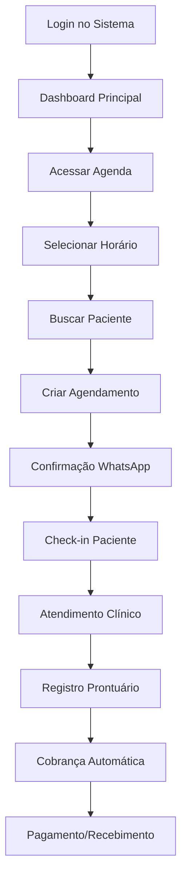

# 📋 Product Requirements Document (PRD) - FisioFlow
## Funcionalidades Essenciais para Finalização

## 1. Product Overview

O FisioFlow é um sistema completo de gestão de clínicas de fisioterapia que integra agendamento inteligente, prontuário eletrônico, controle financeiro e assistente de IA. O sistema visa otimizar a operação de clínicas de fisioterapia através de automação, insights inteligentes e uma experiência de usuário excepcional.

O produto resolve os principais problemas de gestão clínica: agendamentos conflitantes, prontuários desorganizados, controle financeiro manual e falta de insights sobre o negócio. Será usado por fisioterapeutas, recepcionistas, administradores de clínica e pacientes.

O objetivo é tornar-se a plataforma líder em gestão de clínicas de fisioterapia no Brasil, com potencial de expansão para outros países da América Latina.

## 2. Core Features

### 2.1 User Roles

| Role | Registration Method | Core Permissions |
|------|---------------------|------------------|
| Administrador | Criado pelo sistema | Acesso total, configurações, relatórios financeiros, gestão de usuários |
| Fisioterapeuta | Convite do admin | Agenda própria, prontuários, prescrições, relatórios de atendimento |
| Recepcionista | Convite do admin | Agenda geral, cadastro de pacientes, controle financeiro básico, check-in |
| Paciente | Auto-registro ou convite | Próprios agendamentos, histórico pessoal, exercícios, comunicação |

### 2.2 Feature Module

Nossos requisitos do FisioFlow consistem nas seguintes páginas principais:

1. **Dashboard**: métricas principais, agenda do dia, alertas importantes, atalhos rápidos.
2. **Agenda Inteligente**: calendário visual completo, drag & drop, múltiplas visualizações, controle de conflitos.
3. **Gestão de Pacientes**: CRUD completo, busca avançada, histórico de atendimentos, dados de contato.
4. **Prontuário Eletrônico**: evolução SOAP, avaliações padronizadas, mapa de dor, métricas de progresso.
5. **Controle Financeiro**: dashboard financeiro, recebimentos, inadimplência, relatórios, emissão de recibos.
6. **Biblioteca de Exercícios**: catálogo com vídeos, prescrições personalizadas, acompanhamento de execução.
7. **Relatórios e Analytics**: relatórios operacionais, financeiros, de performance, insights de IA.
8. **Configurações**: perfil da clínica, usuários, integrações, notificações, horários de funcionamento.

### 2.3 Page Details

| Page Name | Module Name | Feature description |
|-----------|-------------|---------------------|
| **Dashboard** | Métricas Principais | Exibir KPIs em tempo real: agendamentos do dia, receita mensal, taxa de ocupação, pacientes ativos |
| Dashboard | Agenda do Dia | Mostrar próximos agendamentos com status, alertas de atraso, botões de check-in rápido |
| Dashboard | Alertas e Notificações | Exibir lembretes importantes, pacientes inadimplentes, conflitos de agenda, tarefas pendentes |
| **Agenda Inteligente** | Calendário Visual | Visualizações diária/semanal/mensal com cores por tipo de consulta, status visual dos agendamentos |
| Agenda Inteligente | Drag & Drop | Arrastar agendamentos para reagendar, validação automática de conflitos, confirmação de mudanças |
| Agenda Inteligente | Formulário de Agendamento | Criar/editar agendamentos com busca de paciente, seleção de profissional, definição de horário e tipo |
| Agenda Inteligente | Controle de Disponibilidade | Gerenciar horários de funcionamento por profissional, bloqueios temporários, feriados |
| Agenda Inteligente | Agendamento Recorrente | Criar séries de agendamentos com frequência definida, exceções, controle de sessões |
| **Gestão de Pacientes** | Lista de Pacientes | Listar todos os pacientes com busca, filtros por status, ordenação, paginação |
| Gestão de Pacientes | Formulário de Paciente | Cadastrar/editar dados completos: pessoais, contato, endereço, emergência, consentimentos |
| Gestão de Pacientes | Perfil do Paciente | Visualizar dados completos, histórico de consultas, métricas de evolução, documentos |
| Gestão de Pacientes | Busca Inteligente | Buscar por nome, CPF, telefone com sugestões automáticas, resultados instantâneos |
| **Prontuário Eletrônico** | Evolução SOAP | Registrar Subjetivo, Objetivo, Avaliação e Plano para cada consulta com templates |
| Prontuário Eletrônico | Avaliações Padronizadas | Aplicar questionários validados (Oswestry, DASH, etc.) com cálculo automático de scores |
| Prontuário Eletrônico | Mapa de Dor Interativo | Marcar pontos de dor no corpo humano com intensidade, tipo, evolução temporal |
| Prontuário Eletrônico | Métricas de Progresso | Acompanhar evolução de dor, amplitude de movimento, força, funcionalidade com gráficos |
| Prontuário Eletrônico | Anexos e Documentos | Upload de fotos, exames, relatórios com organização por data e tipo |
| **Controle Financeiro** | Dashboard Financeiro | Visualizar receita mensal, contas a receber, inadimplência, fluxo de caixa com gráficos |
| Controle Financeiro | Gestão de Recebimentos | Controlar pagamentos de consultas, parcelamentos, diferentes formas de pagamento |
| Controle Financeiro | Controle de Inadimplência | Listar devedores, enviar cobranças automáticas, bloquear agendamentos, histórico de ações |
| Controle Financeiro | Emissão de Recibos | Gerar recibos automáticos com dados da clínica, paciente, serviços prestados |
| Controle Financeiro | Relatórios Financeiros | Gerar relatórios de faturamento, recebimentos, inadimplência por período |
| **Biblioteca de Exercícios** | Catálogo de Exercícios | Listar exercícios por categoria, região corporal, dificuldade com vídeos e instruções |
| Biblioteca de Exercícios | Prescrição de Exercícios | Criar protocolos personalizados com séries, repetições, progressão, observações |
| Biblioteca de Exercícios | Acompanhamento | Monitorar execução pelo paciente, feedback de dificuldade, ajustes na prescrição |
| **Relatórios e Analytics** | Relatórios Operacionais | Gerar relatórios de agendamentos, no-shows, ocupação por profissional e período |
| Relatórios e Analytics | Insights de IA | Análises preditivas de no-show, sugestões de otimização, padrões de agendamento |
| Relatórios e Analytics | Exportação de Dados | Exportar relatórios em PDF, Excel com filtros personalizáveis |
| **Configurações** | Perfil da Clínica | Configurar dados da clínica, logo, informações de contato, especialidades |
| Configurações | Gestão de Usuários | Adicionar/remover usuários, definir permissões, controlar acesso por funcionalidade |
| Configurações | Integrações | Configurar WhatsApp, email, pagamentos, calendário externo |
| Configurações | Notificações | Definir templates de mensagens, horários de envio, canais de comunicação |

## 3. Core Process

### Fluxo Principal de Agendamento
O usuário (recepcionista ou fisioterapeuta) acessa a agenda, seleciona um horário disponível, busca o paciente pelo nome ou CPF, define o tipo de consulta e confirma o agendamento. O sistema valida conflitos automaticamente e envia confirmação via WhatsApp. Lembretes são enviados 24h e 2h antes da consulta.

### Fluxo de Atendimento Clínico
O paciente chega e faz check-in na recepção. O fisioterapeuta acessa o prontuário, realiza o atendimento registrando a evolução SOAP, prescreve exercícios se necessário, agenda o retorno e finaliza gerando a cobrança automaticamente.

### Fluxo Financeiro
Após cada consulta, o sistema gera automaticamente uma cobrança. O pagamento pode ser registrado imediatamente (à vista) ou fica como conta a receber. O sistema monitora vencimentos e envia cobranças automáticas para inadimplentes.

## 4. User Interface Design

### 4.1 Design Style

**Cores Principais:**
- Primary: #3B82F6 (Azul moderno e confiável)
- Secondary: #10B981 (Verde para ações positivas)
- Accent: #F59E0B (Amarelo para alertas)
- Neutral: #64748B (Cinza para textos secundários)
- Background: #F8FAFC (Cinza muito claro)

**Estilo de Botões:**
- Botões primários: Rounded corners (8px), sombra sutil, hover com elevação
- Botões secundários: Outline style com border colorido
- Botões de ação: Ícone + texto, cores semânticas (verde=confirmar, vermelho=cancelar)

**Tipografia:**
- Fonte principal: Inter (clean e moderna)
- Títulos: 24px-32px, weight 600-700
- Corpo: 14px-16px, weight 400-500
- Captions: 12px-14px, weight 400

**Layout:**
- Sidebar fixa com navegação principal
- Cards com sombra sutil para agrupamento de conteúdo
- Grid responsivo com breakpoints bem definidos
- Espaçamento consistente (múltiplos de 8px)

**Ícones e Elementos:**
- Lucide React icons (consistentes e modernos)
- Emojis para humanizar alertas e notificações
- Badges coloridos para status (verde=confirmado, amarelo=pendente, vermelho=cancelado)
- Loading states com skeletons animados

### 4.2 Page Design Overview

| Page Name | Module Name | UI Elements |
|-----------|-------------|-------------|
| **Dashboard** | Métricas Principais | Cards com números grandes, ícones coloridos, gráficos simples (donut, bar), cores semânticas |
| Dashboard | Agenda do Dia | Lista vertical com cards compactos, avatar do paciente, status badges, botões de ação |
| **Agenda Inteligente** | Calendário Visual | Grid de horários com slots de 30min, cores por tipo de consulta, drag handles visíveis |
| Agenda Inteligente | Formulário Modal | Modal centralizado, campos organizados em seções, autocomplete para pacientes |
| **Gestão de Pacientes** | Lista de Pacientes | Tabela responsiva com foto, dados principais, filtros no topo, busca em tempo real |
| Gestão de Pacientes | Perfil do Paciente | Layout em duas colunas: dados pessoais + histórico, tabs para organizar informações |
| **Prontuário Eletrônico** | Evolução SOAP | Formulário em abas (S-O-A-P), editor de texto rico, templates pré-definidos |
| Prontuário Eletrônico | Mapa de Dor | SVG interativo do corpo humano, modal para detalhes do ponto, escala visual de dor |
| **Controle Financeiro** | Dashboard Financeiro | Gráficos de linha e barra, KPIs em destaque, filtros de período, cores para receita/despesa |
| Controle Financeiro | Lista de Transações | Tabela com filtros, status coloridos, ações inline, paginação |

### 4.3 Responsiveness

O sistema é **desktop-first** com adaptação completa para mobile e tablet. A sidebar colapsa em menu hambúrguer em telas menores. Tabelas se transformam em cards empilhados. Formulários ajustam campos para uma coluna. Touch interactions são otimizadas com botões maiores e gestos intuitivos (swipe para ações rápidas).

**Breakpoints:**
- Desktop: 1024px+
- Tablet: 768px-1023px  
- Mobile: 320px-767px

**Adaptações Mobile:**
- Agenda: Visualização diária prioritária, swipe entre dias
- Pacientes: Cards ao invés de tabela, busca com foco
- Prontuário: Formulários em etapas, campos maiores
- Financeiro: Gráficos simplificados, métricas empilhadas

---

**Status**: PRD de Funcionalidades Essenciais ✅  
**Última atualização**: Janeiro 2024  
**Responsável**: Product Manager FisioFlow