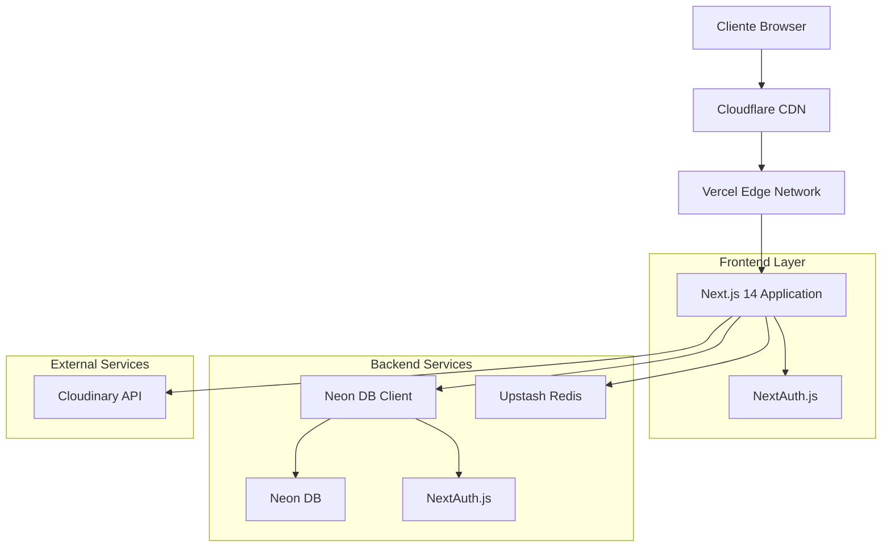
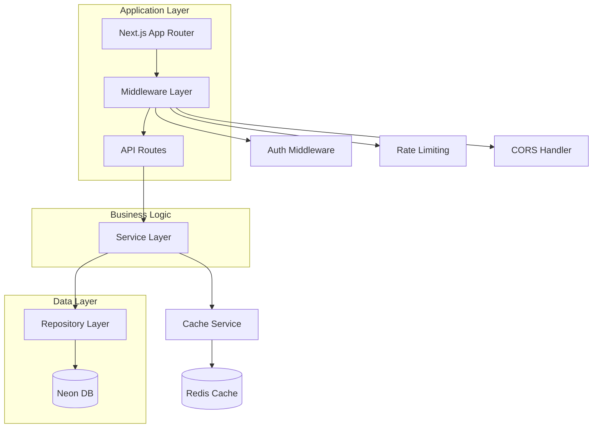
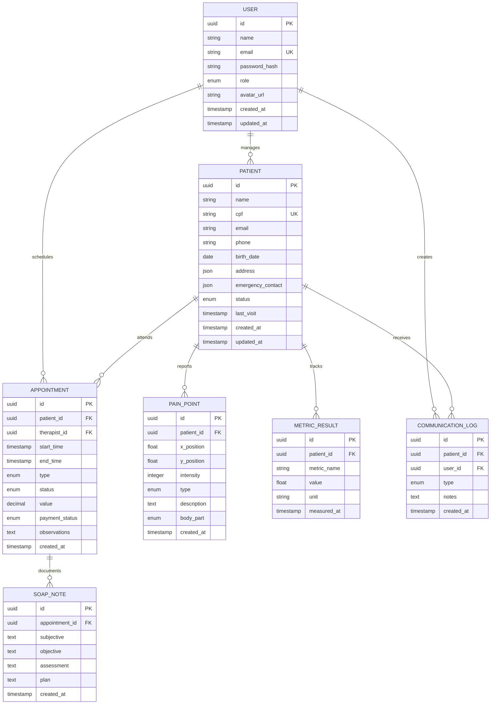

# Arquitetura Técnica - FisioFlow Online

## 1. Arquitetura de Sistema



## 2. Descrição Tecnológica

- **Frontend**: Next.js 14 + React 18 + TypeScript + Tailwind CSS
- **Autenticação**: NextAuth.js 5.0 + Neon DB
- **Database**: Neon DB (PostgreSQL)
- **Cache**: Upstash Redis
- **Storage**: Cloudinary
- **Deploy**: Vercel
- **Monitoramento**: Vercel Analytics + Sentry

## 3. Definições de Rotas

| Rota | Propósito |
|------|----------|
| `/` | Página inicial com redirecionamento baseado em auth |
| `/login` | Página de autenticação otimizada |
| `/dashboard` | Dashboard principal para terapeutas |
| `/pacientes` | Listagem e gestão de pacientes |
| `/pacientes/[id]` | Detalhes específicos do paciente |
| `/agenda` | Sistema de agendamento |
| `/teleconsulta` | Interface de teleconsulta |
| `/portal` | Portal do paciente |
| `/partner` | Portal do educador físico |
| `/api/auth/[...nextauth]` | Endpoints de autenticação |
| `/api/pacientes` | API REST para pacientes |
| `/api/appointments` | API REST para agendamentos |

## 4. Definições de API

### 4.1 Autenticação

**POST /api/auth/signin**

Request:
| Param | Type | Required | Description |
|-------|------|----------|-------------|
| email | string | true | Email do usuário |
| password | string | true | Senha do usuário |
| csrfToken | string | true | Token CSRF |

Response:
| Param | Type | Description |
|-------|------|-------------|
| user | User | Dados do usuário autenticado |
| expires | string | Data de expiração da sessão |

Example:
```json
{
  "user": {
    "id": "uuid",
    "name": "Dr. Roberto",
    "email": "roberto@fisioflow.com",
    "role": "Fisioterapeuta"
  },
  "expires": "2024-12-31T23:59:59.999Z"
}
```

### 4.2 Gestão de Pacientes

**GET /api/pacientes**

Query Parameters:
| Param | Type | Required | Description |
|-------|------|----------|-------------|
| page | number | false | Número da página (default: 1) |
| limit | number | false | Itens por página (default: 10) |
| search | string | false | Termo de busca |
| status | string | false | Filtro por status |

Response:
```json
{
  "patients": [
    {
      "id": "uuid",
      "name": "João Silva",
      "email": "joao@email.com",
      "status": "Active",
      "lastVisit": "2024-01-15T10:00:00Z"
    }
  ],
  "pagination": {
    "total": 150,
    "page": 1,
    "limit": 10,
    "totalPages": 15
  }
}
```

**POST /api/pacientes**

Request:
```json
{
  "name": "Maria Santos",
  "email": "maria@email.com",
  "phone": "+5511999999999",
  "cpf": "123.456.789-00",
  "birthDate": "1985-03-15",
  "address": {
    "street": "Rua das Flores, 123",
    "city": "São Paulo",
    "state": "SP",
    "zip": "01234-567"
  }
}
```

### 4.3 Sistema de Agendamentos

**GET /api/appointments**

Query Parameters:
| Param | Type | Required | Description |
|-------|------|----------|-------------|
| startDate | string | true | Data inicial (ISO) |
| endDate | string | true | Data final (ISO) |
| therapistId | string | false | ID do terapeuta |
| patientId | string | false | ID do paciente |

**POST /api/appointments**

Request:
```json
{
  "patientId": "uuid",
  "therapistId": "uuid",
  "startTime": "2024-01-20T14:00:00Z",
  "endTime": "2024-01-20T15:00:00Z",
  "type": "Sessão",
  "observations": "Primeira sessão pós-cirurgia"
}
```

## 5. Arquitetura do Servidor



## 6. Modelo de Dados

### 6.1 Diagrama de Entidades



### 6.2 Schema do Banco de Dados

```sql
-- Tabela de usuários
CREATE TABLE users (
    id UUID PRIMARY KEY DEFAULT gen_random_uuid(),
    name VARCHAR(255) NOT NULL,
    email VARCHAR(255) UNIQUE NOT NULL,
    password_hash VARCHAR(255),
    role VARCHAR(50) NOT NULL CHECK (role IN ('Admin', 'Fisioterapeuta', 'Paciente', 'EducadorFisico')),
    avatar_url TEXT,
    created_at TIMESTAMP WITH TIME ZONE DEFAULT NOW(),
    updated_at TIMESTAMP WITH TIME ZONE DEFAULT NOW()
);

-- Tabela de pacientes
CREATE TABLE patients (
    id UUID PRIMARY KEY DEFAULT gen_random_uuid(),
    name VARCHAR(255) NOT NULL,
    cpf VARCHAR(14) UNIQUE NOT NULL,
    email VARCHAR(255),
    phone VARCHAR(20),
    birth_date DATE,
    address JSONB,
    emergency_contact JSONB,
    status VARCHAR(20) DEFAULT 'Active' CHECK (status IN ('Active', 'Inactive', 'Discharged')),
    last_visit TIMESTAMP WITH TIME ZONE,
    allergies TEXT,
    medical_alerts TEXT,
    consent_given BOOLEAN DEFAULT false,
    whatsapp_consent VARCHAR(10) DEFAULT 'opt-out' CHECK (whatsapp_consent IN ('opt-in', 'opt-out')),
    created_at TIMESTAMP WITH TIME ZONE DEFAULT NOW(),
    updated_at TIMESTAMP WITH TIME ZONE DEFAULT NOW()
);

-- Tabela de agendamentos
CREATE TABLE appointments (
    id UUID PRIMARY KEY DEFAULT gen_random_uuid(),
    patient_id UUID NOT NULL REFERENCES patients(id) ON DELETE CASCADE,
    therapist_id UUID NOT NULL REFERENCES users(id) ON DELETE CASCADE,
    start_time TIMESTAMP WITH TIME ZONE NOT NULL,
    end_time TIMESTAMP WITH TIME ZONE NOT NULL,
    type VARCHAR(50) NOT NULL CHECK (type IN ('Avaliação', 'Sessão', 'Retorno', 'Pilates', 'Urgente', 'Teleconsulta')),
    status VARCHAR(20) DEFAULT 'Agendado' CHECK (status IN ('Agendado', 'Realizado', 'Cancelado', 'Faltou')),
    value DECIMAL(10,2),
    payment_status VARCHAR(20) DEFAULT 'pending' CHECK (payment_status IN ('paid', 'pending')),
    observations TEXT,
    series_id UUID,
    session_number INTEGER,
    total_sessions INTEGER,
    created_at TIMESTAMP WITH TIME ZONE DEFAULT NOW()
);

-- Tabela de pontos de dor
CREATE TABLE pain_points (
    id UUID PRIMARY KEY DEFAULT gen_random_uuid(),
    patient_id UUID NOT NULL REFERENCES patients(id) ON DELETE CASCADE,
    x_position FLOAT NOT NULL,
    y_position FLOAT NOT NULL,
    intensity INTEGER NOT NULL CHECK (intensity >= 0 AND intensity <= 10),
    type VARCHAR(50) NOT NULL CHECK (type IN ('latejante', 'aguda', 'queimação', 'formigamento', 'cansaço')),
    description TEXT,
    body_part VARCHAR(10) NOT NULL CHECK (body_part IN ('front', 'back')),
    created_at TIMESTAMP WITH TIME ZONE DEFAULT NOW()
);

-- Tabela de resultados de métricas
CREATE TABLE metric_results (
    id UUID PRIMARY KEY DEFAULT gen_random_uuid(),
    patient_id UUID NOT NULL REFERENCES patients(id) ON DELETE CASCADE,
    metric_name VARCHAR(255) NOT NULL,
    value FLOAT NOT NULL,
    unit VARCHAR(50) NOT NULL,
    measured_at TIMESTAMP WITH TIME ZONE DEFAULT NOW()
);

-- Tabela de notas SOAP
CREATE TABLE soap_notes (
    id UUID PRIMARY KEY DEFAULT gen_random_uuid(),
    appointment_id UUID NOT NULL REFERENCES appointments(id) ON DELETE CASCADE,
    subjective TEXT,
    objective TEXT,
    assessment TEXT,
    plan TEXT,
    created_at TIMESTAMP WITH TIME ZONE DEFAULT NOW()
);

-- Tabela de logs de comunicação
CREATE TABLE communication_logs (
    id UUID PRIMARY KEY DEFAULT gen_random_uuid(),
    patient_id UUID NOT NULL REFERENCES patients(id) ON DELETE CASCADE,
    user_id UUID NOT NULL REFERENCES users(id) ON DELETE CASCADE,
    type VARCHAR(20) NOT NULL CHECK (type IN ('WhatsApp', 'Ligação', 'Email', 'Outro')),
    notes TEXT NOT NULL,
    created_at TIMESTAMP WITH TIME ZONE DEFAULT NOW()
);

-- Índices para performance
CREATE INDEX idx_appointments_patient_id ON appointments(patient_id);
CREATE INDEX idx_appointments_therapist_id ON appointments(therapist_id);
CREATE INDEX idx_appointments_start_time ON appointments(start_time);
CREATE INDEX idx_pain_points_patient_id ON pain_points(patient_id);
CREATE INDEX idx_pain_points_created_at ON pain_points(created_at DESC);
CREATE INDEX idx_metric_results_patient_id ON metric_results(patient_id);
CREATE INDEX idx_metric_results_measured_at ON metric_results(measured_at DESC);
CREATE INDEX idx_communication_logs_patient_id ON communication_logs(patient_id);
CREATE INDEX idx_communication_logs_created_at ON communication_logs(created_at DESC);

-- Políticas RLS (Row Level Security) para Neon DB
ALTER TABLE patients ENABLE ROW LEVEL SECURITY;
ALTER TABLE appointments ENABLE ROW LEVEL SECURITY;
ALTER TABLE pain_points ENABLE ROW LEVEL SECURITY;
ALTER TABLE metric_results ENABLE ROW LEVEL SECURITY;
ALTER TABLE soap_notes ENABLE ROW LEVEL SECURITY;
ALTER TABLE communication_logs ENABLE ROW LEVEL SECURITY;

-- Políticas de acesso
CREATE POLICY "Users can view their own data" ON patients
    FOR SELECT USING (auth.uid()::text = id::text OR 
                     EXISTS (SELECT 1 FROM users WHERE id = auth.uid() AND role IN ('Admin', 'Fisioterapeuta')));

CREATE POLICY "Therapists can manage appointments" ON appointments
    FOR ALL USING (EXISTS (SELECT 1 FROM users WHERE id = auth.uid() AND role IN ('Admin', 'Fisioterapeuta')));

-- Dados iniciais
INSERT INTO users (name, email, role, avatar_url) VALUES
('Administrador', 'admin@fisioflow.com', 'Admin', 'https://i.pravatar.cc/150?img=1'),
('Dr. Roberto Silva', 'roberto@fisioflow.com', 'Fisioterapeuta', 'https://i.pravatar.cc/150?img=2'),
('Dra. Ana Costa', 'ana@fisioflow.com', 'Fisioterapeuta', 'https://i.pravatar.cc/150?img=3'),
('Juliana Santos', 'juliana@fisioflow.com', 'EducadorFisico', 'https://i.pravatar.cc/150?img=4');
```

## 7. Configurações de Segurança

### 7.1 Middleware de Segurança

```typescript
// middleware.ts
import { withAuth } from "next-auth/middleware";
import { NextResponse } from "next/server";
import type { NextRequest } from "next/server";

export default withAuth(
  function middleware(req: NextRequest) {
    // Rate limiting
    const ip = req.ip ?? '127.0.0.1';
    const rateLimitKey = `rate_limit:${ip}`;
    
    // CSRF protection
    if (req.method === 'POST') {
      const csrfToken = req.headers.get('x-csrf-token');
      if (!csrfToken) {
        return new NextResponse('CSRF token missing', { status: 403 });
      }
    }
    
    return NextResponse.next();
  },
  {
    callbacks: {
      authorized: ({ token, req }) => {
        // Verificar se o usuário tem permissão para acessar a rota
        const { pathname } = req.nextUrl;
        
        if (pathname.startsWith('/admin')) {
          return token?.role === 'Admin';
        }
        
        if (pathname.startsWith('/portal')) {
          return token?.role === 'Paciente';
        }
        
        if (pathname.startsWith('/partner')) {
          return token?.role === 'EducadorFisico';
        }
        
        return !!token;
      },
    },
  }
);

export const config = {
  matcher: [
    '/dashboard/:path*',
    '/pacientes/:path*',
    '/agenda/:path*',
    '/admin/:path*',
    '/portal/:path*',
    '/partner/:path*',
    '/api/pacientes/:path*',
    '/api/appointments/:path*'
  ]
};
```

### 7.2 Configuração NextAuth

```typescript
// app/api/auth/[...nextauth]/route.ts
import NextAuth from "next-auth";
import CredentialsProvider from "next-auth/providers/credentials";
import { Pool } from 'pg';
import bcrypt from 'bcryptjs';

const pool = new Pool({
  connectionString: process.env.DATABASE_URL!,
  ssl: { rejectUnauthorized: false }
});

const handler = NextAuth({
  providers: [
    CredentialsProvider({
      name: "credentials",
      credentials: {
        email: { label: "Email", type: "email" },
        password: { label: "Password", type: "password" }
      },
      async authorize(credentials) {
        if (!credentials?.email || !credentials?.password) {
          return null;
        }

        const result = await pool.query(
          'SELECT * FROM users WHERE email = $1',
          [credentials.email]
        );
        const user = result.rows[0];

        if (!user || !user.password_hash) {
          return null;
        }

        const isValidPassword = await bcrypt.compare(
          credentials.password,
          user.password_hash
        );

        if (!isValidPassword) {
          return null;
        }

        return {
          id: user.id,
          email: user.email,
          name: user.name,
          role: user.role,
          avatarUrl: user.avatar_url
        };
      }
    })
  ],
  session: {
    strategy: "jwt",
    maxAge: 24 * 60 * 60, // 24 horas
  },
  callbacks: {
    async jwt({ token, user }) {
      if (user) {
        token.role = user.role;
        token.avatarUrl = user.avatarUrl;
      }
      return token;
    },
    async session({ session, token }) {
      session.user.id = token.sub!;
      session.user.role = token.role as string;
      session.user.avatarUrl = token.avatarUrl as string;
      return session;
    }
  },
  pages: {
    signIn: '/login',
    error: '/login'
  }
});

export { handler as GET, handler as POST };
```

Esta arquitetura técnica fornece uma base sólida e escalável para o sistema FisioFlow, com foco em performance, segurança e manutenibilidade.