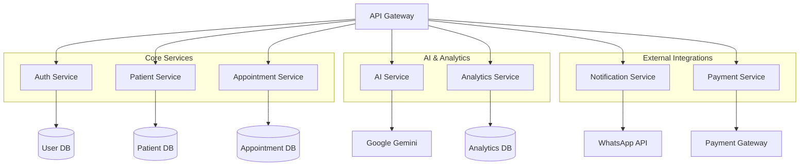

# Arquitetura Técnica FisioFlow
## Especificações Técnicas para Implementação do Plano Executivo

## 1. Arquitetura Geral do Sistema

```mermaid
graph TD
<<<<<<< HEAD
    A[Cliente Web/Mobile] --> B[Load Balancer]
    B --> C[Next.js Frontend]
    C --> D[API Gateway]
    D --> E[Microserviços]
    E --> F[Neon PostgreSQL]
    E --> G[Redis Cache]
    E --> H[File Storage]
    
    subgraph "Frontend Layer"
=======
    A[Cliente Browser] --> B[Cloudflare CDN]
    B --> C[Vercel Edge Network]
    C --> D[Next.js 14 Application]
    D --> E[NextAuth.js]
    D --> F[Neon DB Client]
    F --> G[Neon DB]
    F --> H[NextAuth.js]
    D --> I[Upstash Redis]
    D --> J[Cloudinary API]

    subgraph "Frontend Layer"
        D
        E
    end

    subgraph "Backend Services"
        F
        G
        H
        I
    end

    subgraph "External Services"
        J
    end
```

## 2. Descrição Tecnológica

- **Frontend**: Next.js 14 + React 18 + TypeScript + Tailwind CSS
- **Autenticação**: NextAuth.js 5.0 + Neon DB
- **Database**: Neon DB (PostgreSQL)
- **Cache**: Upstash Redis
- **Storage**: Cloudinary
- **Deploy**: Vercel
- **Monitoramento**: Vercel Analytics + Sentry

## 3. Definições de Rotas

| Rota                      | Propósito                                           |
| ------------------------- | --------------------------------------------------- |
| `/`                       | Página inicial com redirecionamento baseado em auth |
| `/login`                  | Página de autenticação otimizada                    |
| `/dashboard`              | Dashboard principal para terapeutas                 |
| `/pacientes`              | Listagem e gestão de pacientes                      |
| `/pacientes/[id]`         | Detalhes específicos do paciente                    |
| `/agenda`                 | Sistema de agendamento                              |
| `/teleconsulta`           | Interface de teleconsulta                           |
| `/portal`                 | Portal do paciente                                  |
| `/partner`                | Portal do educador físico                           |
| `/api/auth/[...nextauth]` | Endpoints de autenticação                           |
| `/api/pacientes`          | API REST para pacientes                             |
| `/api/appointments`       | API REST para agendamentos                          |

## 4. Definições de API

### 4.1 Autenticação

**POST /api/auth/signin**

Request: | Param | Type | Required | Description | |-------|------|----------|-------------| | email
| string | true | Email do usuário | | password | string | true | Senha do usuário | | csrfToken |
string | true | Token CSRF |

Response: | Param | Type | Description | |-------|------|-------------| | user | User | Dados do
usuário autenticado | | expires | string | Data de expiração da sessão |

Example:

```json
{
  "user": {
    "id": "uuid",
    "name": "Dr. Roberto",
    "email": "roberto@fisioflow.com",
    "role": "Fisioterapeuta"
  },
  "expires": "2024-12-31T23:59:59.999Z"
}
```

### 4.2 Gestão de Pacientes

**GET /api/pacientes**

Query Parameters: | Param | Type | Required | Description |
|-------|------|----------|-------------| | page | number | false | Número da página (default: 1) |
| limit | number | false | Itens por página (default: 10) | | search | string | false | Termo de
busca | | status | string | false | Filtro por status |

Response:

```json
{
  "patients": [
    {
      "id": "uuid",
      "name": "João Silva",
      "email": "joao@email.com",
      "status": "Active",
      "lastVisit": "2024-01-15T10:00:00Z"
    }
  ],
  "pagination": {
    "total": 150,
    "page": 1,
    "limit": 10,
    "totalPages": 15
  }
}
```

**POST /api/pacientes**

Request:

```json
{
  "name": "Maria Santos",
  "email": "maria@email.com",
  "phone": "+5511999999999",
  "cpf": "123.456.789-00",
  "birthDate": "1985-03-15",
  "address": {
    "street": "Rua das Flores, 123",
    "city": "São Paulo",
    "state": "SP",
    "zip": "01234-567"
  }
}
```

### 4.3 Sistema de Agendamentos

**GET /api/appointments**

Query Parameters: | Param | Type | Required | Description |
|-------|------|----------|-------------| | startDate | string | true | Data inicial (ISO) | |
endDate | string | true | Data final (ISO) | | therapistId | string | false | ID do terapeuta | |
patientId | string | false | ID do paciente |

**POST /api/appointments**

Request:

```json
{
  "patientId": "uuid",
  "therapistId": "uuid",
  "startTime": "2024-01-20T14:00:00Z",
  "endTime": "2024-01-20T15:00:00Z",
  "type": "Sessão",
  "observations": "Primeira sessão pós-cirurgia"
}
```

## 5. Arquitetura do Servidor

```mermaid
graph TD
    A[Next.js App Router] --> B[Middleware Layer]
    B --> C[API Routes]
    C --> D[Service Layer]
    D --> E[Repository Layer]
    E --> F[(Neon DB)]

    B --> G[Auth Middleware]
    B --> H[Rate Limiting]
    B --> I[CORS Handler]

    D --> J[Cache Service]
    J --> K[(Redis Cache)]

    subgraph "Application Layer"
        A
        B
>>>>>>> 0a044a4fefabf8a04dc73a6184972379c66221b3
        C
        I[PWA Service Worker]
        J[React Native App]
    end
<<<<<<< HEAD
    
    subgraph "API Layer"
=======

    subgraph "Business Logic"
>>>>>>> 0a044a4fefabf8a04dc73a6184972379c66221b3
        D
        K[Authentication Service]
        L[Patient Service]
        M[Appointment Service]
        N[AI Service]
        O[Analytics Service]
    end

    subgraph "Data Layer"
        F
        G
        H
        P[Backup Storage]
    end
    
    subgraph "External Services"
        Q[Google Gemini AI]
        R[WhatsApp API]
        S[Payment Gateway]
        T[TISS Integration]
    end
```

## 2. Stack Tecnológico Detalhado

### 2.1 Frontend
- **Framework**: Next.js 14 com App Router
- **UI Library**: React 18 + TypeScript
- **Styling**: Tailwind CSS + Shadcn/ui
- **State Management**: Zustand + React Query
- **Forms**: React Hook Form + Zod validation
- **Charts**: Recharts + D3.js
- **Mobile**: React Native + Expo
- **PWA**: Workbox + Service Workers

### 2.2 Backend
- **Runtime**: Node.js 20 LTS
- **Framework**: Next.js API Routes + Express.js
- **Database ORM**: Prisma ORM
- **Authentication**: NextAuth.js + JWT
- **Validation**: Zod schemas
- **File Upload**: Uploadthing
- **Background Jobs**: Bull Queue + Redis
- **WebSockets**: Socket.io

### 2.3 Database & Storage
- **Primary DB**: Neon PostgreSQL (Serverless)
- **Cache**: Redis (Upstash)
- **File Storage**: AWS S3 / Cloudflare R2
- **Search**: PostgreSQL Full-Text Search
- **Analytics**: ClickHouse (opcional)

### 2.4 DevOps & Infrastructure
- **Hosting**: Vercel (Frontend) + Railway (Backend)
- **CDN**: Cloudflare
- **Monitoring**: Sentry + Vercel Analytics
- **CI/CD**: GitHub Actions
- **Container**: Docker
- **Secrets**: Vercel Environment Variables

## 3. Definições de Rotas

### 3.1 Rotas Frontend
| Rota | Propósito | Componente Principal |
|------|-----------|---------------------|
| `/` | Landing page pública | HomePage |
| `/login` | Autenticação de usuários | LoginPage |
| `/dashboard` | Dashboard principal | DashboardPage |
| `/pacientes` | Gestão de pacientes | PatientsPage |
| `/pacientes/[id]` | Detalhes do paciente | PatientDetailPage |
| `/agenda` | Calendário de consultas | AgendaPage |
| `/teleconsulta` | Videochamadas | TeleconsultaPage |
| `/relatorios` | Relatórios e analytics | ReportsPage |
| `/configuracoes` | Configurações do sistema | SettingsPage |
| `/ia-assistente` | Assistente de IA | AIAssistantPage |
| `/financeiro` | Gestão financeira | FinancialPage |

### 3.2 Rotas Mobile (React Native)
| Rota | Propósito | Screen |
|------|-----------|--------|
| `/` | Splash screen | SplashScreen |
| `/auth` | Login/Register | AuthScreen |
| `/home` | Dashboard mobile | HomeScreen |
| `/patients` | Lista de pacientes | PatientsScreen |
| `/appointments` | Agenda mobile | AppointmentsScreen |
| `/profile` | Perfil do usuário | ProfileScreen |

## 4. APIs e Endpoints

### 4.1 Authentication API
```typescript
// Autenticação e autorização
POST /api/auth/login
POST /api/auth/register
POST /api/auth/logout
GET /api/auth/me
POST /api/auth/refresh
POST /api/auth/forgot-password
POST /api/auth/reset-password
```

### 4.2 Patients API
```typescript
// Gestão de pacientes
GET /api/patients
POST /api/patients
GET /api/patients/[id]
PUT /api/patients/[id]
DELETE /api/patients/[id]
GET /api/patients/[id]/history
POST /api/patients/[id]/notes
GET /api/patients/search
```

### 4.3 Appointments API
```typescript
// Gestão de consultas
GET /api/appointments
POST /api/appointments
GET /api/appointments/[id]
PUT /api/appointments/[id]
DELETE /api/appointments/[id]
POST /api/appointments/[id]/reschedule
GET /api/appointments/calendar
POST /api/appointments/bulk-create
```

### 4.4 AI Assistant API
```typescript
// Assistente de IA
POST /api/ai/chat
POST /api/ai/diagnosis-assist
POST /api/ai/treatment-plan
POST /api/ai/exercise-recommendation
GET /api/ai/conversation/[id]
POST /api/ai/analyze-movement
```

### 4.5 Analytics API
```typescript
// Analytics e relatórios
GET /api/analytics/dashboard
GET /api/analytics/patients
GET /api/analytics/appointments
GET /api/analytics/financial
GET /api/analytics/performance
POST /api/analytics/custom-report
```

## 5. Arquitetura de Microserviços



## 6. Modelo de Dados Expandido

### 6.1 Diagrama ER Completo
```mermaid
erDiagram
    USER ||--o{ PATIENT : manages
    USER ||--o{ APPOINTMENT : schedules
<<<<<<< HEAD
    USER ||--o{ CLINIC : belongs_to
    
    PATIENT ||--o{ APPOINTMENT : has
    PATIENT ||--o{ MEDICAL_RECORD : has
    PATIENT ||--o{ TREATMENT_PLAN : follows
    PATIENT ||--o{ PAYMENT : makes
    
    APPOINTMENT ||--o{ SOAP_NOTE : generates
    APPOINTMENT ||--o{ EXERCISE_SESSION : includes
    APPOINTMENT ||--|| TELECONSULTA : can_be
    
    TREATMENT_PLAN ||--o{ EXERCISE : contains
    TREATMENT_PLAN ||--o{ GOAL : has
    
    CLINIC ||--o{ EQUIPMENT : owns
    CLINIC ||--o{ SUBSCRIPTION : has
    
=======
    PATIENT ||--o{ APPOINTMENT : attends
    PATIENT ||--o{ PAIN_POINT : reports
    PATIENT ||--o{ METRIC_RESULT : tracks
    APPOINTMENT ||--o{ SOAP_NOTE : documents
    USER ||--o{ COMMUNICATION_LOG : creates
    PATIENT ||--o{ COMMUNICATION_LOG : receives

>>>>>>> 0a044a4fefabf8a04dc73a6184972379c66221b3
    USER {
        uuid id PK
        string email UK
        string name
        string role
        string specialty
        timestamp created_at
        timestamp updated_at
    }

    PATIENT {
        uuid id PK
        uuid user_id FK
        string name
        date birth_date
        string cpf UK
        string phone
        string address
        json medical_history
        timestamp created_at
        timestamp updated_at
    }

    APPOINTMENT {
        uuid id PK
        uuid patient_id FK
        uuid therapist_id FK
        datetime scheduled_at
        integer duration
        string type
        string status
        decimal price
        json metadata
        timestamp created_at
        timestamp updated_at
    }
    
    MEDICAL_RECORD {
        uuid id PK
        uuid patient_id FK
        string type
        text content
        json attachments
        timestamp created_at
    }
<<<<<<< HEAD
    
    TREATMENT_PLAN {
=======

    PAIN_POINT {
>>>>>>> 0a044a4fefabf8a04dc73a6184972379c66221b3
        uuid id PK
        uuid patient_id FK
        string diagnosis
        text objectives
        integer sessions_planned
        date start_date
        date end_date
        string status
        timestamp created_at
        timestamp updated_at
    }
    
    EXERCISE {
        uuid id PK
        string name
        text description
        string video_url
        string category
        integer difficulty
        json parameters
        timestamp created_at
    }
<<<<<<< HEAD
    
    TELECONSULTA {
=======

    METRIC_RESULT {
        uuid id PK
        uuid patient_id FK
        string metric_name
        float value
        string unit
        timestamp measured_at
    }

    SOAP_NOTE {
>>>>>>> 0a044a4fefabf8a04dc73a6184972379c66221b3
        uuid id PK
        uuid appointment_id FK
        string room_id
        string recording_url
        json participants
        timestamp started_at
        timestamp ended_at
    }
<<<<<<< HEAD
    
    PAYMENT {
=======

    COMMUNICATION_LOG {
>>>>>>> 0a044a4fefabf8a04dc73a6184972379c66221b3
        uuid id PK
        uuid patient_id FK
        uuid appointment_id FK
        decimal amount
        string method
        string status
        string transaction_id
        timestamp created_at
    }
    
    CLINIC {
        uuid id PK
        string name
        string cnpj UK
        string address
        json settings
        timestamp created_at
        timestamp updated_at
    }
    
    SUBSCRIPTION {
        uuid id PK
        uuid clinic_id FK
        string plan
        decimal price
        date start_date
        date end_date
        string status
        timestamp created_at
    }
```

### 6.2 Schemas Prisma Expandidos

```prisma
// Modelo expandido para suporte às novas funcionalidades

model User {
  id            String    @id @default(cuid())
  email         String    @unique
  name          String
  role          Role      @default(THERAPIST)
  specialty     String?
  avatar        String?
  phone         String?
  crm           String?   @unique
  clinicId      String?
  
  // Relacionamentos
  clinic        Clinic?   @relation(fields: [clinicId], references: [id])
  patients      Patient[]
  appointments  Appointment[]
  aiChats       AiChat[]
  
  createdAt     DateTime  @default(now())
  updatedAt     DateTime  @updatedAt
  
  @@map("users")
}

model Patient {
  id              String    @id @default(cuid())
  name            String
  email           String?   @unique
  phone           String
  cpf             String    @unique
  birthDate       DateTime
  gender          Gender
  address         Json?
  emergencyContact Json?
  medicalHistory  Json?
  allergies       String[]
  medications     String[]
  
  // Relacionamentos
  therapistId     String
  therapist       User      @relation(fields: [therapistId], references: [id])
  appointments    Appointment[]
  medicalRecords  MedicalRecord[]
  treatmentPlans  TreatmentPlan[]
  payments        Payment[]
  
  createdAt       DateTime  @default(now())
  updatedAt       DateTime  @updatedAt
  
  @@map("patients")
}

model Appointment {
  id              String    @id @default(cuid())
  patientId       String
  therapistId     String
  scheduledAt     DateTime
  duration        Int       @default(60)
  type            AppointmentType
  status          AppointmentStatus
  price           Decimal?
  notes           String?
  metadata        Json?
  
  // Relacionamentos
  patient         Patient   @relation(fields: [patientId], references: [id])
  therapist       User      @relation(fields: [therapistId], references: [id])
  soapNotes       SoapNote[]
  teleconsulta    Teleconsulta?
  exerciseSessions ExerciseSession[]
  
  createdAt       DateTime  @default(now())
  updatedAt       DateTime  @updatedAt
  
  @@map("appointments")
}

model MedicalRecord {
  id          String    @id @default(cuid())
  patientId   String
  type        RecordType
  title       String
  content     String
  attachments Json?
  
  // Relacionamentos
  patient     Patient   @relation(fields: [patientId], references: [id])
  
  createdAt   DateTime  @default(now())
  
  @@map("medical_records")
}

model TreatmentPlan {
  id              String    @id @default(cuid())
  patientId       String
  diagnosis       String
  objectives      String
  sessionsPlanned Int
  startDate       DateTime
  endDate         DateTime?
  status          PlanStatus
  
  // Relacionamentos
  patient         Patient   @relation(fields: [patientId], references: [id])
  exercises       PlanExercise[]
  goals           Goal[]
  
  createdAt       DateTime  @default(now())
  updatedAt       DateTime  @updatedAt
  
  @@map("treatment_plans")
}

model Exercise {
  id          String    @id @default(cuid())
  name        String
  description String
  videoUrl    String?
  imageUrl    String?
  category    String
  difficulty  Int       @default(1)
  parameters  Json?
  
  // Relacionamentos
  planExercises PlanExercise[]
  
  createdAt   DateTime  @default(now())
  updatedAt   DateTime  @updatedAt
  
  @@map("exercises")
}

model PlanExercise {
  id            String    @id @default(cuid())
  planId        String
  exerciseId    String
  sets          Int
  reps          Int
  duration      Int?
  notes         String?
  
  // Relacionamentos
  plan          TreatmentPlan @relation(fields: [planId], references: [id])
  exercise      Exercise  @relation(fields: [exerciseId], references: [id])
  
  @@unique([planId, exerciseId])
  @@map("plan_exercises")
}

model Teleconsulta {
  id            String    @id @default(cuid())
  appointmentId String    @unique
  roomId        String    @unique
  recordingUrl  String?
  participants  Json?
  startedAt     DateTime?
  endedAt       DateTime?
  
  // Relacionamentos
  appointment   Appointment @relation(fields: [appointmentId], references: [id])
  
  createdAt     DateTime  @default(now())
  
  @@map("teleconsultas")
}

<<<<<<< HEAD
model AiChat {
  id        String    @id @default(cuid())
  userId    String
  messages  Json
  context   String?
  
  // Relacionamentos
  user      User      @relation(fields: [userId], references: [id])
  
  createdAt DateTime  @default(now())
  updatedAt DateTime  @updatedAt
  
  @@map("ai_chats")
}
=======
-- Políticas de acesso
CREATE POLICY "Users can view their own data" ON patients
    FOR SELECT USING (auth.uid()::text = id::text OR
                     EXISTS (SELECT 1 FROM users WHERE id = auth.uid() AND role IN ('Admin', 'Fisioterapeuta')));
>>>>>>> 0a044a4fefabf8a04dc73a6184972379c66221b3

model Payment {
  id            String    @id @default(cuid())
  patientId     String
  appointmentId String?
  amount        Decimal
  method        PaymentMethod
  status        PaymentStatus
  transactionId String?
  metadata      Json?
  
  // Relacionamentos
  patient       Patient   @relation(fields: [patientId], references: [id])
  
  createdAt     DateTime  @default(now())
  updatedAt     DateTime  @updatedAt
  
  @@map("payments")
}

model Clinic {
  id          String    @id @default(cuid())
  name        String
  cnpj        String    @unique
  address     Json
  phone       String
  email       String
  settings    Json?
  
  // Relacionamentos
  users       User[]
  subscription Subscription?
  
  createdAt   DateTime  @default(now())
  updatedAt   DateTime  @updatedAt
  
  @@map("clinics")
}

model Subscription {
  id        String    @id @default(cuid())
  clinicId  String    @unique
  plan      PlanType
  price     Decimal
  startDate DateTime
  endDate   DateTime
  status    SubscriptionStatus
  
  // Relacionamentos
  clinic    Clinic    @relation(fields: [clinicId], references: [id])
  
  createdAt DateTime  @default(now())
  updatedAt DateTime  @updatedAt
  
  @@map("subscriptions")
}

// Enums
enum Role {
  ADMIN
  THERAPIST
  RECEPTIONIST
}

enum Gender {
  MALE
  FEMALE
  OTHER
}

enum AppointmentType {
  CONSULTATION
  THERAPY
  EVALUATION
  TELECONSULTA
}

enum AppointmentStatus {
  SCHEDULED
  CONFIRMED
  IN_PROGRESS
  COMPLETED
  CANCELLED
  NO_SHOW
}

enum RecordType {
  ANAMNESIS
  EVOLUTION
  EXAM
  PRESCRIPTION
  DISCHARGE
}

enum PlanStatus {
  ACTIVE
  COMPLETED
  SUSPENDED
  CANCELLED
}

enum PaymentMethod {
  CASH
  CARD
  PIX
  BANK_TRANSFER
  INSURANCE
}

enum PaymentStatus {
  PENDING
  PAID
  CANCELLED
  REFUNDED
}

enum PlanType {
  BASIC
  PROFESSIONAL
  ENTERPRISE
}

enum SubscriptionStatus {
  ACTIVE
  CANCELLED
  EXPIRED
  SUSPENDED
}
```

## 7. Implementação de Funcionalidades Premium

### 7.1 Teleconsulta com WebRTC
```typescript
<<<<<<< HEAD
// hooks/useTeleconsulta.ts
export const useTeleconsulta = () => {
  const [localStream, setLocalStream] = useState<MediaStream | null>(null)
  const [remoteStream, setRemoteStream] = useState<MediaStream | null>(null)
  const [peerConnection, setPeerConnection] = useState<RTCPeerConnection | null>(null)
  
  const startCall = async (roomId: string) => {
    const stream = await navigator.mediaDevices.getUserMedia({
      video: true,
      audio: true
    })
    setLocalStream(stream)
    
    const pc = new RTCPeerConnection({
      iceServers: [{ urls: 'stun:stun.l.google.com:19302' }]
    })
    
    stream.getTracks().forEach(track => {
      pc.addTrack(track, stream)
    })
    
    setPeerConnection(pc)
  }
  
  return { localStream, remoteStream, startCall }
}
=======
// middleware.ts
import { withAuth } from 'next-auth/middleware';
import { NextResponse } from 'next/server';
import type { NextRequest } from 'next/server';

export default withAuth(
  function middleware(req: NextRequest) {
    // Rate limiting
    const ip = req.ip ?? '127.0.0.1';
    const rateLimitKey = `rate_limit:${ip}`;

    // CSRF protection
    if (req.method === 'POST') {
      const csrfToken = req.headers.get('x-csrf-token');
      if (!csrfToken) {
        return new NextResponse('CSRF token missing', { status: 403 });
      }
    }

    return NextResponse.next();
  },
  {
    callbacks: {
      authorized: ({ token, req }) => {
        // Verificar se o usuário tem permissão para acessar a rota
        const { pathname } = req.nextUrl;

        if (pathname.startsWith('/admin')) {
          return token?.role === 'Admin';
        }

        if (pathname.startsWith('/portal')) {
          return token?.role === 'Paciente';
        }

        if (pathname.startsWith('/partner')) {
          return token?.role === 'EducadorFisico';
        }

        return !!token;
      },
    },
  }
);

export const config = {
  matcher: [
    '/dashboard/:path*',
    '/pacientes/:path*',
    '/agenda/:path*',
    '/admin/:path*',
    '/portal/:path*',
    '/partner/:path*',
    '/api/pacientes/:path*',
    '/api/appointments/:path*',
  ],
};
>>>>>>> 0a044a4fefabf8a04dc73a6184972379c66221b3
```

### 7.2 IA Assistente Avançada
```typescript
<<<<<<< HEAD
// services/aiService.ts
export class AIService {
  async diagnosisAssist(symptoms: string[], patientHistory: any) {
    const response = await fetch('/api/ai/diagnosis-assist', {
      method: 'POST',
      headers: { 'Content-Type': 'application/json' },
      body: JSON.stringify({ symptoms, patientHistory })
    })
    return response.json()
  }
  
  async generateTreatmentPlan(diagnosis: string, patientProfile: any) {
    const response = await fetch('/api/ai/treatment-plan', {
      method: 'POST',
      headers: { 'Content-Type': 'application/json' },
      body: JSON.stringify({ diagnosis, patientProfile })
    })
    return response.json()
  }
  
  async analyzeMovement(videoFile: File) {
    const formData = new FormData()
    formData.append('video', videoFile)
    
    const response = await fetch('/api/ai/analyze-movement', {
      method: 'POST',
      body: formData
    })
    return response.json()
  }
}
```

### 7.3 Sistema de Notificações
```typescript
// services/notificationService.ts
export class NotificationService {
  async sendWhatsAppReminder(patientPhone: string, appointmentData: any) {
    return fetch('/api/notifications/whatsapp', {
      method: 'POST',
      headers: { 'Content-Type': 'application/json' },
      body: JSON.stringify({
        to: patientPhone,
        template: 'appointment_reminder',
        data: appointmentData
      })
    })
  }
  
  async sendPushNotification(userId: string, message: string) {
    return fetch('/api/notifications/push', {
      method: 'POST',
      headers: { 'Content-Type': 'application/json' },
      body: JSON.stringify({ userId, message })
    })
  }
}
```

## 8. Performance e Otimização

### 8.1 Estratégias de Cache
```typescript
// utils/cache.ts
export class CacheManager {
  private redis = new Redis(process.env.REDIS_URL!)
  
  async get<T>(key: string): Promise<T | null> {
    const cached = await this.redis.get(key)
    return cached ? JSON.parse(cached) : null
  }
  
  async set(key: string, value: any, ttl = 3600) {
    await this.redis.setex(key, ttl, JSON.stringify(value))
  }
  
  async invalidate(pattern: string) {
    const keys = await this.redis.keys(pattern)
    if (keys.length > 0) {
      await this.redis.del(...keys)
    }
  }
}
```

### 8.2 Otimização de Queries
```typescript
// utils/database.ts
export const optimizedQueries = {
  getPatientWithAppointments: (patientId: string) => {
    return prisma.patient.findUnique({
      where: { id: patientId },
      include: {
        appointments: {
          orderBy: { scheduledAt: 'desc' },
          take: 10,
          include: {
            soapNotes: true
          }
        },
        treatmentPlans: {
          where: { status: 'ACTIVE' },
          include: {
            exercises: {
              include: {
                exercise: true
              }
            }
          }
        }
      }
    })
  }
}
```

## 9. Segurança e Compliance

### 9.1 Middleware de Segurança
```typescript
// middleware/security.ts
export const securityMiddleware = {
  rateLimit: rateLimit({
    windowMs: 15 * 60 * 1000, // 15 minutes
    max: 100 // limit each IP to 100 requests per windowMs
  }),
  
  validateJWT: (req: Request, res: Response, next: NextFunction) => {
    const token = req.headers.authorization?.split(' ')[1]
    if (!token) {
      return res.status(401).json({ error: 'Token required' })
    }
    
    try {
      const decoded = jwt.verify(token, process.env.JWT_SECRET!)
      req.user = decoded
      next()
    } catch (error) {
      return res.status(401).json({ error: 'Invalid token' })
    }
  },
  
  auditLog: (action: string) => {
    return (req: Request, res: Response, next: NextFunction) => {
      // Log da ação para auditoria
      console.log(`[AUDIT] ${action} by user ${req.user?.id} at ${new Date()}`)
      next()
    }
  }
}
```

### 9.2 Criptografia de Dados Sensíveis
```typescript
// utils/encryption.ts
import crypto from 'crypto'

export class EncryptionService {
  private algorithm = 'aes-256-gcm'
  private key = Buffer.from(process.env.ENCRYPTION_KEY!, 'hex')
  
  encrypt(text: string): string {
    const iv = crypto.randomBytes(16)
    const cipher = crypto.createCipher(this.algorithm, this.key)
    cipher.setAAD(Buffer.from('fisioflow', 'utf8'))
    
    let encrypted = cipher.update(text, 'utf8', 'hex')
    encrypted += cipher.final('hex')
    
    const authTag = cipher.getAuthTag()
    return iv.toString('hex') + ':' + authTag.toString('hex') + ':' + encrypted
  }
  
  decrypt(encryptedData: string): string {
    const parts = encryptedData.split(':')
    const iv = Buffer.from(parts[0], 'hex')
    const authTag = Buffer.from(parts[1], 'hex')
    const encrypted = parts[2]
    
    const decipher = crypto.createDecipher(this.algorithm, this.key)
    decipher.setAAD(Buffer.from('fisioflow', 'utf8'))
    decipher.setAuthTag(authTag)
    
    let decrypted = decipher.update(encrypted, 'hex', 'utf8')
    decrypted += decipher.final('utf8')
    
    return decrypted
  }
}
```

## 10. Monitoramento e Observabilidade

### 10.1 Métricas Customizadas
```typescript
// utils/metrics.ts
export class MetricsCollector {
  private metrics = new Map<string, number>()
  
  increment(metric: string, value = 1) {
    const current = this.metrics.get(metric) || 0
    this.metrics.set(metric, current + value)
  }
  
  gauge(metric: string, value: number) {
    this.metrics.set(metric, value)
  }
  
  async flush() {
    // Enviar métricas para serviço de monitoramento
    const data = Object.fromEntries(this.metrics)
    await fetch(process.env.METRICS_ENDPOINT!, {
      method: 'POST',
      headers: { 'Content-Type': 'application/json' },
      body: JSON.stringify(data)
    })
    this.metrics.clear()
  }
}
```

---

**Esta arquitetura técnica fornece a base sólida para implementar todas as funcionalidades do plano executivo, garantindo escalabilidade, segurança e performance.**
=======
// app/api/auth/[...nextauth]/route.ts
import NextAuth from 'next-auth';
import CredentialsProvider from 'next-auth/providers/credentials';
import { Pool } from 'pg';
import bcrypt from 'bcryptjs';

const pool = new Pool({
  connectionString: process.env.DATABASE_URL!,
  ssl: { rejectUnauthorized: false },
});

const handler = NextAuth({
  providers: [
    CredentialsProvider({
      name: 'credentials',
      credentials: {
        email: { label: 'Email', type: 'email' },
        password: { label: 'Password', type: 'password' },
      },
      async authorize(credentials) {
        if (!credentials?.email || !credentials?.password) {
          return null;
        }

        const result = await pool.query('SELECT * FROM users WHERE email = $1', [
          credentials.email,
        ]);
        const user = result.rows[0];

        if (!user || !user.password_hash) {
          return null;
        }

        const isValidPassword = await bcrypt.compare(credentials.password, user.password_hash);

        if (!isValidPassword) {
          return null;
        }

        return {
          id: user.id,
          email: user.email,
          name: user.name,
          role: user.role,
          avatarUrl: user.avatar_url,
        };
      },
    }),
  ],
  session: {
    strategy: 'jwt',
    maxAge: 24 * 60 * 60, // 24 horas
  },
  callbacks: {
    async jwt({ token, user }) {
      if (user) {
        token.role = user.role;
        token.avatarUrl = user.avatarUrl;
      }
      return token;
    },
    async session({ session, token }) {
      session.user.id = token.sub!;
      session.user.role = token.role as string;
      session.user.avatarUrl = token.avatarUrl as string;
      return session;
    },
  },
  pages: {
    signIn: '/login',
    error: '/login',
  },
});

export { handler as GET, handler as POST };
```

Esta arquitetura técnica fornece uma base sólida e escalável para o sistema FisioFlow, com foco em
performance, segurança e manutenibilidade.
>>>>>>> 0a044a4fefabf8a04dc73a6184972379c66221b3
