# Arquitetura Técnica FisioFlow - Neon DB

## 1. Arquitetura de Sistema

### 1.1 Diagrama de Arquitetura Geral


### 1.2 Arquitetura de Dados

```mermaid
erDiagram
    PACIENTES {
        uuid id PK
        varchar nome
        varchar email UK
        varchar telefone
        date data_nascimento
        varchar cpf UK
        text endereco
        varchar status
        uuid fisioterapeuta_id FK
        timestamp created_at
        timestamp updated_at
    }

    FISIOTERAPEUTAS {
        uuid id PK
        varchar nome
        varchar email UK
        varchar crefito
        varchar especialidade
        varchar telefone
        varchar status
        timestamp created_at
        timestamp updated_at
    }

    CONSULTAS {
        uuid id PK
        uuid paciente_id FK
        uuid fisioterapeuta_id FK
        timestamp data_consulta
        integer duracao_minutos
        varchar status
        text observacoes
        decimal valor
        varchar tipo_consulta
        timestamp created_at
        timestamp updated_at
    }

    PRONTUARIOS {
        uuid id PK
        uuid paciente_id FK
        uuid consulta_id FK
        text anamnese
        text diagnostico
        text plano_tratamento
        text evolucao
        json dados_vitais
        timestamp created_at
        timestamp updated_at
    }

    EXERCICIOS {
        uuid id PK
        varchar nome
        text descricao
        varchar categoria
        varchar nivel_dificuldade
        integer duracao_segundos
        json instrucoes
        varchar video_url
        varchar imagem_url
        timestamp created_at
        timestamp updated_at
    }

    PRESCRICOES_EXERCICIOS {
        uuid id PK
        uuid paciente_id FK
        uuid exercicio_id FK
        uuid fisioterapeuta_id FK
        integer series
        integer repeticoes
        integer duracao_segundos
        text observacoes
        varchar status
        timestamp data_prescricao
        timestamp data_inicio
        timestamp data_fim
        timestamp created_at
        timestamp updated_at
    }

    EXECUCOES_EXERCICIOS {
        uuid id PK
        uuid prescricao_id FK
        uuid paciente_id FK
        timestamp data_execucao
        integer series_realizadas
        integer repeticoes_realizadas
        integer duracao_realizada
        integer nivel_dor
        text observacoes_paciente
        json dados_sensores
        timestamp created_at
    }

    AGENDAMENTOS {
        uuid id PK
        uuid paciente_id FK
        uuid fisioterapeuta_id FK
        timestamp data_hora
        integer duracao_minutos
        varchar tipo_consulta
        varchar status
        text observacoes
        varchar canal_comunicacao
        timestamp created_at
        timestamp updated_at
    }

    PAGAMENTOS {
        uuid id PK
        uuid consulta_id FK
        uuid paciente_id FK
        decimal valor
        varchar metodo_pagamento
        varchar status
        varchar gateway_transacao_id
        timestamp data_pagamento
        timestamp data_vencimento
        text observacoes
        timestamp created_at
        timestamp updated_at
    }

    AUDIT_LOGS {
        uuid id PK
        varchar tabela
        varchar operacao
        uuid registro_id
        uuid usuario_id
        json dados_anteriores
        json dados_novos
        varchar ip_address
        varchar user_agent
        timestamp created_at
    }

    PACIENTES ||--o{ CONSULTAS : "tem"
    FISIOTERAPEUTAS ||--o{ CONSULTAS : "realiza"
    FISIOTERAPEUTAS ||--o{ PACIENTES : "atende"
    CONSULTAS ||--o{ PRONTUARIOS : "gera"
    PACIENTES ||--o{ PRONTUARIOS : "possui"
    EXERCICIOS ||--o{ PRESCRICOES_EXERCICIOS : "é prescrito"
    PACIENTES ||--o{ PRESCRICOES_EXERCICIOS : "recebe"
    FISIOTERAPEUTAS ||--o{ PRESCRICOES_EXERCICIOS : "prescreve"
    PRESCRICOES_EXERCICIOS ||--o{ EXECUCOES_EXERCICIOS : "é executado"
    PACIENTES ||--o{ EXECUCOES_EXERCICIOS : "executa"
    PACIENTES ||--o{ AGENDAMENTOS : "agenda"
    FISIOTERAPEUTAS ||--o{ AGENDAMENTOS : "atende"
    CONSULTAS ||--o{ PAGAMENTOS : "gera"
    PACIENTES ||--o{ PAGAMENTOS : "efetua"
```



## 2. Configuração Técnica

### 2.1 Schema Prisma Otimizado para Neon

```prisma
// prisma/schema.prisma
generator client {
  provider = "prisma-client-js"
  previewFeatures = ["postgresqlExtensions", "views", "multiSchema", "relationJoins"]
}

datasource db {
  provider = "postgresql"
  url = env("NEON_DATABASE_URL")
  directUrl = env("NEON_DIRECT_URL")
  extensions = [uuid_ossp, pg_trgm, btree_gin, pg_stat_statements]
  schemas = ["public", "analytics", "audit"]
}

// Configuração de particionamento
model Consultas {
  id                String   @id @default(dbgenerated("gen_random_uuid()")) @db.Uuid
  pacienteId        String   @db.Uuid
  fisioterapeutaId  String   @db.Uuid
  dataConsulta      DateTime @db.Timestamptz
  duracaoMinutos    Int
  status            String   @db.VarChar(20)
  observacoes       String?  @db.Text
  valor             Decimal? @db.Decimal(10, 2)
  tipoConsulta      String   @db.VarChar(50)
  createdAt         DateTime @default(now()) @db.Timestamptz
  updatedAt         DateTime @updatedAt @db.Timestamptz

  paciente          Pacientes @relation(fields: [pacienteId], references: [id])
  fisioterapeuta    Fisioterapeutas @relation(fields: [fisioterapeutaId], references: [id])
  prontuarios       Prontuarios[]
  pagamentos        Pagamentos[]

  @@index([pacienteId, dataConsulta(sort: Desc)])
  @@index([fisioterapeutaId])
  @@index([status, createdAt(sort: Desc)])
  @@index([email]) // Para busca rápida por email
  @@map("pacientes")
}

model Fisioterapeutas {
  id            String   @id @default(dbgenerated("gen_random_uuid()")) @db.Uuid
  nome          String   @db.VarChar(255)
  email         String   @unique @db.VarChar(255)
  crefito       String   @unique @db.VarChar(20)
  especialidade String?  @db.VarChar(100)
  telefone      String?  @db.VarChar(20)
  status        String   @default("ativo") @db.VarChar(20)
  createdAt     DateTime @default(now()) @db.Timestamptz
  updatedAt     DateTime @updatedAt @db.Timestamptz

  pacientes     Pacientes[]
  consultas     Consultas[]
  prescricoes   PrescricoesExercicios[]
  agendamentos  Agendamentos[]

  @@index([status])
  @@index([especialidade])
  @@map("fisioterapeutas")
}

// View para analytics
view ConsultasAnalytics {
  mes               String
  ano               Int
  totalConsultas    Int
  receitaTotal      Decimal
  fisioterapeutaId  String

  @@map("vw_consultas_analytics")
  @@schema("analytics")
}
```

### 2.2 Configuração de Connection Pool

```typescript
// lib/neon-config.ts
import { Pool } from '@neondatabase/serverless';
import { PrismaNeon } from '@prisma/adapter-neon';
import { PrismaClient } from '@prisma/client';

// Configuração otimizada para Neon
const neonConfig = {
  connectionString: process.env.NEON_DATABASE_URL!,
  max: parseInt(process.env.DATABASE_POOL_SIZE || '20'),
  idleTimeoutMillis: parseInt(process.env.DATABASE_POOL_IDLE_TIMEOUT || '600000'),
  connectionTimeoutMillis: parseInt(process.env.DATABASE_POOL_TIMEOUT || '30000'),
  allowExitOnIdle: true,
  ssl: {
    rejectUnauthorized: false,
  },
};

const pool = new Pool(neonConfig);
const adapter = new PrismaNeon(pool);

// Cliente Prisma global
const globalForPrisma = globalThis as unknown as {
  prisma: PrismaClient | undefined;
};

export const prisma =
  globalForPrisma.prisma ??
  new PrismaClient({
    adapter,
    log: process.env.NODE_ENV === 'development' ? ['query', 'error', 'warn'] : ['error'],
    errorFormat: 'pretty',
  });

if (process.env.NODE_ENV !== 'production') globalForPrisma.prisma = prisma;

// Health check específico para Neon
export async function checkNeonHealth() {
  try {
    const start = Date.now();
    await prisma.$queryRaw`SELECT 1`;
    const latency = Date.now() - start;

    const stats = await prisma.$queryRaw`
      SELECT 
        (SELECT count(*) FROM pg_stat_activity WHERE state = 'active') as active_connections,
        (SELECT count(*) FROM pg_stat_activity) as total_connections,
        pg_database_size(current_database()) as database_size
    `;

    return {
      status: 'healthy',
      latency,
      connections: stats[0],
      timestamp: new Date(),
    };
  } catch (error) {
    return {
      status: 'unhealthy',
      error: error.message,
      timestamp: new Date(),
    };
  }
}
```

### 2.3 Configuração de Segurança

```sql
-- Configuração de Row Level Security
-- Aplicar RLS em todas as tabelas principais
ALTER TABLE pacientes ENABLE ROW LEVEL SECURITY;
ALTER TABLE consultas ENABLE ROW LEVEL SECURITY;
ALTER TABLE prontuarios ENABLE ROW LEVEL SECURITY;
ALTER TABLE prescricoes_exercicios ENABLE ROW LEVEL SECURITY;
ALTER TABLE execucoes_exercicios ENABLE ROW LEVEL SECURITY;
ALTER TABLE agendamentos ENABLE ROW LEVEL SECURITY;
ALTER TABLE pagamentos ENABLE ROW LEVEL SECURITY;

-- Políticas para Fisioterapeutas
CREATE POLICY "fisioterapeutas_podem_ver_seus_pacientes" ON pacientes
    FOR ALL USING (fisioterapeuta_id = auth.uid());

CREATE POLICY "fisioterapeutas_podem_ver_suas_consultas" ON consultas
    FOR ALL USING (fisioterapeuta_id = auth.uid());

-- Políticas para Pacientes
CREATE POLICY "pacientes_podem_ver_seus_dados" ON pacientes
    FOR SELECT USING (id = auth.uid());

CREATE POLICY "pacientes_podem_ver_suas_consultas" ON consultas
    FOR SELECT USING (paciente_id = auth.uid());

-- Política de auditoria (somente leitura)
CREATE POLICY "audit_logs_readonly" ON audit_logs
    FOR SELECT USING (true);

-- Função para auditoria automática
CREATE OR REPLACE FUNCTION audit_trigger_function()
RETURNS TRIGGER AS $$
BEGIN
    IF TG_OP = 'INSERT' THEN
        INSERT INTO audit_logs (tabela, operacao, registro_id, usuario_id, dados_novos, ip_address)
        VALUES (TG_TABLE_NAME, TG_OP, NEW.id, auth.uid(), to_jsonb(NEW), inet_client_addr());
        RETURN NEW;
    ELSIF TG_OP = 'UPDATE' THEN
        INSERT INTO audit_logs (tabela, operacao, registro_id, usuario_id, dados_anteriores, dados_novos, ip_address)
        VALUES (TG_TABLE_NAME, TG_OP, NEW.id, auth.uid(), to_jsonb(OLD), to_jsonb(NEW), inet_client_addr());
        RETURN NEW;
    ELSIF TG_OP = 'DELETE' THEN
        INSERT INTO audit_logs (tabela, operacao, registro_id, usuario_id, dados_anteriores, ip_address)
        VALUES (TG_TABLE_NAME, TG_OP, OLD.id, auth.uid(), to_jsonb(OLD), inet_client_addr());
        RETURN OLD;
    END IF;
    RETURN NULL;
END;
$$ LANGUAGE plpgsql;

-- Aplicar triggers de auditoria
CREATE TRIGGER audit_pacientes
    AFTER INSERT OR UPDATE OR DELETE ON pacientes
    FOR EACH ROW EXECUTE FUNCTION audit_trigger_function();

CREATE TRIGGER audit_consultas
    AFTER INSERT OR UPDATE OR DELETE ON consultas
    FOR EACH ROW EXECUTE FUNCTION audit_trigger_function();
```

## 3. APIs e Endpoints

### 3.1 API de Gerenciamento Neon

```typescript
// app/api/neon/management/route.ts
import { NextRequest, NextResponse } from 'next/server';

const NEON_API_BASE = 'https://console.neon.tech/api/v2';
const headers = {
  Authorization: `Bearer ${process.env.NEON_API_KEY}`,
  'Content-Type': 'application/json',
};

// Criar branch
export async function POST(request: NextRequest) {
  try {
    const { name, purpose, parentBranchId } = await request.json();

    const computeUnits =
      {
        production: 2,
        staging: 1,
        development: 0.25,
        testing: 0.25,
      }[purpose] || 0.25;

    const response = await fetch(
      `${NEON_API_BASE}/projects/${process.env.NEON_PROJECT_ID}/branches`,
      {
        method: 'POST',
        headers,
        body: JSON.stringify({
          name,
          parent_id: parentBranchId || process.env.NEON_MAIN_BRANCH_ID,
          compute_units: computeUnits,
          auto_suspend_delay_seconds: purpose === 'production' ? 300 : 60,
        }),
      }
    );

    const branch = await response.json();

    return NextResponse.json({
      success: true,
      branch: {
        id: branch.id,
        name: branch.name,
        connectionString: branch.connection_string,
        computeUnits: branch.compute_units,
        createdAt: branch.created_at,
      },
    });
  } catch (error) {
    return NextResponse.json({ success: false, error: error.message }, { status: 500 });
  }
}

// Listar branches
export async function GET() {
  try {
    const response = await fetch(
      `${NEON_API_BASE}/projects/${process.env.NEON_PROJECT_ID}/branches`,
      { headers }
    );

    const data = await response.json();

    return NextResponse.json({
      branches: data.branches.map(branch => ({
        id: branch.id,
        name: branch.name,
        parentId: branch.parent_id,
        computeUnits: branch.compute_units,
        status: branch.status,
        createdAt: branch.created_at,
      })),
    });
  } catch (error) {
    return NextResponse.json({ error: error.message }, { status: 500 });
  }
}
```

### 3.2 API de Métricas e Monitoramento

```typescript
// app/api/neon/metrics/route.ts
import { prisma } from '@/lib/neon-config';

export async function GET() {
  try {
    const [dbMetrics, connectionMetrics, performanceMetrics] = await Promise.all([
      getDatabaseMetrics(),
      getConnectionMetrics(),
      getPerformanceMetrics(),
    ]);

    return NextResponse.json({
      database: dbMetrics,
      connections: connectionMetrics,
      performance: performanceMetrics,
      timestamp: new Date().toISOString(),
    });
  } catch (error) {
    return NextResponse.json({ error: error.message }, { status: 500 });
  }
}

async function getDatabaseMetrics() {
  const result = await prisma.$queryRaw`
    SELECT 
      pg_database_size(current_database()) as size_bytes,
      (SELECT count(*) FROM information_schema.tables WHERE table_schema = 'public') as table_count,
      (SELECT count(*) FROM pg_stat_user_indexes) as index_count
  `;

  return result[0];
}

async function getConnectionMetrics() {
  const result = await prisma.$queryRaw`
    SELECT 
      count(*) as total_connections,
      count(*) FILTER (WHERE state = 'active') as active_connections,
      count(*) FILTER (WHERE state = 'idle') as idle_connections,
      max(extract(epoch from (now() - state_change))) as max_connection_age
    FROM pg_stat_activity 
    WHERE pid <> pg_backend_pid()
  `;

  return result[0];
}

async function getPerformanceMetrics() {
  const result = await prisma.$queryRaw`
    SELECT 
      (SELECT sum(calls) FROM pg_stat_statements) as total_queries,
      (SELECT avg(mean_exec_time) FROM pg_stat_statements) as avg_query_time,
      (SELECT max(max_exec_time) FROM pg_stat_statements) as max_query_time,
      (SELECT sum(shared_blks_hit) / (sum(shared_blks_hit) + sum(shared_blks_read)) * 100 
       FROM pg_stat_statements) as cache_hit_ratio
  `;

  return result[0];
}
```

## 4. Monitoramento e Observabilidade

### 4.1 Dashboard de Métricas

```typescript
// lib/monitoring/neon-dashboard.ts
interface NeonDashboardMetrics {
  computeUnits: number;
  storageUsed: number;
  activeConnections: number;
  queryLatency: number;
  cacheHitRatio: number;
  errorRate: number;
}

class NeonDashboard {
  async getMetrics(): Promise<NeonDashboardMetrics> {
    const [compute, storage, connections, performance] = await Promise.all([
      this.getComputeMetrics(),
      this.getStorageMetrics(),
      this.getConnectionMetrics(),
      this.getPerformanceMetrics(),
    ]);

    return {
      computeUnits: compute.current_cu,
      storageUsed: storage.used_bytes,
      activeConnections: connections.active,
      queryLatency: performance.avg_latency,
      cacheHitRatio: performance.cache_hit_ratio,
      errorRate: performance.error_rate,
    };
  }

  async getSlowQueries(limit: number = 10) {
    return await prisma.$queryRaw`
      SELECT 
        query,
        calls,
        mean_exec_time,
        max_exec_time,
        total_exec_time,
        rows,
        100.0 * shared_blks_hit / nullif(shared_blks_hit + shared_blks_read, 0) AS hit_percent
      FROM pg_stat_statements 
      WHERE query NOT LIKE '%pg_stat_statements%'
      ORDER BY mean_exec_time DESC 
      LIMIT ${limit}
    `;
  }

  async getTableStats() {
    return await prisma.$queryRaw`
      SELECT 
        schemaname,
        tablename,
        n_tup_ins as inserts,
        n_tup_upd as updates,
        n_tup_del as deletes,
        n_live_tup as live_tuples,
        n_dead_tup as dead_tuples,
        last_vacuum,
        last_autovacuum,
        last_analyze,
        last_autoanalyze
      FROM pg_stat_user_tables
      ORDER BY n_live_tup DESC
    `;
  }
}
```

### 4.2 Alertas e Notificações

```typescript
// lib/monitoring/neon-alerts.ts
interface AlertRule {
  name: string;
  metric: string;
  threshold: number;
  operator: '>' | '<' | '>=' | '<=' | '=';
  severity: 'low' | 'medium' | 'high' | 'critical';
  cooldownMinutes: number;
}

class NeonAlertManager {
  private rules: AlertRule[] = [
    {
      name: 'High Connection Count',
      metric: 'activeConnections',
      threshold: 80,
      operator: '>',
      severity: 'high',
      cooldownMinutes: 5,
    },
    {
      name: 'High Query Latency',
      metric: 'queryLatency',
      threshold: 1000,
      operator: '>',
      severity: 'medium',
      cooldownMinutes: 10,
    },
    {
      name: 'Low Cache Hit Ratio',
      metric: 'cacheHitRatio',
      threshold: 90,
      operator: '<',
      severity: 'medium',
      cooldownMinutes: 15,
    },
    {
      name: 'High Error Rate',
      metric: 'errorRate',
      threshold: 5,
      operator: '>',
      severity: 'critical',
      cooldownMinutes: 2,
    },
  ];

  async checkAlerts() {
    const metrics = await new NeonDashboard().getMetrics();
    const triggeredAlerts = [];

    for (const rule of this.rules) {
      if (this.isInCooldown(rule)) continue;

      const value = metrics[rule.metric];
      const triggered = this.evaluateRule(value, rule);

      if (triggered) {
        triggeredAlerts.push({
          rule,
          value,
          timestamp: new Date(),
        });

        await this.sendAlert(rule, value);
        this.setCooldown(rule);
      }
    }

    return triggeredAlerts;
  }

  private async sendAlert(rule: AlertRule, value: number) {
    const message =
      `🚨 Alert: ${rule.name}\n` +
      `Metric: ${rule.metric}\n` +
      `Current Value: ${value}\n` +
      `Threshold: ${rule.operator} ${rule.threshold}\n` +
      `Severity: ${rule.severity.toUpperCase()}`;

    // Enviar para Slack, Discord, email, etc.
    await this.sendToSlack(message);
    await this.sendEmail(rule, value);
  }
}
```

## 5. Deployment e CI/CD

### 5.1 Configuração de Deploy

```yaml
# .github/workflows/deploy-neon.yml
name: Deploy to Neon DB

on:
  push:
    branches: [main, staging, development]
  pull_request:
    branches: [main]

env:
  NEON_PROJECT_ID: ${{ secrets.NEON_PROJECT_ID }}
  NEON_API_KEY: ${{ secrets.NEON_API_KEY }}

jobs:
  deploy:
    runs-on: ubuntu-latest

    strategy:
      matrix:
        environment: [development, staging, production]

    steps:
      - name: Checkout code
        uses: actions/checkout@v4

      - name: Setup Node.js
        uses: actions/setup-node@v4
        with:
          node-version: '20'
          cache: 'npm'

      - name: Install dependencies
        run: npm ci

      - name: Create Neon Branch
        id: create-branch
        run: |
          BRANCH_NAME="deploy-$(date +%Y%m%d-%H%M%S)"
          RESPONSE=$(curl -s -X POST \
            "https://console.neon.tech/api/v2/projects/$NEON_PROJECT_ID/branches" \
            -H "Authorization: Bearer $NEON_API_KEY" \
            -H "Content-Type: application/json" \
            -d "{
              \"name\": \"$BRANCH_NAME\",
              \"parent_id\": \"${{ secrets.NEON_MAIN_BRANCH_ID }}\"
            }")

          BRANCH_ID=$(echo $RESPONSE | jq -r '.id')
          CONNECTION_STRING=$(echo $RESPONSE | jq -r '.connection_string')

          echo "branch_id=$BRANCH_ID" >> $GITHUB_OUTPUT
          echo "connection_string=$CONNECTION_STRING" >> $GITHUB_OUTPUT

      - name: Run Database Migrations
        env:
          DATABASE_URL: ${{ steps.create-branch.outputs.connection_string }}
        run: |
          npx prisma migrate deploy
          npx prisma generate

      - name: Run Tests
        env:
          DATABASE_URL: ${{ steps.create-branch.outputs.connection_string }}
        run: |
          npm run test:integration
          npm run test:e2e

      - name: Deploy to Vercel
        if: success()
        env:
          VERCEL_TOKEN: ${{ secrets.VERCEL_TOKEN }}
          NEON_DATABASE_URL: ${{ steps.create-branch.outputs.connection_string }}
        run: |
          npx vercel --prod --token $VERCEL_TOKEN

      - name: Health Check
        run: |
          sleep 30
          curl -f ${{ secrets.APP_URL }}/api/health || exit 1

      - name: Cleanup on Failure
        if: failure()
        run: |
          curl -X DELETE \
            "https://console.neon.tech/api/v2/projects/$NEON_PROJECT_ID/branches/${{ steps.create-branch.outputs.branch_id }}" \
            -H "Authorization: Bearer $NEON_API_KEY"
```

### 5.2 Scripts de Deployment

```typescript
// scripts/deploy-neon.ts
import { exec } from 'child_process';
import { promisify } from 'util';

const execAsync = promisify(exec);

interface DeploymentConfig {
  environment: 'development' | 'staging' | 'production';
  branchName?: string;
  parentBranchId?: string;
  runMigrations: boolean;
  runSeeds: boolean;
}

class NeonDeployment {
  private config: DeploymentConfig;

  constructor(config: DeploymentConfig) {
    this.config = config;
  }

  async deploy(): Promise<void> {
    console.log(`🚀 Iniciando deployment para ${this.config.environment}`);

    try {
      // 1. Criar branch se necessário
      const branch = await this.createBranch();

      // 2. Executar migrações
      if (this.config.runMigrations) {
        await this.runMigrations(branch.connectionString);
      }

      // 3. Executar seeds
      if (this.config.runSeeds) {
        await this.runSeeds(branch.connectionString);
      }

      // 4. Executar testes
      await this.runTests(branch.connectionString);

      // 5. Deploy da aplicação
      await this.deployApplication(branch.connectionString);

      // 6. Health check
      await this.healthCheck();

      console.log('✅ Deployment concluído com sucesso!');
    } catch (error) {
      console.error('❌ Erro no deployment:', error);
      throw error;
    }
  }

  private async createBranch() {
    const branchName = this.config.branchName || `${this.config.environment}-${Date.now()}`;

    const response = await fetch(
      `https://console.neon.tech/api/v2/projects/${process.env.NEON_PROJECT_ID}/branches`,
      {
        method: 'POST',
        headers: {
          Authorization: `Bearer ${process.env.NEON_API_KEY}`,
          'Content-Type': 'application/json',
        },
        body: JSON.stringify({
          name: branchName,
          parent_id: this.config.parentBranchId || process.env.NEON_MAIN_BRANCH_ID,
        }),
      }
    );

    return await response.json();
  }

  private async runMigrations(connectionString: string) {
    console.log('📦 Executando migrações...');

    process.env.DATABASE_URL = connectionString;
    await execAsync('npx prisma migrate deploy');
    await execAsync('npx prisma generate');
  }

  private async runSeeds(connectionString: string) {
    console.log('🌱 Executando seeds...');

    process.env.DATABASE_URL = connectionString;
    await execAsync('npx prisma db seed');
  }

  private async runTests(connectionString: string) {
    console.log('🧪 Executando testes...');

    process.env.DATABASE_URL = connectionString;
    await execAsync('npm run test:integration');
  }

  private async deployApplication(connectionString: string) {
    console.log('🚀 Fazendo deploy da aplicação...');

    process.env.NEON_DATABASE_URL = connectionString;
    await execAsync('npx vercel --prod');
  }

  private async healthCheck() {
    console.log('🏥 Verificando saúde da aplicação...');

    const maxAttempts = 10;
    const delay = 5000;

    for (let i = 0; i < maxAttempts; i++) {
      try {
        const response = await fetch(`${process.env.APP_URL}/api/health`);
        if (response.ok) {
          console.log('✅ Health check passou!');
          return;
        }
      } catch (error) {
        console.log(`⏳ Tentativa ${i + 1}/${maxAttempts} falhou, tentando novamente...`);
      }

      await new Promise(resolve => setTimeout(resolve, delay));
    }

    throw new Error('Health check falhou após múltiplas tentativas');
  }
}
```

## 6. Escalabilidade e Performance

### 6.1 Auto-scaling de Compute Units

```typescript
// lib/scaling/neon-autoscaler.ts
interface ScalingPolicy {
  minComputeUnits: number;
  maxComputeUnits: number;
  targetCpuUtilization: number;
  scaleUpThreshold: number;
  scaleDownThreshold: number;
  cooldownPeriodMinutes: number;
}

class NeonAutoScaler {
  private policy: ScalingPolicy;
  private lastScaleAction: Date;

  constructor(policy: ScalingPolicy) {
    this.policy = policy;
    this.lastScaleAction = new Date(0);
  }

  async evaluateScaling(): Promise<void> {
    const now = new Date();
    const timeSinceLastAction = now.getTime() - this.lastScaleAction.getTime();
    const cooldownMs = this.policy.cooldownPeriodMinutes * 60 * 1000;

    if (timeSinceLastAction < cooldownMs) {
      console.log('⏳ Ainda em período de cooldown');
      return;
    }

    const metrics = await this.getCurrentMetrics();
    const currentCU = await this.getCurrentComputeUnits();

    console.log(`📊 Métricas atuais: CPU ${metrics.cpuUtilization}%, CU ${currentCU}`);

    if (metrics.cpuUtilization > this.policy.scaleUpThreshold) {
      const newCU = Math.min(currentCU * 2, this.policy.maxComputeUnits);
      if (newCU > currentCU) {
        await this.scaleCompute(newCU);
        console.log(`📈 Escalando para cima: ${currentCU} -> ${newCU} CU`);
        this.lastScaleAction = now;
      }
    } else if (metrics.cpuUtilization < this.policy.scaleDownThreshold) {
      const newCU = Math.max(currentCU / 2, this.policy.minComputeUnits);
      if (newCU < currentCU) {
        await this.scaleCompute(newCU);
        console.log(`📉 Escalando para baixo: ${currentCU} -> ${newCU} CU`);
        this.lastScaleAction = now;
      }
    }
  }

  private async getCurrentMetrics() {
    const result = await prisma.$queryRaw`
      SELECT 
        (SELECT count(*) FROM pg_stat_activity WHERE state = 'active') as active_connections,
        (SELECT avg(mean_exec_time) FROM pg_stat_statements WHERE calls > 10) as avg_query_time
    `;

    // Simular CPU utilization baseado em conexões ativas e tempo de query
    const cpuUtilization = Math.min(
      (result[0].active_connections / 100) * 100 + (result[0].avg_query_time / 1000) * 10,
      100
    );

    return { cpuUtilization };
  }

  private async getCurrentComputeUnits(): Promise<number> {
    const response = await fetch(
      `https://console.neon.tech/api/v2/projects/${process.env.NEON_PROJECT_ID}/endpoints`,
      {
        headers: {
          Authorization: `Bearer ${process.env.NEON_API_KEY}`,
        },
      }
    );

    const data = await response.json();
    return data.endpoints[0].compute_units;
  }

  private async scaleCompute(computeUnits: number): Promise<void> {
    await fetch(
      `https://console.neon.tech/api/v2/projects/${process.env.NEON_PROJECT_ID}/endpoints/${process.env.NEON_ENDPOINT_ID}`,
      {
        method: 'PATCH',
        headers: {
          Authorization: `Bearer ${process.env.NEON_API_KEY}`,
          'Content-Type': 'application/json',
        },
        body: JSON.stringify({
          compute_units: computeUnits,
        }),
      }
    );
  }
}
```

### 6.2 Read Replicas e Load Balancing

```typescript
// lib/scaling/read-replicas.ts
class NeonReadReplicaManager {
  private readReplicas: string[] = [];
  private writeConnection: string;
  private currentReplicaIndex = 0;

  constructor(writeConnection: string) {
    this.writeConnection = writeConnection;
  }

  async createReadReplica(name: string): Promise<string> {
    const response = await fetch(
      `https://console.neon.tech/api/v2/projects/${process.env.NEON_PROJECT_ID}/branches`,
      {
        method: 'POST',
        headers: {
          Authorization: `Bearer ${process.env.NEON_API_KEY}`,
          'Content-Type': 'application/json',
        },
        body: JSON.stringify({
          name: `${name}-read-replica`,
          parent_id: process.env.NEON_MAIN_BRANCH_ID,
          compute_units: 1,
          read_only: true,
        }),
      }
    );

    const replica = await response.json();
    this.readReplicas.push(replica.connection_string);

    console.log(`📖 Read replica criada: ${replica.name}`);
    return replica.id;
  }

  getReadConnection(): string {
    if (this.readReplicas.length === 0) {
      return this.writeConnection;
    }

    const connection = this.readReplicas[this.currentReplicaIndex];
    this.currentReplicaIndex = (this.currentReplicaIndex + 1) % this.readReplicas.length;

    return connection;
  }

  getWriteConnection(): string {
    return this.writeConnection;
  }

  async healthCheckReplicas(): Promise<void> {
    const healthChecks = this.readReplicas.map(async (replica, index) => {
      try {
        const client = new Pool({ connectionString: replica });
        await client.query('SELECT 1');
        await client.end();
        return { index, status: 'healthy' };
      } catch (error) {
        console.error(`❌ Read replica ${index} não está saudável:`, error.message);
        return { index, status: 'unhealthy' };
      }
    });

    const results = await Promise.all(healthChecks);

    // Remover replicas não saudáveis
    const unhealthyIndexes = results
      .filter(r => r.status === 'unhealthy')
      .map(r => r.index)
      .sort((a, b) => b - a); // Ordem decrescente para remoção segura

    unhealthyIndexes.forEach(index => {
      this.readReplicas.splice(index, 1);
    });
  }
}
```

## 7. Considerações Finais

### 7.1 Vantagens da Arquitetura Neon

1. **Serverless**: Auto-suspend e auto-scaling automáticos
2. **Branching**: Ambientes isolados para desenvolvimento e testes
3. **Performance**: PostgreSQL otimizado com storage separado
4. **Custo-efetivo**: Pague apenas pelo que usar
5. **Backup automático**: Point-in-time recovery nativo

### 7.2 Métricas de Sucesso

- **Latência**: < 50ms para 95% das queries

- **Throughput**: > 2000 QPS

- **Disponibilidade**: 99.95% uptime

- **Escalabilidade**: Auto-scaling em < 30 segundos

- **Custo**: Redução de 40% comparado a soluções tradicionais

### 7.3 Roadmap de Implementação

**Fase 1 (Semanas 1-2)**: Configuração inicial

- Setup do projeto Neon

- Configuração de branches

- Migração do schema

**Fase 2 (Semanas 3-4)**: Migração de dados

- Backup e migração incremental

- Testes de integridade

- Configuração de RLS

**Fase 3 (Semanas 5-6)**: Integração e APIs

- Implementação de APIs de gerenciamento

- Sistema de monitoramento

- Auto-scaling

**Fase 4 (Semanas 7-8)**: Deploy e otimização

- CI/CD com Neon

- Testes de carga

- Otimizações de performance

Esta arquitetura garante uma solução robusta, escalável e custo-efetiva para o FisioFlow,
aproveitando ao máximo as capacidades serverless do Neon DB.

// Configuração para particionamento por hash model Pacientes { id String @id
@default(dbgenerated("gen_random_uuid()")) @db.Uuid nome String @db.VarChar(255) email String?
@unique @db.VarChar(255) telefone String? @db.VarChar(20) dataNascimento DateTime? @db.Date cpf
String? @unique @db.VarChar(14) endereco String? @db.Text status String @default("ativo")
@db.VarChar(20) fisioterapeutaId String? @db.Uuid createdAt DateTime @default(now()) @db.Timestamptz
updatedAt DateTime @updatedAt @db.Timestamptz

fisioterapeuta Fisioterapeutas? @relation(fields: \[fisioterapeutaId], references: \[id]) consultas
Consultas\[] prontuarios Prontuarios\[] prescricoes PrescricoesExercicios\[] execucoes
ExecucoesExercicios\[] agendamentos Agendamentos\[] pagamentos Pag
