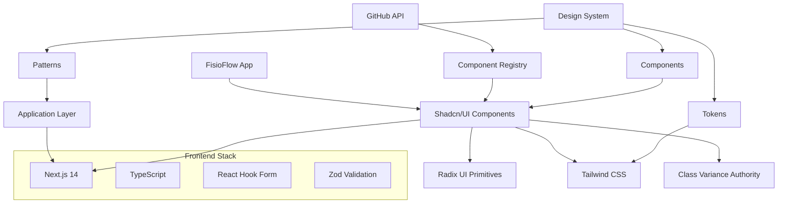

# Arquitetura Técnica - Implementação Shadcn/UI no FisioFlow

## 1. Visão Geral da Arquitetura

### 1.1 Diagrama de Arquitetura



### 1.2 Stack Tecnológico

**Core Technologies:**
- Next.js 14 (App Router)
- React 18
- TypeScript 5.0+
- Tailwind CSS 3.4+

**UI Framework:**
- Shadcn/UI (latest)
- Radix UI Primitives
- Class Variance Authority (CVA)
- Tailwind Merge

**Form Management:**
- React Hook Form 7.0+
- Zod validation
- Hookform Resolvers

**Development Tools:**
- Storybook 7.0+
- ESLint + Prettier
- Husky + Lint-staged
- GitHub Actions

## 2. Estrutura de Componentes

### 2.1 Hierarquia de Componentes

```
components/
├── ui/                     # Shadcn/UI base components
│   ├── button.tsx
│   ├── input.tsx
│   ├── card.tsx
│   ├── form.tsx
│   └── ...
├── domain/                 # Domain-specific components
│   ├── patient/
│   │   ├── patient-card.tsx
│   │   ├── patient-form.tsx
│   │   └── patient-list.tsx
│   ├── appointment/
│   │   ├── appointment-calendar.tsx
│   │   ├── appointment-form.tsx
│   │   └── appointment-card.tsx
│   └── dashboard/
│       ├── metrics-card.tsx
│       ├── chart-wrapper.tsx
│       └── dashboard-layout.tsx
├── layout/                 # Layout components
│   ├── header.tsx
│   ├── sidebar.tsx
│   ├── footer.tsx
│   └── main-layout.tsx
└── providers/              # Context providers
    ├── theme-provider.tsx
    ├── toast-provider.tsx
    └── form-provider.tsx
```

### 2.2 Padrões de Composição

**Compound Components Pattern:**
```typescript
// PatientCard compound component
export const PatientCard = {
  Root: PatientCardRoot,
  Header: PatientCardHeader,
  Content: PatientCardContent,
  Actions: PatientCardActions,
}

// Usage
<PatientCard.Root>
  <PatientCard.Header>
    <Avatar src={patient.avatar} />
    <div>
      <h3>{patient.name}</h3>
      <p>{patient.email}</p>
    </div>
  </PatientCard.Header>
  <PatientCard.Content>
    <Badge variant="secondary">{patient.status}</Badge>
    <p>Próxima consulta: {patient.nextAppointment}</p>
  </PatientCard.Content>
  <PatientCard.Actions>
    <Button variant="outline" size="sm">Ver Perfil</Button>
    <Button size="sm">Agendar</Button>
  </PatientCard.Actions>
</PatientCard.Root>
```

**Render Props Pattern:**
```typescript
interface DataTableProps<T> {
  data: T[]
  columns: ColumnDef<T>[]
  renderRow?: (item: T) => React.ReactNode
  renderEmpty?: () => React.ReactNode
}

export function DataTable<T>({ 
  data, 
  columns, 
  renderRow, 
  renderEmpty 
}: DataTableProps<T>) {
  // Implementation with flexibility
}
```

## 3. Sistema de Design

### 3.1 Design Tokens

**Configuração Tailwind:**
```javascript
// tailwind.config.js
module.exports = {
  content: [
    './pages/**/*.{ts,tsx}',
    './components/**/*.{ts,tsx}',
    './app/**/*.{ts,tsx}',
    './src/**/*.{ts,tsx}',
  ],
  theme: {
    container: {
      center: true,
      padding: "2rem",
      screens: {
        "2xl": "1400px",
      },
    },
    extend: {
      colors: {
        border: "hsl(var(--border))",
        input: "hsl(var(--input))",
        ring: "hsl(var(--ring))",
        background: "hsl(var(--background))",
        foreground: "hsl(var(--foreground))",
        primary: {
          DEFAULT: "hsl(var(--primary))",
          foreground: "hsl(var(--primary-foreground))",
        },
        secondary: {
          DEFAULT: "hsl(var(--secondary))",
          foreground: "hsl(var(--secondary-foreground))",
        },
        // FisioFlow specific colors
        fisio: {
          blue: "hsl(200 100% 50%)",
          green: "hsl(160 60% 45%)",
          orange: "hsl(25 95% 53%)",
        },
      },
      fontFamily: {
        sans: ["Inter", "sans-serif"],
        mono: ["JetBrains Mono", "monospace"],
      },
      keyframes: {
        "accordion-down": {
          from: { height: 0 },
          to: { height: "var(--radix-accordion-content-height)" },
        },
        "accordion-up": {
          from: { height: "var(--radix-accordion-content-height)" },
          to: { height: 0 },
        },
      },
      animation: {
        "accordion-down": "accordion-down 0.2s ease-out",
        "accordion-up": "accordion-up 0.2s ease-out",
      },
    },
  },
  plugins: [require("tailwindcss-animate")],
}
```

**CSS Variables:**
```css
/* globals.css */
@layer base {
  :root {
    --background: 0 0% 100%;
    --foreground: 222.2 84% 4.9%;
    --card: 0 0% 100%;
    --card-foreground: 222.2 84% 4.9%;
    --popover: 0 0% 100%;
    --popover-foreground: 222.2 84% 4.9%;
    --primary: 200 100% 50%;
    --primary-foreground: 210 40% 98%;
    --secondary: 160 60% 45%;
    --secondary-foreground: 222.2 84% 4.9%;
    --muted: 210 40% 96%;
    --muted-foreground: 215.4 16.3% 46.9%;
    --accent: 25 95% 53%;
    --accent-foreground: 222.2 84% 4.9%;
    --destructive: 0 84.2% 60.2%;
    --destructive-foreground: 210 40% 98%;
    --border: 214.3 31.8% 91.4%;
    --input: 214.3 31.8% 91.4%;
    --ring: 200 100% 50%;
    --radius: 0.5rem;
  }

  .dark {
    --background: 222.2 84% 4.9%;
    --foreground: 210 40% 98%;
    --card: 222.2 84% 4.9%;
    --card-foreground: 210 40% 98%;
    --popover: 222.2 84% 4.9%;
    --popover-foreground: 210 40% 98%;
    --primary: 200 100% 50%;
    --primary-foreground: 222.2 84% 4.9%;
    --secondary: 217.2 32.6% 17.5%;
    --secondary-foreground: 210 40% 98%;
    --muted: 217.2 32.6% 17.5%;
    --muted-foreground: 215 20.2% 65.1%;
    --accent: 25 95% 53%;
    --accent-foreground: 210 40% 98%;
    --destructive: 0 62.8% 30.6%;
    --destructive-foreground: 210 40% 98%;
    --border: 217.2 32.6% 17.5%;
    --input: 217.2 32.6% 17.5%;
    --ring: 200 100% 50%;
  }
}
```

### 3.2 Variantes de Componentes

**Button Variants (CVA):**
```typescript
import { cva, type VariantProps } from "class-variance-authority"

const buttonVariants = cva(
  "inline-flex items-center justify-center whitespace-nowrap rounded-md text-sm font-medium ring-offset-background transition-colors focus-visible:outline-none focus-visible:ring-2 focus-visible:ring-ring focus-visible:ring-offset-2 disabled:pointer-events-none disabled:opacity-50",
  {
    variants: {
      variant: {
        default: "bg-primary text-primary-foreground hover:bg-primary/90",
        destructive: "bg-destructive text-destructive-foreground hover:bg-destructive/90",
        outline: "border border-input bg-background hover:bg-accent hover:text-accent-foreground",
        secondary: "bg-secondary text-secondary-foreground hover:bg-secondary/80",
        ghost: "hover:bg-accent hover:text-accent-foreground",
        link: "text-primary underline-offset-4 hover:underline",
        // FisioFlow specific variants
        fisio: "bg-fisio-blue text-white hover:bg-fisio-blue/90",
        success: "bg-fisio-green text-white hover:bg-fisio-green/90",
        warning: "bg-fisio-orange text-white hover:bg-fisio-orange/90",
      },
      size: {
        default: "h-10 px-4 py-2",
        sm: "h-9 rounded-md px-3",
        lg: "h-11 rounded-md px-8",
        icon: "h-10 w-10",
      },
    },
    defaultVariants: {
      variant: "default",
      size: "default",
    },
  }
)
```

## 4. Integração com APIs

### 4.1 GitHub API Configuration

**Environment Setup:**
```bash
# .env.local
GITHUB_TOKEN=ghp_xxxxxxxxxxxxxxxxxxxx
SHADCN_REGISTRY_URL=https://ui.shadcn.com/registry
SHADCN_RATE_LIMIT=5000
```

**API Client:**
```typescript
// lib/shadcn-api.ts
interface ShadcnComponent {
  name: string
  type: 'components:ui' | 'components:example'
  files: Array<{
    name: string
    content: string
  }>
  dependencies?: string[]
  devDependencies?: string[]
}

class ShadcnAPI {
  private baseURL = 'https://ui.shadcn.com/registry'
  private token = process.env.GITHUB_TOKEN

  async getComponent(name: string): Promise<ShadcnComponent> {
    const response = await fetch(`${this.baseURL}/components/${name}.json`, {
      headers: {
        'Authorization': `Bearer ${this.token}`,
        'User-Agent': 'FisioFlow/1.0'
      }
    })
    
    if (!response.ok) {
      throw new Error(`Failed to fetch component: ${name}`)
    }
    
    return response.json()
  }

  async installComponent(name: string, targetDir: string = 'components/ui') {
    const component = await this.getComponent(name)
    
    // Install dependencies
    if (component.dependencies?.length) {
      await this.installDependencies(component.dependencies)
    }
    
    // Write component files
    for (const file of component.files) {
      await this.writeComponentFile(file, targetDir)
    }
  }

  private async installDependencies(deps: string[]) {
    const { execSync } = require('child_process')
    execSync(`npm install ${deps.join(' ')}`, { stdio: 'inherit' })
  }

  private async writeComponentFile(file: any, targetDir: string) {
    const fs = require('fs').promises
    const path = require('path')
    
    const filePath = path.join(targetDir, file.name)
    await fs.writeFile(filePath, file.content, 'utf8')
  }
}

export const shadcnAPI = new ShadcnAPI()
```

### 4.2 Component Installation Script

```typescript
// scripts/install-components.ts
import { shadcnAPI } from '../lib/shadcn-api'

const REQUIRED_COMPONENTS = [
  // Phase 1
  'button',
  'input',
  'label',
  'card',
  'badge',
  'avatar',
  'separator',
  
  // Phase 2
  'form',
  'select',
  'checkbox',
  'radio-group',
  'switch',
  'textarea',
  'calendar',
  
  // Phase 3
  'sheet',
  'dialog',
  'dropdown-menu',
  'navigation-menu',
  'breadcrumb',
  'tabs',
  
  // Phase 4
  'data-table',
  'command',
  'popover',
  'toast',
  'progress',
]

async function installAllComponents() {
  console.log('🚀 Installing Shadcn/UI components...')
  
  for (const component of REQUIRED_COMPONENTS) {
    try {
      console.log(`📦 Installing ${component}...`)
      await shadcnAPI.installComponent(component)
      console.log(`✅ ${component} installed successfully`)
    } catch (error) {
      console.error(`❌ Failed to install ${component}:`, error)
    }
  }
  
  console.log('🎉 All components installed!')
}

if (require.main === module) {
  installAllComponents()
}
```

## 5. Formulários e Validação

### 5.1 Form Schema Definition

```typescript
// schemas/patient.ts
import { z } from 'zod'

export const patientSchema = z.object({
  name: z.string().min(2, 'Nome deve ter pelo menos 2 caracteres'),
  email: z.string().email('Email inválido'),
  phone: z.string().regex(/^\(\d{2}\)\s\d{4,5}-\d{4}$/, 'Telefone inválido'),
  birthDate: z.date({
    required_error: 'Data de nascimento é obrigatória',
  }),
  gender: z.enum(['male', 'female', 'other'], {
    required_error: 'Selecione o gênero',
  }),
  address: z.object({
    street: z.string().min(5, 'Endereço deve ter pelo menos 5 caracteres'),
    city: z.string().min(2, 'Cidade deve ter pelo menos 2 caracteres'),
    state: z.string().length(2, 'Estado deve ter 2 caracteres'),
    zipCode: z.string().regex(/^\d{5}-?\d{3}$/, 'CEP inválido'),
  }),
  medicalHistory: z.string().optional(),
  emergencyContact: z.object({
    name: z.string().min(2, 'Nome do contato de emergência é obrigatório'),
    phone: z.string().regex(/^\(\d{2}\)\s\d{4,5}-\d{4}$/, 'Telefone inválido'),
    relationship: z.string().min(2, 'Relacionamento é obrigatório'),
  }),
})

export type PatientFormData = z.infer<typeof patientSchema>
```

### 5.2 Form Component Implementation

```typescript
// components/forms/patient-form.tsx
import { useForm } from 'react-hook-form'
import { zodResolver } from '@hookform/resolvers/zod'
import { patientSchema, type PatientFormData } from '@/schemas/patient'
import {
  Form,
  FormControl,
  FormDescription,
  FormField,
  FormItem,
  FormLabel,
  FormMessage,
} from '@/components/ui/form'
import { Input } from '@/components/ui/input'
import { Button } from '@/components/ui/button'
import { Calendar } from '@/components/ui/calendar'
import { Select, SelectContent, SelectItem, SelectTrigger, SelectValue } from '@/components/ui/select'
import { Textarea } from '@/components/ui/textarea'

interface PatientFormProps {
  defaultValues?: Partial<PatientFormData>
  onSubmit: (data: PatientFormData) => Promise<void>
  isLoading?: boolean
}

export function PatientForm({ defaultValues, onSubmit, isLoading }: PatientFormProps) {
  const form = useForm<PatientFormData>({
    resolver: zodResolver(patientSchema),
    defaultValues: {
      name: '',
      email: '',
      phone: '',
      gender: undefined,
      address: {
        street: '',
        city: '',
        state: '',
        zipCode: '',
      },
      medicalHistory: '',
      emergencyContact: {
        name: '',
        phone: '',
        relationship: '',
      },
      ...defaultValues,
    },
  })

  const handleSubmit = async (data: PatientFormData) => {
    try {
      await onSubmit(data)
      form.reset()
    } catch (error) {
      console.error('Form submission error:', error)
    }
  }

  return (
    <Form {...form}>
      <form onSubmit={form.handleSubmit(handleSubmit)} className="space-y-6">
        <div className="grid grid-cols-1 md:grid-cols-2 gap-4">
          <FormField
            control={form.control}
            name="name"
            render={({ field }) => (
              <FormItem>
                <FormLabel>Nome Completo</FormLabel>
                <FormControl>
                  <Input placeholder="Digite o nome completo" {...field} />
                </FormControl>
                <FormMessage />
              </FormItem>
            )}
          />
          
          <FormField
            control={form.control}
            name="email"
            render={({ field }) => (
              <FormItem>
                <FormLabel>Email</FormLabel>
                <FormControl>
                  <Input type="email" placeholder="email@exemplo.com" {...field} />
                </FormControl>
                <FormMessage />
              </FormItem>
            )}
          />
        </div>

        <div className="grid grid-cols-1 md:grid-cols-3 gap-4">
          <FormField
            control={form.control}
            name="phone"
            render={({ field }) => (
              <FormItem>
                <FormLabel>Telefone</FormLabel>
                <FormControl>
                  <Input placeholder="(11) 99999-9999" {...field} />
                </FormControl>
                <FormMessage />
              </FormItem>
            )}
          />
          
          <FormField
            control={form.control}
            name="birthDate"
            render={({ field }) => (
              <FormItem>
                <FormLabel>Data de Nascimento</FormLabel>
                <FormControl>
                  <Calendar
                    mode="single"
                    selected={field.value}
                    onSelect={field.onChange}
                    disabled={(date) => date > new Date()}
                  />
                </FormControl>
                <FormMessage />
              </FormItem>
            )}
          />
          
          <FormField
            control={form.control}
            name="gender"
            render={({ field }) => (
              <FormItem>
                <FormLabel>Gênero</FormLabel>
                <Select onValueChange={field.onChange} defaultValue={field.value}>
                  <FormControl>
                    <SelectTrigger>
                      <SelectValue placeholder="Selecione o gênero" />
                    </SelectTrigger>
                  </FormControl>
                  <SelectContent>
                    <SelectItem value="male">Masculino</SelectItem>
                    <SelectItem value="female">Feminino</SelectItem>
                    <SelectItem value="other">Outro</SelectItem>
                  </SelectContent>
                </Select>
                <FormMessage />
              </FormItem>
            )}
          />
        </div>

        {/* Address Section */}
        <div className="space-y-4">
          <h3 className="text-lg font-medium">Endereço</h3>
          <div className="grid grid-cols-1 md:grid-cols-2 gap-4">
            <FormField
              control={form.control}
              name="address.street"
              render={({ field }) => (
                <FormItem>
                  <FormLabel>Rua</FormLabel>
                  <FormControl>
                    <Input placeholder="Rua, número, complemento" {...field} />
                  </FormControl>
                  <FormMessage />
                </FormItem>
              )}
            />
            
            <FormField
              control={form.control}
              name="address.city"
              render={({ field }) => (
                <FormItem>
                  <FormLabel>Cidade</FormLabel>
                  <FormControl>
                    <Input placeholder="Cidade" {...field} />
                  </FormControl>
                  <FormMessage />
                </FormItem>
              )}
            />
          </div>
          
          <div className="grid grid-cols-1 md:grid-cols-2 gap-4">
            <FormField
              control={form.control}
              name="address.state"
              render={({ field }) => (
                <FormItem>
                  <FormLabel>Estado</FormLabel>
                  <FormControl>
                    <Input placeholder="SP" maxLength={2} {...field} />
                  </FormControl>
                  <FormMessage />
                </FormItem>
              )}
            />
            
            <FormField
              control={form.control}
              name="address.zipCode"
              render={({ field }) => (
                <FormItem>
                  <FormLabel>CEP</FormLabel>
                  <FormControl>
                    <Input placeholder="00000-000" {...field} />
                  </FormControl>
                  <FormMessage />
                </FormItem>
              )}
            />
          </div>
        </div>

        {/* Medical History */}
        <FormField
          control={form.control}
          name="medicalHistory"
          render={({ field }) => (
            <FormItem>
              <FormLabel>Histórico Médico</FormLabel>
              <FormControl>
                <Textarea
                  placeholder="Descreva o histórico médico relevante..."
                  className="min-h-[100px]"
                  {...field}
                />
              </FormControl>
              <FormDescription>
                Inclua informações sobre condições médicas, cirurgias, medicamentos, etc.
              </FormDescription>
              <FormMessage />
            </FormItem>
          )}
        />

        {/* Emergency Contact */}
        <div className="space-y-4">
          <h3 className="text-lg font-medium">Contato de Emergência</h3>
          <div className="grid grid-cols-1 md:grid-cols-3 gap-4">
            <FormField
              control={form.control}
              name="emergencyContact.name"
              render={({ field }) => (
                <FormItem>
                  <FormLabel>Nome</FormLabel>
                  <FormControl>
                    <Input placeholder="Nome do contato" {...field} />
                  </FormControl>
                  <FormMessage />
                </FormItem>
              )}
            />
            
            <FormField
              control={form.control}
              name="emergencyContact.phone"
              render={({ field }) => (
                <FormItem>
                  <FormLabel>Telefone</FormLabel>
                  <FormControl>
                    <Input placeholder="(11) 99999-9999" {...field} />
                  </FormControl>
                  <FormMessage />
                </FormItem>
              )}
            />
            
            <FormField
              control={form.control}
              name="emergencyContact.relationship"
              render={({ field }) => (
                <FormItem>
                  <FormLabel>Relacionamento</FormLabel>
                  <FormControl>
                    <Input placeholder="Ex: Cônjuge, Filho(a)" {...field} />
                  </FormControl>
                  <FormMessage />
                </FormItem>
              )}
            />
          </div>
        </div>

        <div className="flex justify-end space-x-4">
          <Button type="button" variant="outline" onClick={() => form.reset()}>
            Cancelar
          </Button>
          <Button type="submit" disabled={isLoading}>
            {isLoading ? 'Salvando...' : 'Salvar Paciente'}
          </Button>
        </div>
      </form>
    </Form>
  )
}
```

## 6. Testes e Qualidade

### 6.1 Configuração de Testes

**Jest Configuration:**
```javascript
// jest.config.js
const nextJest = require('next/jest')

const createJestConfig = nextJest({
  dir: './'
})

const customJestConfig = {
  setupFilesAfterEnv: ['<rootDir>/jest.setup.js'],
  moduleNameMapping: {
    '^@/components/(.*)$': '<rootDir>/components/$1',
    '^@/lib/(.*)$': '<rootDir>/lib/$1',
    '^@/hooks/(.*)$': '<rootDir>/hooks/$1',
  },
  testEnvironment: 'jest-environment-jsdom',
  collectCoverageFrom: [
    'components/**/*.{js,jsx,ts,tsx}',
    'lib/**/*.{js,jsx,ts,tsx}',
    'hooks/**/*.{js,jsx,ts,tsx}',
    '!**/*.d.ts',
    '!**/node_modules/**',
  ],
  coverageThreshold: {
    global: {
      branches: 80,
      functions: 80,
      lines: 80,
      statements: 80,
    },
  },
}

module.exports = createJestConfig(customJestConfig)
```

**Component Testing:**
```typescript
// __tests__/components/patient-form.test.tsx
import { render, screen, fireEvent, waitFor } from '@testing-library/react'
import userEvent from '@testing-library/user-event'
import { PatientForm } from '@/components/forms/patient-form'
import { patientSchema } from '@/schemas/patient'

const mockOnSubmit = jest.fn()

describe('PatientForm', () => {
  beforeEach(() => {
    mockOnSubmit.mockClear()
  })

  it('renders all form fields', () => {
    render(<PatientForm onSubmit={mockOnSubmit} />)
    
    expect(screen.getByLabelText(/nome completo/i)).toBeInTheDocument()
    expect(screen.getByLabelText(/email/i)).toBeInTheDocument()
    expect(screen.getByLabelText(/telefone/i)).toBeInTheDocument()
    expect(screen.getByLabelText(/gênero/i)).toBeInTheDocument()
  })

  it('validates required fields', async () => {
    const user = userEvent.setup()
    render(<PatientForm onSubmit={mockOnSubmit} />)
    
    const submitButton = screen.getByRole('button', { name: /salvar paciente/i })
    await user.click(submitButton)
    
    await waitFor(() => {
      expect(screen.getByText(/nome deve ter pelo menos 2 caracteres/i)).toBeInTheDocument()
      expect(screen.getByText(/email inválido/i)).toBeInTheDocument()
    })
    
    expect(mockOnSubmit).not.toHaveBeenCalled()
  })

  it('submits valid form data', async () => {
    const user = userEvent.setup()
    render(<PatientForm onSubmit={mockOnSubmit} />)
    
    // Fill form with valid data
    await user.type(screen.getByLabelText(/nome completo/i), 'João Silva')
    await user.type(screen.getByLabelText(/email/i), 'joao@exemplo.com')
    await user.type(screen.getByLabelText(/telefone/i), '(11) 99999-9999')
    
    // Submit form
    const submitButton = screen.getByRole('button', { name: /salvar paciente/i })
    await user.click(submitButton)
    
    await waitFor(() => {
      expect(mockOnSubmit).toHaveBeenCalledWith(
        expect.objectContaining({
          name: 'João Silva',
          email: 'joao@exemplo.com',
          phone: '(11) 99999-9999',
        })
      )
    })
  })

  it('displays loading state during submission', async () => {
    const user = userEvent.setup()
    render(<PatientForm onSubmit={mockOnSubmit} isLoading={true} />)
    
    const submitButton = screen.getByRole('button', { name: /salvando.../i })
    expect(submitButton).toBeDisabled()
  })
})
```

### 6.2 Storybook Configuration

```typescript
// .storybook/main.ts
import type { StorybookConfig } from '@storybook/nextjs'

const config: StorybookConfig = {
  stories: ['../components/**/*.stories.@(js|jsx|ts|tsx|mdx)'],
  addons: [
    '@storybook/addon-essentials',
    '@storybook/addon-interactions',
    '@storybook/addon-a11y',
    '@storybook/addon-design-tokens',
  ],
  framework: {
    name: '@storybook/nextjs',
    options: {},
  },
  docs: {
    autodocs: 'tag',
  },
  typescript: {
    check: false,
    reactDocgen: 'react-docgen-typescript',
    reactDocgenTypescriptOptions: {
      shouldExtractLiteralValuesFromEnum: true,
      propFilter: (prop) => (prop.parent ? !/node_modules/.test(prop.parent.fileName) : true),
    },
  },
}

export default config
```

**Component Story:**
```typescript
// components/forms/patient-form.stories.tsx
import type { Meta, StoryObj } from '@storybook/react'
import { PatientForm } from './patient-form'

const meta: Meta<typeof PatientForm> = {
  title: 'Forms/PatientForm',
  component: PatientForm,
  parameters: {
    layout: 'padded',
    docs: {
      description: {
        component: 'Formulário completo para cadastro e edição de pacientes.',
      },
    },
  },
  argTypes: {
    onSubmit: { action: 'submitted' },
    isLoading: {
      control: 'boolean',
      description: 'Estado de carregamento do formulário',
    },
  },
}

export default meta
type Story = StoryObj<typeof PatientForm>

export const Default: Story = {
  args: {
    onSubmit: async (data) => {
      console.log('Form submitted:', data)
      await new Promise(resolve => setTimeout(resolve, 1000))
    },
  },
}

export const WithDefaultValues: Story = {
  args: {
    defaultValues: {
      name: 'João Silva',
      email: 'joao@exemplo.com',
      phone: '(11) 99999-9999',
      gender: 'male',
      address: {
        street: 'Rua das Flores, 123',
        city: 'São Paulo',
        state: 'SP',
        zipCode: '01234-567',
      },
    },
    onSubmit: async (data) => {
      console.log('Form submitted:', data)
    },
  },
}

export const Loading: Story = {
  args: {
    isLoading: true,
    onSubmit: async () => {},
  },
}
```

## 7. Performance e Otimização

### 7.1 Bundle Optimization

**Tree Shaking Configuration:**
```javascript
// next.config.js
/** @type {import('next').NextConfig} */
const nextConfig = {
  experimental: {
    optimizePackageImports: [
      '@radix-ui/react-icons',
      'lucide-react',
      'date-fns',
    ],
  },
  compiler: {
    removeConsole: process.env.NODE_ENV === 'production',
  },
  webpack: (config, { dev, isServer }) => {
    if (!dev && !isServer) {
      config.optimization.splitChunks.cacheGroups = {
        ...config.optimization.splitChunks.cacheGroups,
        shadcn: {
          name: 'shadcn-ui',
          test: /[\\/]node_modules[\\/](@radix-ui|class-variance-authority|clsx|tailwind-merge)[\\/]/,
          chunks: 'all',
          priority: 10,
        },
      }
    }
    return config
  },
}

module.exports = nextConfig
```

### 7.2 Component Lazy Loading

```typescript
// components/lazy-components.ts
import { lazy } from 'react'

// Lazy load heavy components
export const PatientForm = lazy(() => 
  import('./forms/patient-form').then(module => ({ default: module.PatientForm }))
)

export const DataTable = lazy(() => 
  import('./ui/data-table').then(module => ({ default: module.DataTable }))
)

export const Calendar = lazy(() => 
  import('./ui/calendar').then(module => ({ default: module.Calendar }))
)

// Usage with Suspense
import { Suspense } from 'react'
import { PatientForm } from './lazy-components'
import { Skeleton } from './ui/skeleton'

function PatientPage() {
  return (
    <Suspense fallback={<Skeleton className="h-96 w-full" />}>
      <PatientForm onSubmit={handleSubmit} />
    </Suspense>
  )
}
```

### 7.3 Performance Monitoring

```typescript
// lib/performance.ts
export function measureComponentPerformance<T extends Record<string, any>>(
  WrappedComponent: React.ComponentType<T>,
  componentName: string
) {
  return function PerformanceWrapper(props: T) {
    const startTime = performance.now()
    
    React.useEffect(() => {
      const endTime = performance.now()
      const renderTime = endTime - startTime
      
      if (renderTime > 16) { // More than one frame
        console.warn(`${componentName} took ${renderTime.toFixed(2)}ms to render`)
      }
      
      // Send to analytics
      if (typeof window !== 'undefined' && window.gtag) {
        window.gtag('event', 'component_performance', {
          component_name: componentName,
          render_time: renderTime,
        })
      }
    })
    
    return <WrappedComponent {...props} />
  }
}

// Usage
export const PatientCard = measureComponentPerformance(
  PatientCardComponent,
  'PatientCard'
)
```

## 8. Deployment e CI/CD

### 8.1 GitHub Actions Workflow

```yaml
# .github/workflows/ui-tests.yml
name: UI Tests and Build

on:
  push:
    branches: [main, develop]
  pull_request:
    branches: [main]

jobs:
  test:
    runs-on: ubuntu-latest
    
    steps:
      - uses: actions/checkout@v4
      
      - name: Setup Node.js
        uses: actions/setup-node@v4
        with:
          node-version: '18'
          cache: 'npm'
      
      - name: Install dependencies
        run: npm ci
        
      - name: Run linting
        run: npm run lint
        
      - name: Run type checking
        run: npm run type-check
        
      - name: Run unit tests
        run: npm run test:coverage
        
      - name: Run Storybook tests
        run: npm run test-storybook:ci
        
      - name: Build application
        run: npm run build
        env:
          GITHUB_TOKEN: ${{ secrets.GITHUB_TOKEN }}
          
      - name: Upload coverage reports
        uses: codecov/codecov-action@v3
        with:
          file: ./coverage/lcov.info
          
  visual-tests:
    runs-on: ubuntu-latest
    
    steps:
      - uses: actions/checkout@v4
        with:
          fetch-depth: 0
          
      - name: Setup Node.js
        uses: actions/setup-node@v4
        with:
          node-version: '18'
          cache: 'npm'
          
      - name: Install dependencies
        run: npm ci
        
      - name: Build Storybook
        run: npm run build-storybook
        
      - name: Run Chromatic
        uses: chromaui/action@v1
        with:
          projectToken: ${{ secrets.CHROMATIC_PROJECT_TOKEN }}
          buildScriptName: build-storybook
```

### 8.2 Quality Gates

```json
// package.json scripts
{
  "scripts": {
    "dev": "next dev",
    "build": "next build",
    "start": "next start",
    "lint": "next lint",
    "lint:fix": "next lint --fix",
    "type-check": "tsc --noEmit",
    "test": "jest",
    "test:watch": "jest --watch",
    "test:coverage": "jest --coverage",
    "test-storybook": "test-storybook",
    "test-storybook:ci": "concurrently -k -s first -n \"SB,TEST\" -c \"magenta,blue\" \"npm run build-storybook --quiet && npx http-server storybook-static --port 6006 --silent\" \"wait-on tcp:6006 && npm run test-storybook\"",
    "storybook": "storybook dev -p 6006",
    "build-storybook": "storybook build",
    "shadcn:add": "npx shadcn-ui@latest add",
    "shadcn:install": "node scripts/install-components.js",
    "pre-commit": "lint-staged",
    "prepare": "husky install"
  }
}
```

Esta arquitetura técnica fornece uma base sólida para a implementação do Shadcn/UI no FisioFlow, garantindo qualidade, performance e manutenibilidade do código.