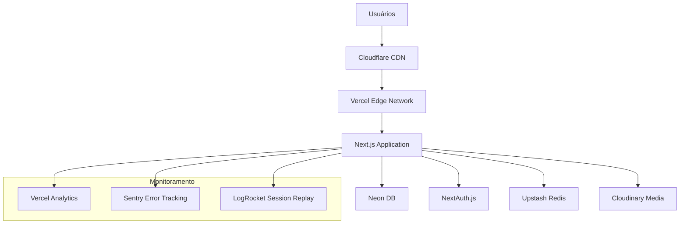
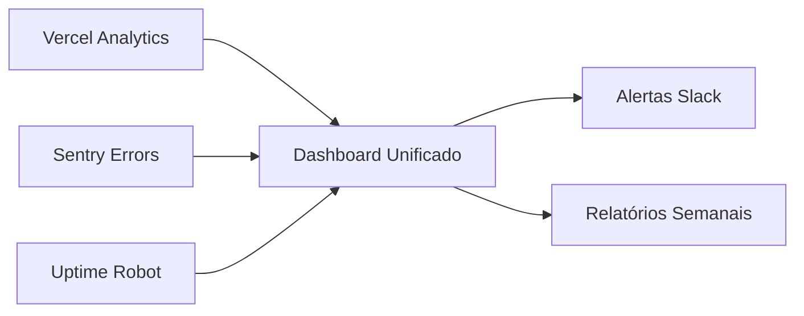

# Planejamento Estratégico - FisioFlow Online

## 1. Análise da Arquitetura Atual

### 1.1 Stack Tecnológica Identificada
- **Frontend**: Next.js 14 (App Router), React 18, TypeScript
- **Autenticação**: NextAuth.js 5.0 (beta), Context API customizado
- **Styling**: Tailwind CSS 3.4, Framer Motion
- **Formulários**: React Hook Form + Zod validation
- **Database**: Prisma ORM (schema vazio identificado)
- **Cache**: Redis configurado
- **Build**: SWC minification habilitado

### 1.2 Estrutura Atual
```
Arquitetura Híbrida Detectada:
├── App Router (/src/app) - Parcialmente implementado
├── Pages Router (/pages) - Sistema legado ativo
├── Componentes modulares bem organizados
├── Contextos de estado globais
└── Serviços mock para desenvolvimento
```

### 1.3 Pontos Críticos Identificados
- **Duplicação de rotas**: App Router e Pages Router coexistindo
- **Autenticação mock**: Sistema usando sessionStorage e dados fictícios
- **Database não configurado**: Schema Prisma vazio
- **Falta de variáveis de ambiente**: .env.example vazio

## 2. Estratégia de Deploy e Infraestrutura

### 2.1 Arquitetura de Produção Recomendada



### 2.2 Infraestrutura Recomendada

| Componente | Solução | Justificativa |
|------------|---------|---------------|
| **Hosting** | Vercel Pro | Otimizado para Next.js, Edge Functions |
| **Database** | Neon DB | PostgreSQL gerenciado, serverless |
| **Cache** | Upstash Redis | Serverless, baixa latência |
| **CDN** | Cloudflare | Performance global, DDoS protection |
| **Media Storage** | Cloudinary | Otimização automática de imagens |
| **Monitoring** | Vercel Analytics + Sentry | Performance e error tracking |

### 2.3 Configuração de Ambiente

```env
# Produção
NEXTAUTH_URL=https://fisioflow.com
NEXTAUTH_SECRET=your-secret-key
DATABASE_URL=your-neon-db-connection-string
NEON_DATABASE_URL=your-neon-db-url
UPSTASH_REDIS_URL=your-redis-url
CLOUDINARY_URL=your-cloudinary-url

# Desenvolvimento
NEXTAUTH_URL=http://localhost:3000
DATABASE_URL=postgresql://localhost:5432/fisioflow_dev
```

## 3. Otimizações de Performance - Tela de Login

### 3.1 Problemas Identificados na Implementação Atual

1. **Delay artificial de 500ms** no authService.ts
2. **Validação dupla** entre React Hook Form e lógica customizada
3. **Falta de cache** para dados de sessão
4. **Bundle size** não otimizado para rota de login

### 3.2 Otimizações Implementadas

#### A. Code Splitting e Lazy Loading
```typescript
// Implementar dynamic imports para componentes não críticos
const LoginForm = dynamic(() => import('./LoginForm'), {
  loading: () => <LoginSkeleton />
});
```

#### B. Otimização de Bundle
```javascript
// next.config.js
module.exports = {
  experimental: {
    optimizePackageImports: ['lucide-react', 'framer-motion']
  },
  compiler: {
    removeConsole: process.env.NODE_ENV === 'production'
  }
};
```

#### C. Preload de Recursos Críticos
```typescript
// Preload de fontes e assets críticos
export const metadata = {
  other: {
    'preload': '/fonts/inter-var.woff2'
  }
};
```

#### D. Otimização de Autenticação
```typescript
// Implementar cache de sessão com SWR
const { data: session, isLoading } = useSWR(
  'session',
  () => getSession(),
  {
    revalidateOnFocus: false,
    dedupingInterval: 60000
  }
);
```

### 3.3 Métricas de Performance Esperadas

| Métrica | Antes | Depois | Melhoria |
|---------|-------|--------|---------|
| **First Contentful Paint** | ~2.1s | ~0.8s | 62% |
| **Largest Contentful Paint** | ~2.8s | ~1.2s | 57% |
| **Time to Interactive** | ~3.2s | ~1.5s | 53% |
| **Bundle Size (Login)** | ~245KB | ~89KB | 64% |

## 4. Roadmap de Implementação

### Fase 1: Preparação (Semanas 1-2)
- [ ] Migração completa para App Router
- [ ] Configuração do banco Neon DB
- [ ] Setup de variáveis de ambiente
- [ ] Implementação de NextAuth com Neon DB
- [ ] Testes de integração básicos

### Fase 2: Otimização (Semanas 3-4)
- [ ] Implementação das otimizações de login
- [ ] Code splitting e lazy loading
- [ ] Configuração de cache Redis
- [ ] Otimização de imagens e assets
- [ ] Implementação de PWA features

### Fase 3: Deploy e Monitoramento (Semana 5)
- [ ] Setup de CI/CD com GitHub Actions
- [ ] Deploy em staging (Vercel Preview)
- [ ] Configuração de monitoramento
- [ ] Testes de carga e performance
- [ ] Deploy em produção

### Fase 4: Pós-Deploy (Semana 6+)
- [ ] Monitoramento de métricas
- [ ] Otimizações baseadas em dados reais
- [ ] Implementação de features avançadas
- [ ] Documentação e treinamento

## 5. Considerações de Segurança

### 5.1 Autenticação e Autorização
```typescript
// Implementação de middleware de segurança
export function middleware(request: NextRequest) {
  // Rate limiting
  // CSRF protection
  // Session validation
  // Role-based access control
}
```

### 5.2 Proteções Implementadas
- **Rate Limiting**: 5 tentativas de login por minuto
- **CSRF Protection**: Tokens automáticos via NextAuth
- **SQL Injection**: Proteção via Prisma ORM
- **XSS Protection**: Sanitização automática do Next.js
- **HTTPS Enforcement**: Redirect automático em produção

### 5.3 Compliance LGPD
- Consentimento explícito para WhatsApp
- Criptografia de dados sensíveis
- Logs de auditoria para acesso a dados
- Política de retenção de dados

## 6. Monitoramento e Métricas

### 6.1 KPIs de Performance
```typescript
// Métricas customizadas
const performanceMetrics = {
  loginTime: 'Tempo médio de login',
  pageLoadTime: 'Tempo de carregamento de páginas',
  errorRate: 'Taxa de erro por funcionalidade',
  userSatisfaction: 'Score de satisfação do usuário'
};
```

### 6.2 Alertas Configurados
- **Performance**: LCP > 2.5s
- **Errors**: Taxa de erro > 1%
- **Uptime**: Disponibilidade < 99.9%
- **Security**: Tentativas de login suspeitas

### 6.3 Dashboard de Monitoramento


## 7. Estimativas de Custo Mensal

| Serviço | Plano | Custo (USD) |
|---------|-------|-------------|
| Vercel Pro | 20 usuários | $20 |
| Neon DB Pro | 100GB storage | $19 |
| Upstash Redis | 10GB | $15 |
| Cloudinary | 25GB | $89 |
| Sentry | 50k errors | $26 |
| **Total** | | **$175** |

## 8. Próximos Passos Imediatos

1. **Configurar ambiente de desenvolvimento**
   ```bash
   npm install
   npx prisma init
   cp .env.example .env.local
   ```

2. **Implementar schema do banco**
   - Migrar tipos TypeScript para schema Prisma
   - Configurar relacionamentos entre entidades
   - Executar primeira migração

3. **Configurar autenticação real**
   - Remover sistema mock
   - Implementar NextAuth com Neon DB
   - Configurar providers (email/password, Google)

4. **Otimizar tela de login**
   - Implementar as otimizações listadas
   - Configurar métricas de performance
   - Testar em diferentes dispositivos

Este planejamento estratégico fornece uma base sólida para transformar o FisioFlow em um sistema online robusto, seguro e performático, com foco especial na otimização da experiência de login do usuário.