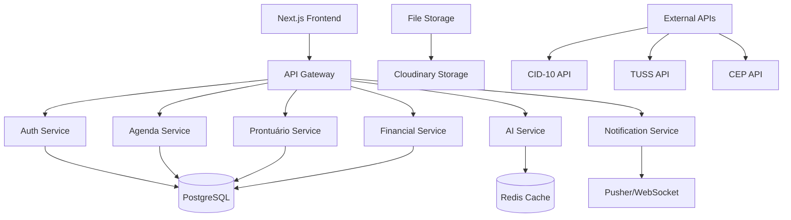

# Guia de Implementação Técnica - FisioFlow v2.0

## 1. Arquitetura Técnica Detalhada

### 1.1 Stack Tecnológico Atual vs. Proposto

#### Stack Atual

```
Frontend: Next.js 14 + React + TypeScript + Tailwind CSS
Backend: Next.js API Routes + Prisma ORM
Database: PostgreSQL (Neon DB)
Auth: NextAuth.js
AI: Gemini + OpenAI + Claude (via MCP)
Deploy: Railway
Monitoring: Sentry
```

#### Stack Proposto (Melhorias)

```
Frontend: Next.js 14 + React + TypeScript + Tailwind CSS + Framer Motion
Backend: Next.js API Routes + Prisma ORM + tRPC
Database: PostgreSQL (Neon DB) + Redis (Cache)
Auth: NextAuth.js + RBAC
AI: Gemini + OpenAI + Claude (via MCP) + Whisper (Transcrição)
Realtime: Pusher/Socket.io
Files: Cloudinary Storage
Deploy: Railway + Vercel (Frontend)
Monitoring: Sentry + Posthog (Analytics)
Testing: Jest + Playwright
```

### 1.2 Arquitetura de Microserviços



## 2. Implementação por Fases

### 2.1 Fase 1: Agenda Avançada (Semanas 1-6)

#### 2.1.1 Schema de Banco de Dados

```sql
-- Extensão do schema atual
CREATE TABLE appointment_types (
  id UUID PRIMARY KEY DEFAULT gen_random_uuid(),
  name VARCHAR(100) NOT NULL,
  duration INTEGER NOT NULL, -- em minutos
  color VARCHAR(7) NOT NULL, -- hex color
  specialty_id UUID REFERENCES specialties(id),
  is_active BOOLEAN DEFAULT true,
  created_at TIMESTAMP WITH TIME ZONE DEFAULT NOW(),
  updated_at TIMESTAMP WITH TIME ZONE DEFAULT NOW()
);

CREATE TABLE rooms (
  id UUID PRIMARY KEY DEFAULT gen_random_uuid(),
  name VARCHAR(100) NOT NULL,
  capacity INTEGER DEFAULT 1,
  equipment TEXT[], -- array de equipamentos
  is_active BOOLEAN DEFAULT true,
  created_at TIMESTAMP WITH TIME ZONE DEFAULT NOW()
);

CREATE TABLE equipment (
  id UUID PRIMARY KEY DEFAULT gen_random_uuid(),
  name VARCHAR(100) NOT NULL,
  type VARCHAR(50) NOT NULL,
  room_id UUID REFERENCES rooms(id),
  maintenance_date DATE,
  is_available BOOLEAN DEFAULT true,
  created_at TIMESTAMP WITH TIME ZONE DEFAULT NOW()
);

CREATE TABLE waiting_queue (
  id UUID PRIMARY KEY DEFAULT gen_random_uuid(),
  patient_id UUID REFERENCES patients(id),
  appointment_id UUID REFERENCES appointments(id),
  position INTEGER NOT NULL,
  estimated_time TIMESTAMP WITH TIME ZONE,
  status VARCHAR(20) DEFAULT 'waiting', -- waiting, called, completed, cancelled
  created_at TIMESTAMP WITH TIME ZONE DEFAULT NOW(),
  updated_at TIMESTAMP WITH TIME ZONE DEFAULT NOW()
);

CREATE TABLE check_ins (
  id UUID PRIMARY KEY DEFAULT gen_random_uuid(),
  appointment_id UUID REFERENCES appointments(id),
  patient_id UUID REFERENCES patients(id),
  check_in_time TIMESTAMP WITH TIME ZONE,
  check_out_time TIMESTAMP WITH TIME ZONE,
  status VARCHAR(20) DEFAULT 'pending', -- pending, checked_in, completed
  qr_code VARCHAR(255),
  created_at TIMESTAMP WITH TIME ZONE DEFAULT NOW()
);

-- Índices para performance
CREATE INDEX idx_waiting_queue_position ON waiting_queue(position);
CREATE INDEX idx_waiting_queue_status ON waiting_queue(status);
CREATE INDEX idx_check_ins_appointment ON check_ins(appointment_id);
CREATE INDEX idx_appointments_room_date ON appointments(room_id, date);
```

#### 2.1.2 API Routes

```typescript
// app/api/agenda/multiple/route.ts
export async function GET(request: Request) {
  const { searchParams } = new URL(request.url);
  const viewType = searchParams.get('view'); // 'professional' | 'room' | 'equipment'
  const date = searchParams.get('date');
  const filters = JSON.parse(searchParams.get('filters') || '[]');

  const appointments = await getMultipleViewAppointments({
    viewType,
    date,
    filters,
  });

  return Response.json(appointments);
}

// app/api/waiting-queue/route.ts
export async function POST(request: Request) {
  const { patientId, appointmentId } = await request.json();

  const queueEntry = await addToWaitingQueue({
    patientId,
    appointmentId,
  });

  // Notificar via WebSocket
  await notifyQueueUpdate(queueEntry);

  return Response.json(queueEntry);
}

// app/api/check-in/[appointmentId]/route.ts
export async function POST(request: Request, { params }: { params: { appointmentId: string } }) {
  const checkIn = await processCheckIn(params.appointmentId);

  // Atualizar fila de espera
  await updateWaitingQueue(params.appointmentId);

  return Response.json(checkIn);
}
```

#### 2.1.3 Componentes React

```typescript
// components/agenda/MultiCalendarView.tsx
interface MultiCalendarViewProps {
  viewType: 'professional' | 'room' | 'equipment';
  selectedDate: Date;
  filters: CalendarFilter[];
}

export const MultiCalendarView: React.FC<MultiCalendarViewProps> = ({
  viewType,
  selectedDate,
  filters
}) => {
  const { data: appointments, isLoading } = useQuery({
    queryKey: ['appointments', viewType, selectedDate, filters],
    queryFn: () => fetchMultipleViewAppointments({ viewType, selectedDate, filters })
  });

  const renderTimeSlots = () => {
    const timeSlots = generateTimeSlots();

    return timeSlots.map(time => (
      <div key={time} className="grid grid-cols-4 gap-2">
        <div className="text-sm text-gray-500">{time}</div>
        {getResourcesByViewType(viewType).map(resource => (
          <AppointmentSlot
            key={resource.id}
            time={time}
            resource={resource}
            appointment={getAppointmentForSlot(appointments, time, resource.id)}
            onAppointmentClick={handleAppointmentClick}
          />
        ))}
      </div>
    ));
  };

  return (
    <div className="calendar-container">
      <CalendarHeader
        viewType={viewType}
        selectedDate={selectedDate}
        onViewTypeChange={setViewType}
        onDateChange={setSelectedDate}
      />
      <CalendarFilters
        filters={filters}
        onFiltersChange={setFilters}
      />
      <div className="calendar-grid">
        {renderTimeSlots()}
      </div>
    </div>
  );
};

// components/agenda/WaitingQueue.tsx
export const WaitingQueue: React.FC = () => {
  const { data: queue } = useRealtimeQuery('waiting-queue');

  return (
    <div className="waiting-queue">
      <h3>Fila de Espera</h3>
      {queue?.map((entry, index) => (
        <WaitingQueueItem
          key={entry.id}
          entry={entry}
          position={index + 1}
          onCall={() => callPatient(entry.id)}
        />
      ))}
    </div>
  );
};

// components/agenda/CheckInQR.tsx
export const CheckInQR: React.FC<{ appointmentId: string }> = ({ appointmentId }) => {
  const qrCodeUrl = `${process.env.NEXT_PUBLIC_APP_URL}/check-in/${appointmentId}`;

  return (
    <div className="check-in-qr">
      <QRCodeSVG value={qrCodeUrl} size={200} />
      <p>Escaneie para fazer check-in</p>
    </div>
  );
};
```

### 2.2 Fase 2: Prontuário Avançado (Semanas 7-14)

#### 2.2.1 Schema para Templates

```sql
CREATE TABLE medical_templates (
  id UUID PRIMARY KEY DEFAULT gen_random_uuid(),
  name VARCHAR(200) NOT NULL,
  specialty VARCHAR(100) NOT NULL,
  type VARCHAR(50) NOT NULL, -- anamnesis, evolution, report
  template_data JSONB NOT NULL,
  is_active BOOLEAN DEFAULT true,
  created_by UUID REFERENCES users(id),
  created_at TIMESTAMP WITH TIME ZONE DEFAULT NOW()
);

CREATE TABLE medical_records_extended (
  id UUID PRIMARY KEY DEFAULT gen_random_uuid(),
  patient_id UUID REFERENCES patients(id),
  appointment_id UUID REFERENCES appointments(id),
  template_id UUID REFERENCES medical_templates(id),
  form_data JSONB NOT NULL,
  ai_suggestions JSONB,
  images UUID[], -- array de IDs de imagens
  audio_transcription TEXT,
  created_by UUID REFERENCES users(id),
  created_at TIMESTAMP WITH TIME ZONE DEFAULT NOW(),
  updated_at TIMESTAMP WITH TIME ZONE DEFAULT NOW()
);

CREATE TABLE patient_images (
  id UUID PRIMARY KEY DEFAULT gen_random_uuid(),
  patient_id UUID REFERENCES patients(id),
  medical_record_id UUID REFERENCES medical_records_extended(id),
  file_url VARCHAR(500) NOT NULL,
  file_type VARCHAR(50) NOT NULL,
  annotations JSONB,
  taken_at TIMESTAMP WITH TIME ZONE,
  created_at TIMESTAMP WITH TIME ZONE DEFAULT NOW()
);

CREATE TABLE cid_codes (
  code VARCHAR(10) PRIMARY KEY,
  description TEXT NOT NULL,
  category VARCHAR(100),
  subcategory VARCHAR(100)
);

CREATE TABLE patient_diagnoses (
  id UUID PRIMARY KEY DEFAULT gen_random_uuid(),
  patient_id UUID REFERENCES patients(id),
  medical_record_id UUID REFERENCES medical_records_extended(id),
  cid_code VARCHAR(10) REFERENCES cid_codes(code),
  diagnosis_text TEXT,
  is_primary BOOLEAN DEFAULT false,
  diagnosed_at TIMESTAMP WITH TIME ZONE DEFAULT NOW(),
  created_by UUID REFERENCES users(id)
);
```

#### 2.2.2 Serviços de IA Avançados

```typescript
// services/ai/medicalAI.ts
export class MedicalAIService {
  private openai: OpenAI;
  private gemini: GoogleGenerativeAI;

  constructor() {
    this.openai = new OpenAI({ apiKey: process.env.OPENAI_API_KEY });
    this.gemini = new GoogleGenerativeAI(process.env.GEMINI_API_KEY!);
  }

  async transcribeConsultation(audioFile: File): Promise<string> {
    const transcription = await this.openai.audio.transcriptions.create({
      file: audioFile,
      model: 'whisper-1',
      language: 'pt',
    });

    return transcription.text;
  }

  async extractSymptoms(consultationText: string): Promise<Symptom[]> {
    const prompt = `
      Analise o seguinte texto de consulta médica e extraia os sintomas mencionados:
      
      ${consultationText}
      
      Retorne um JSON com os sintomas encontrados no formato:
      {
        "symptoms": [
          {
            "name": "nome do sintoma",
            "severity": "leve|moderado|grave",
            "duration": "duração em dias",
            "location": "localização anatômica"
          }
        ]
      }
    `;

    const model = this.gemini.getGenerativeModel({ model: 'gemini-pro' });
    const result = await model.generateContent(prompt);

    return JSON.parse(result.response.text()).symptoms;
  }

  async suggestDiagnosis(
    symptoms: Symptom[],
    patientHistory: string
  ): Promise<DiagnosisSuggestion[]> {
    const prompt = `
      Com base nos sintomas e histórico do paciente, sugira possíveis diagnósticos:
      
      Sintomas: ${JSON.stringify(symptoms)}
      Histórico: ${patientHistory}
      
      Retorne sugestões com códigos CID-10 quando aplicável.
    `;

    const model = this.gemini.getGenerativeModel({ model: 'gemini-pro' });
    const result = await model.generateContent(prompt);

    return this.parseDiagnosisSuggestions(result.response.text());
  }

  async generateReport(patientData: PatientData, consultationNotes: string): Promise<string> {
    const prompt = `
      Gere um relatório médico profissional baseado nos dados:
      
      Paciente: ${JSON.stringify(patientData)}
      Notas da consulta: ${consultationNotes}
      
      O relatório deve incluir:
      - Anamnese
      - Exame físico
      - Hipóteses diagnósticas
      - Plano terapêutico
    `;

    const model = this.gemini.getGenerativeModel({ model: 'gemini-pro' });
    const result = await model.generateContent(prompt);

    return result.response.text();
  }
}

// services/cid/cidService.ts
export class CIDService {
  async searchCID(query: string): Promise<CIDCode[]> {
    const results = await prisma.cidCodes.findMany({
      where: {
        OR: [
          { description: { contains: query, mode: 'insensitive' } },
          { code: { contains: query, mode: 'insensitive' } },
        ],
      },
      take: 10,
    });

    return results;
  }

  async getCIDByCode(code: string): Promise<CIDCode | null> {
    return await prisma.cidCodes.findUnique({
      where: { code },
    });
  }
}
```

#### 2.2.3 Componentes de Prontuário

```typescript
// components/prontuario/DynamicForm.tsx
interface DynamicFormProps {
  template: MedicalTemplate;
  initialData?: any;
  onSubmit: (data: any) => void;
  onAISuggestion?: (suggestion: AISuggestion) => void;
}

export const DynamicForm: React.FC<DynamicFormProps> = ({
  template,
  initialData,
  onSubmit,
  onAISuggestion
}) => {
  const [formData, setFormData] = useState(initialData || {});
  const [aiSuggestions, setAISuggestions] = useState<AISuggestion[]>([]);

  const renderField = (field: FormField) => {
    switch (field.type) {
      case 'text':
        return (
          <Input
            key={field.id}
            label={field.label}
            value={formData[field.id] || ''}
            onChange={(value) => updateField(field.id, value)}
            placeholder={field.placeholder}
            required={field.required}
          />
        );

      case 'scale':
        return (
          <PainScale
            key={field.id}
            label={field.label}
            value={formData[field.id] || 0}
            onChange={(value) => updateField(field.id, value)}
            min={field.min || 0}
            max={field.max || 10}
          />
        );

      case 'image':
        return (
          <ImageUpload
            key={field.id}
            label={field.label}
            onUpload={(imageUrl) => updateField(field.id, imageUrl)}
            annotations={formData[`${field.id}_annotations`]}
            onAnnotationChange={(annotations) =>
              updateField(`${field.id}_annotations`, annotations)
            }
          />
        );

      default:
        return null;
    }
  };

  return (
    <form onSubmit={handleSubmit}>
      {template.fields.map(renderField)}

      <AIAssistantPanel
        suggestions={aiSuggestions}
        onAcceptSuggestion={handleAcceptSuggestion}
        onRequestSuggestion={handleRequestSuggestion}
      />

      <Button type="submit">Salvar Prontuário</Button>
    </form>
  );
};

// components/prontuario/ImageAnnotator.tsx
export const ImageAnnotator: React.FC<{
  imageUrl: string;
  annotations: Annotation[];
  onAnnotationChange: (annotations: Annotation[]) => void;
}> = ({ imageUrl, annotations, onAnnotationChange }) => {
  const canvasRef = useRef<HTMLCanvasElement>(null);
  const [isDrawing, setIsDrawing] = useState(false);
  const [currentTool, setCurrentTool] = useState<'arrow' | 'circle' | 'text'>('arrow');

  const handleMouseDown = (e: MouseEvent) => {
    setIsDrawing(true);
    const rect = canvasRef.current?.getBoundingClientRect();
    if (rect) {
      const x = e.clientX - rect.left;
      const y = e.clientY - rect.top;
      startAnnotation(x, y);
    }
  };

  return (
    <div className="image-annotator">
      <div className="toolbar">
        <Button
          variant={currentTool === 'arrow' ? 'primary' : 'secondary'}
          onClick={() => setCurrentTool('arrow')}
        >
          Seta
        </Button>
        <Button
          variant={currentTool === 'circle' ? 'primary' : 'secondary'}
          onClick={() => setCurrentTool('circle')}
        >
          Círculo
        </Button>
        <Button
          variant={currentTool === 'text' ? 'primary' : 'secondary'}
          onClick={() => setCurrentTool('text')}
        >
          Texto
        </Button>
      </div>

      <div className="canvas-container">
        
        <canvas
          ref={canvasRef}
          onMouseDown={handleMouseDown}
          onMouseMove={handleMouseMove}
          onMouseUp={handleMouseUp}
        />
      </div>

      <div className="annotations-list">
        {annotations.map((annotation, index) => (
          <AnnotationItem
            key={index}
            annotation={annotation}
            onEdit={(updatedAnnotation) => updateAnnotation(index, updatedAnnotation)}
            onDelete={() => deleteAnnotation(index)}
          />
        ))}
      </div>
    </div>
  );
};
```

### 2.3 Fase 3: Módulo Financeiro (Semanas 15-24)

#### 2.3.1 Schema Financeiro

```sql
CREATE TABLE financial_accounts (
  id UUID PRIMARY KEY DEFAULT gen_random_uuid(),
  name VARCHAR(200) NOT NULL,
  type VARCHAR(50) NOT NULL, -- checking, savings, credit_card
  bank_name VARCHAR(100),
  account_number VARCHAR(50),
  balance DECIMAL(12,2) DEFAULT 0,
  is_active BOOLEAN DEFAULT true,
  created_at TIMESTAMP WITH TIME ZONE DEFAULT NOW()
);

CREATE TABLE financial_categories (
  id UUID PRIMARY KEY DEFAULT gen_random_uuid(),
  name VARCHAR(100) NOT NULL,
  type VARCHAR(20) NOT NULL, -- income, expense
  parent_id UUID REFERENCES financial_categories(id),
  color VARCHAR(7),
  is_active BOOLEAN DEFAULT true
);

CREATE TABLE financial_transactions (
  id UUID PRIMARY KEY DEFAULT gen_random_uuid(),
  account_id UUID REFERENCES financial_accounts(id),
  category_id UUID REFERENCES financial_categories(id),
  patient_id UUID REFERENCES patients(id),
  appointment_id UUID REFERENCES appointments(id),
  description TEXT NOT NULL,
  amount DECIMAL(12,2) NOT NULL,
  type VARCHAR(20) NOT NULL, -- income, expense
  status VARCHAR(20) DEFAULT 'pending', -- pending, completed, cancelled
  due_date DATE,
  paid_date DATE,
  payment_method VARCHAR(50),
  reference_number VARCHAR(100),
  notes TEXT,
  created_by UUID REFERENCES users(id),
  created_at TIMESTAMP WITH TIME ZONE DEFAULT NOW(),
  updated_at TIMESTAMP WITH TIME ZONE DEFAULT NOW()
);

CREATE TABLE insurance_providers (
  id UUID PRIMARY KEY DEFAULT gen_random_uuid(),
  name VARCHAR(200) NOT NULL,
  code VARCHAR(50),
  contact_info JSONB,
  payment_terms INTEGER, -- dias para pagamento
  is_active BOOLEAN DEFAULT true
);

CREATE TABLE insurance_claims (
  id UUID PRIMARY KEY DEFAULT gen_random_uuid(),
  patient_id UUID REFERENCES patients(id),
  provider_id UUID REFERENCES insurance_providers(id),
  appointment_id UUID REFERENCES appointments(id),
  claim_number VARCHAR(100),
  procedure_codes TEXT[],
  total_amount DECIMAL(12,2),
  approved_amount DECIMAL(12,2),
  status VARCHAR(30) DEFAULT 'submitted',
  submitted_date DATE,
  processed_date DATE,
  notes TEXT,
  created_at TIMESTAMP WITH TIME ZONE DEFAULT NOW()
);
```

#### 2.3.2 Serviços Financeiros

```typescript
// services/financial/financialService.ts
export class FinancialService {
  async createTransaction(data: CreateTransactionData): Promise<Transaction> {
    const transaction = await prisma.financialTransactions.create({
      data: {
        ...data,
        id: generateUUID(),
      },
      include: {
        account: true,
        category: true,
        patient: true,
      },
    });

    // Atualizar saldo da conta
    await this.updateAccountBalance(data.accountId, data.amount, data.type);

    // Notificar sobre vencimentos próximos
    if (data.dueDate && isWithinDays(data.dueDate, 3)) {
      await this.notifyUpcomingPayment(transaction);
    }

    return transaction;
  }

  async generateCashFlow(startDate: Date, endDate: Date): Promise<CashFlowReport> {
    const transactions = await prisma.financialTransactions.findMany({
      where: {
        createdAt: {
          gte: startDate,
          lte: endDate,
        },
      },
      include: {
        category: true,
        account: true,
      },
    });

    return this.processCashFlowData(transactions);
  }

  async reconcileAccount(
    accountId: string,
    bankStatement: BankStatement[]
  ): Promise<ReconciliationResult> {
    const accountTransactions = await this.getAccountTransactions(accountId);

    const matched: Transaction[] = [];
    const unmatched: Transaction[] = [];
    const bankOnly: BankStatement[] = [];

    // Algoritmo de reconciliação
    for (const bankEntry of bankStatement) {
      const match = accountTransactions.find(
        t => Math.abs(t.amount - bankEntry.amount) < 0.01 && isSameDay(t.paidDate, bankEntry.date)
      );

      if (match) {
        matched.push(match);
      } else {
        bankOnly.push(bankEntry);
      }
    }

    return { matched, unmatched, bankOnly };
  }
}

// services/financial/reportService.ts
export class FinancialReportService {
  async generateDRE(startDate: Date, endDate: Date): Promise<DREReport> {
    const transactions = await this.getTransactionsInPeriod(startDate, endDate);

    const revenues = transactions
      .filter(t => t.type === 'income')
      .reduce((sum, t) => sum + t.amount, 0);

    const expenses = transactions
      .filter(t => t.type === 'expense')
      .reduce((sum, t) => sum + t.amount, 0);

    const netIncome = revenues - expenses;

    return {
      period: { startDate, endDate },
      revenues,
      expenses,
      netIncome,
      revenuesByCategory: this.groupByCategory(transactions, 'income'),
      expensesByCategory: this.groupByCategory(transactions, 'expense'),
    };
  }

  async generateProfitabilityReport(): Promise<ProfitabilityReport> {
    const appointments = await prisma.appointments.findMany({
      include: {
        patient: true,
        transactions: true,
      },
    });

    return appointments.map(appointment => {
      const revenue = appointment.transactions
        .filter(t => t.type === 'income')
        .reduce((sum, t) => sum + t.amount, 0);

      const costs = appointment.transactions
        .filter(t => t.type === 'expense')
        .reduce((sum, t) => sum + t.amount, 0);

      return {
        appointmentId: appointment.id,
        patientName: appointment.patient.name,
        revenue,
        costs,
        profit: revenue - costs,
        margin: revenue > 0 ? ((revenue - costs) / revenue) * 100 : 0,
      };
    });
  }
}
```

## 3. Integração com Sistemas Externos

### 3.1 Integração Bancária

```typescript
// services/integrations/bankIntegration.ts
export class BankIntegrationService {
  async connectBank(bankCode: string, credentials: BankCredentials): Promise<BankConnection> {
    // Implementar Open Banking ou APIs bancárias
    const connection = await this.authenticateWithBank(bankCode, credentials);

    return await prisma.bankConnections.create({
      data: {
        bankCode,
        accountNumber: connection.accountNumber,
        accessToken: await this.encryptToken(connection.accessToken),
        refreshToken: await this.encryptToken(connection.refreshToken),
        expiresAt: connection.expiresAt,
      },
    });
  }

  async syncTransactions(connectionId: string): Promise<Transaction[]> {
    const connection = await this.getBankConnection(connectionId);
    const bankTransactions = await this.fetchBankTransactions(connection);

    const newTransactions = [];

    for (const bankTx of bankTransactions) {
      const existing = await this.findExistingTransaction(bankTx);

      if (!existing) {
        const transaction = await this.createTransactionFromBank(bankTx);
        newTransactions.push(transaction);
      }
    }

    return newTransactions;
  }
}
```

### 3.2 Integração com Convênios

```typescript
// services/integrations/insuranceIntegration.ts
export class InsuranceIntegrationService {
  async submitClaim(claimData: ClaimData): Promise<ClaimSubmissionResult> {
    const tissXML = await this.generateTISSXML(claimData);

    const submission = await this.sendToInsurance(claimData.providerId, tissXML);

    await prisma.insuranceClaims.create({
      data: {
        ...claimData,
        claimNumber: submission.claimNumber,
        status: 'submitted',
        submittedDate: new Date(),
      },
    });

    return submission;
  }

  async checkClaimStatus(claimId: string): Promise<ClaimStatus> {
    const claim = await prisma.insuranceClaims.findUnique({
      where: { id: claimId },
      include: { provider: true },
    });

    if (!claim) throw new Error('Claim not found');

    const status = await this.queryInsuranceAPI(claim.provider.code, claim.claimNumber);

    await prisma.insuranceClaims.update({
      where: { id: claimId },
      data: {
        status: status.status,
        approvedAmount: status.approvedAmount,
        processedDate: status.processedDate,
      },
    });

    return status;
  }
}
```

## 4. Testes e Qualidade

### 4.1 Testes Unitários

```typescript
// __tests__/services/financialService.test.ts
describe('FinancialService', () => {
  let service: FinancialService;

  beforeEach(() => {
    service = new FinancialService();
  });

  describe('createTransaction', () => {
    it('should create a transaction and update account balance', async () => {
      const transactionData = {
        accountId: 'account-1',
        amount: 100.0,
        type: 'income' as const,
        description: 'Test transaction',
      };

      const transaction = await service.createTransaction(transactionData);

      expect(transaction).toBeDefined();
      expect(transaction.amount).toBe(100.0);

      const account = await prisma.financialAccounts.findUnique({
        where: { id: 'account-1' },
      });

      expect(account?.balance).toBe(100.0);
    });
  });
});
```

### 4.2 Testes de Integração

```typescript
// __tests__/api/financial.test.ts
describe('/api/financial', () => {
  it('should create a new transaction', async () => {
    const response = await request(app)
      .post('/api/financial/transactions')
      .send({
        accountId: 'test-account',
        amount: 150.0,
        type: 'income',
        description: 'Test payment',
      })
      .expect(201);

    expect(response.body.id).toBeDefined();
    expect(response.body.amount).toBe(150.0);
  });
});
```

### 4.3 Testes E2E

```typescript
// e2e/financial-flow.spec.ts
test('complete financial flow', async ({ page }) => {
  await page.goto('/dashboard/financeiro');

  // Criar nova transação
  await page.click('[data-testid="new-transaction"]');
  await page.fill('[data-testid="amount"]', '250.00');
  await page.selectOption('[data-testid="type"]', 'income');
  await page.fill('[data-testid="description"]', 'Consulta fisioterapia');
  await page.click('[data-testid="save-transaction"]');

  // Verificar se apareceu na lista
  await expect(page.locator('[data-testid="transaction-list"]')).toContainText(
    'Consulta fisioterapia'
  );

  // Verificar atualização do saldo
  await expect(page.locator('[data-testid="account-balance"]')).toContainText('R$ 250,00');
});
```

## 5. Performance e Otimização

### 5.1 Cache Strategy

```typescript
// lib/cache.ts
export class CacheService {
  private redis: Redis;

  constructor() {
    this.redis = new Redis(process.env.REDIS_URL!);
  }

  async get<T>(key: string): Promise<T | null> {
    const cached = await this.redis.get(key);
    return cached ? JSON.parse(cached) : null;
  }

  async set(key: string, value: any, ttl: number = 3600): Promise<void> {
    await this.redis.setex(key, ttl, JSON.stringify(value));
  }

  async invalidate(pattern: string): Promise<void> {
    const keys = await this.redis.keys(pattern);
    if (keys.length > 0) {
      await this.redis.del(...keys);
    }
  }
}

// Uso em serviços
export const getCachedAppointments = async (date: string) => {
  const cacheKey = `appointments:${date}`;

  let appointments = await cache.get<Appointment[]>(cacheKey);

  if (!appointments) {
    appointments = await prisma.appointments.findMany({
      where: { date: new Date(date) },
    });

    await cache.set(cacheKey, appointments, 300); // 5 minutos
  }

  return appointments;
};
```

### 5.2 Database Optimization

```sql
-- Índices para performance
CREATE INDEX CONCURRENTLY idx_appointments_date_professional
  ON appointments(date, professional_id);

CREATE INDEX CONCURRENTLY idx_financial_transactions_date_type
  ON financial_transactions(created_at, type);

CREATE INDEX CONCURRENTLY idx_medical_records_patient_date
  ON medical_records_extended(patient_id, created_at DESC);

-- Particionamento para tabelas grandes
CREATE TABLE financial_transactions_2025
  PARTITION OF financial_transactions
  FOR VALUES FROM ('2025-01-01') TO ('2026-01-01');
```

### 5.3 Monitoring

```typescript
// lib/monitoring.ts
export class MonitoringService {
  static trackPerformance(operation: string, duration: number) {
    // Enviar métricas para Sentry/DataDog
    Sentry.addBreadcrumb({
      message: `Operation ${operation} took ${duration}ms`,
      level: 'info',
      data: { operation, duration },
    });
  }

  static trackError(error: Error, context: any) {
    Sentry.captureException(error, {
      tags: { component: context.component },
      extra: context,
    });
  }

  static trackUserAction(action: string, userId: string) {
    // Analytics tracking
    posthog.capture({
      distinctId: userId,
      event: action,
      properties: {
        timestamp: new Date().toISOString(),
      },
    });
  }
}
```

## 6. Segurança

### 6.1 RBAC (Role-Based Access Control)

```typescript
// lib/auth/rbac.ts
export enum Permission {
  READ_PATIENTS = 'read:patients',
  WRITE_PATIENTS = 'write:patients',
  READ_FINANCIAL = 'read:financial',
  WRITE_FINANCIAL = 'write:financial',
  ADMIN_USERS = 'admin:users',
}

export enum Role {
  ADMIN = 'admin',
  DOCTOR = 'doctor',
  RECEPTIONIST = 'receptionist',
  FINANCIAL = 'financial',
}

const rolePermissions: Record<Role, Permission[]> = {
  [Role.ADMIN]: Object.values(Permission),
  [Role.DOCTOR]: [Permission.READ_PATIENTS, Permission.WRITE_PATIENTS],
  [Role.RECEPTIONIST]: [Permission.READ_PATIENTS],
  [Role.FINANCIAL]: [Permission.READ_FINANCIAL, Permission.WRITE_FINANCIAL],
};

export const hasPermission = (userRole: Role, permission: Permission): boolean => {
  return rolePermissions[userRole]?.includes(permission) || false;
};
```

### 6.2 Data Encryption

```typescript
// lib/encryption.ts
export class EncryptionService {
  private static algorithm = 'aes-256-gcm';
  private static key = Buffer.from(process.env.ENCRYPTION_KEY!, 'hex');

  static encrypt(text: string): string {
    const iv = crypto.randomBytes(16);
    const cipher = crypto.createCipher(this.algorithm, this.key);
    cipher.setAAD(Buffer.from('fisioflow', 'utf8'));

    let encrypted = cipher.update(text, 'utf8', 'hex');
    encrypted += cipher.final('hex');

    const authTag = cipher.getAuthTag();

    return iv.toString('hex') + ':' + authTag.toString('hex') + ':' + encrypted;
  }

  static decrypt(encryptedData: string): string {
    const [ivHex, authTagHex, encrypted] = encryptedData.split(':');

    const iv = Buffer.from(ivHex, 'hex');
    const authTag = Buffer.from(authTagHex, 'hex');

    const decipher = crypto.createDecipher(this.algorithm, this.key);
    decipher.setAAD(Buffer.from('fisioflow', 'utf8'));
    decipher.setAuthTag(authTag);

    let decrypted = decipher.update(encrypted, 'hex', 'utf8');
    decrypted += decipher.final('utf8');

    return decrypted;
  }
}
```

## 7. Deploy e DevOps

### 7.1 CI/CD Pipeline

```yaml
# .github/workflows/deploy.yml
name: Deploy to Production

on:
  push:
    branches: [main]

jobs:
  test:
    runs-on: ubuntu-latest
    steps:
      - uses: actions/checkout@v3
      - uses: actions/setup-node@v3
        with:
          node-version: '18'
      - run: npm ci
      - run: npm run test
      - run: npm run test:e2e

  deploy:
    needs: test
    runs-on: ubuntu-latest
    steps:
      - uses: actions/checkout@v3
      - run: npm ci
      - run: npm run build
      - name: Deploy to Railway
        run: |
          npm install -g @railway/cli
          railway deploy
        env:
          RAILWAY_TOKEN: ${{ secrets.RAILWAY_TOKEN }}
```

### 7.2 Environment Configuration

```bash
# .env.production
DATABASE_URL="postgresql://..."
REDIS_URL="redis://..."
NEXTAUTH_SECRET="..."
GEMINI_API_KEY="..."
OPENAI_API_KEY="..."
CLAUDE_API_KEY="..."
SENTRY_DSN="..."
POSTHOG_KEY="..."
ENCRYPTION_KEY="..."
```

---

_Este documento serve como guia técnico detalhado para a implementação das funcionalidades
identificadas na análise do Feegow Clinic, adaptadas para as necessidades específicas do FisioFlow._
