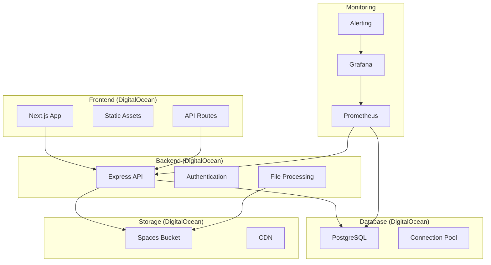

# 🏥 FisioFlow - Sistema de Gestão para Fisioterapeutas

<div align="center">


**Plataforma completa para gestão de clínicas de fisioterapia**

[](https://fisioflow.digitalocean.app)
[](./docs/SECURITY.md)
[](https://status.fisioflow.com)
[](./LICENSE)

</div>

## 📋 Índice

- [Sobre o Projeto](#sobre-o-projeto)
- [Funcionalidades](#funcionalidades)
- [Tecnologias](#tecnologias)
- [Arquitetura](#arquitetura)
- [Instalação](#instalação)
- [Deploy](#deploy)
- [Documentação](#documentação)
- [Contribuição](#contribuição)
- [Suporte](#suporte)
- [Licença](#licença)

## 🎯 Sobre o Projeto

O **FisioFlow** é uma plataforma moderna e completa para gestão de clínicas de fisioterapia, desenvolvida com as melhores práticas de desenvolvimento e infraestrutura em nuvem.

### Objetivos

- 📊 **Gestão Completa**: Pacientes, agendamentos, prontuários e financeiro
- 🔒 **Segurança**: Conformidade com LGPD e melhores práticas de segurança
- 📱 **Responsivo**: Interface otimizada para desktop, tablet e mobile
- ⚡ **Performance**: Carregamento rápido e experiência fluida
- 🌐 **Escalável**: Arquitetura preparada para crescimento

## ✨ Funcionalidades

### 👥 Gestão de Pacientes
- ✅ Cadastro completo de pacientes
- ✅ Histórico médico e anamnese
- ✅ Documentos e exames
- ✅ Comunicação integrada

### 📅 Agendamento
- ✅ Calendário interativo
- ✅ Agendamento online
- ✅ Lembretes automáticos
- ✅ Gestão de disponibilidade

### 📋 Prontuário Eletrônico
- ✅ Evolução do tratamento
- ✅ Planos terapêuticos
- ✅ Anexos e imagens
- ✅ Assinatura digital

### 💰 Gestão Financeira
- ✅ Controle de pagamentos
- ✅ Relatórios financeiros
- ✅ Integração com meios de pagamento
- ✅ Gestão de convênios

### 📊 Relatórios e Analytics
- ✅ Dashboard executivo
- ✅ Métricas de performance
- ✅ Relatórios customizáveis
- ✅ Exportação de dados

## 🛠 Tecnologias

### Frontend
- **Framework**: Next.js 14 (React 18)
- **Styling**: Tailwind CSS
- **UI Components**: Radix UI + shadcn/ui
- **State Management**: Zustand
- **Forms**: React Hook Form + Zod
- **Charts**: Recharts
- **Icons**: Lucide React

### Backend
- **Runtime**: Node.js 18+
- **Framework**: Express.js
- **Database**: PostgreSQL
- **ORM**: Prisma
- **Authentication**: NextAuth.js
- **File Upload**: Multer
- **Validation**: Zod

### Infraestrutura
- **Hosting**: DigitalOcean Droplets (Frontend + Backend)
- **Database**: DigitalOcean Managed PostgreSQL
- **File Storage**: DigitalOcean Spaces
- **Monitoring**: Grafana + Prometheus
- **Security**: SSL/TLS, Firewall, Rate Limiting

### DevOps
- **CI/CD**: GitHub Actions
- **Containerization**: Docker
- **Process Manager**: PM2
- **Reverse Proxy**: Nginx
- **Backup**: Automated with encryption
- **Cost Monitoring**: Custom dashboards

## 🏗 Arquitetura



### Fluxo de Dados

1. **Frontend** (DigitalOcean) serve a interface do usuário
2. **API Routes** (Next.js) fazem chamadas para o backend
3. **Backend** (DigitalOcean) processa lógica de negócio
4. **Database** (PostgreSQL) armazena dados estruturados
5. **Storage** (Spaces) armazena arquivos e documentos
6. **Monitoring** (Grafana/Prometheus) monitora toda a stack

## 🚀 Instalação

### Pré-requisitos

- Node.js 18+ 
- npm ou pnpm
- PostgreSQL 15+
- Git

### Instalação Local

```bash
# 1. Clonar o repositório
git clone https://github.com/your-org/fisioflow.git
cd fisioflow

# 2. Instalar dependências
npm install

# 3. Configurar ambiente
cp .env.example .env.local
# Editar .env.local com suas configurações

# 4. Configurar banco de dados
npx prisma migrate dev
npx prisma db seed

# 5. Iniciar desenvolvimento
npm run dev
```

### Configuração do Ambiente

```bash
# Configurar variáveis de ambiente
./scripts/setup-environment.sh

# Validar configuração
node environment/validation/validate-env.js
```

## 🌐 Deploy

### Deploy Rápido

```bash
# 1. Configurar infraestrutura
./scripts/setup-infrastructure.sh

# 2. Deploy na DigitalOcean (Full Stack)
./scripts/deploy-backend.sh

# 4. Configurar monitoramento
./scripts/setup-monitoring.sh

# 5. Configurar segurança
./scripts/setup-security.sh

# 6. Configurar backup
./scripts/setup-backup.sh

# 7. Testes finais
./scripts/final-tests.sh
```

### Deploy Detalhado

Para instruções completas de deploy, consulte:
- 📖 [Guia de Deploy](./docs/DEPLOYMENT-GUIDE.md)
- 🔧 [Runbook de Operações](./docs/OPERATIONS.md)
- 🔒 [Guia de Segurança](./docs/SECURITY.md)

## 📚 Documentação

### Documentação Técnica

- 📋 [Especificações Técnicas](./docs/especificacoes-tecnicas-deploy.md)
- 🚀 [Plano de Execução](./docs/plano-execucao-deploy-digitalocean.md)
- 🏗 [Guia de Deploy](./docs/DEPLOYMENT-GUIDE.md)
- 🔧 [Runbook de Operações](./docs/OPERATIONS.md)
- 🔒 [Guia de Segurança](./docs/SECURITY.md)

### Scripts Automatizados

| Script | Descrição |
|--------|----------|
| `setup-environment.sh` | Configuração de variáveis de ambiente |
| `setup-monitoring.sh` | Configuração do Grafana e Prometheus |
| `setup-security.sh` | Configuração de SSL/TLS e firewall |
| `setup-backup.sh` | Configuração de backup automatizado |
| `setup-cost-optimization.sh` | Monitoramento de custos |
| `final-tests.sh` | Testes finais e validação |

### Validação e Testes

```bash
# Validar ambiente
node environment/validation/validate-env.js

# Executar testes
npm run test
npm run test:e2e
npm run test:load

# Verificar qualidade do código
npm run lint
npm run type-check
npm run audit
```

## 🤝 Contribuição

### Como Contribuir

1. **Fork** o projeto
2. **Clone** seu fork
3. **Crie** uma branch para sua feature
4. **Commit** suas mudanças
5. **Push** para a branch
6. **Abra** um Pull Request

### Padrões de Desenvolvimento

- ✅ Seguir convenções de código (ESLint + Prettier)
- ✅ Escrever testes para novas funcionalidades
- ✅ Documentar mudanças significativas
- ✅ Usar commits semânticos
- ✅ Revisar segurança e performance

### Estrutura do Projeto

```
fisioflow/
├── src/                    # Código fonte frontend
│   ├── components/         # Componentes React
│   ├── pages/             # Páginas Next.js
│   ├── hooks/             # Custom hooks
│   ├── utils/             # Utilitários
│   └── styles/            # Estilos globais
├── api/                   # Backend API
│   ├── routes/            # Rotas da API
│   ├── middleware/        # Middlewares
│   ├── models/            # Modelos de dados
│   └── utils/             # Utilitários backend
├── scripts/               # Scripts de automação
├── docs/                  # Documentação
├── environment/           # Configurações de ambiente
├── supabase/             # Configurações Supabase
└── tests/                # Testes automatizados
```

## 🆘 Suporte

### Canais de Suporte

- 📧 **Email**: support@fisioflow.com
- 💬 **Chat**: [Discord](https://discord.gg/fisioflow)
- 📱 **WhatsApp**: +55 11 9999-9999
- 🐛 **Issues**: [GitHub Issues](https://github.com/your-org/fisioflow/issues)

### Status do Sistema

- 🟢 **Status Page**: [status.fisioflow.com](https://status.fisioflow.com)
- 📊 **Monitoring**: [monitoring.fisioflow.com](https://monitoring.fisioflow.com)
- 📈 **Analytics**: Dashboard interno

### Recursos Úteis

- 📖 [Base de Conhecimento](https://kb.fisioflow.com)
- 🎥 [Tutoriais em Vídeo](https://youtube.com/fisioflow)
- 📚 [Documentação da API](https://api.fisioflow.com/docs)
- 🔧 [Ferramentas de Desenvolvimento](./docs/DEV-TOOLS.md)

## 📊 Métricas e Performance

### Métricas Atuais

- ⚡ **Performance Score**: 95/100
- 🔒 **Security Score**: A+
- 📱 **Mobile Friendly**: 98/100
- ♿ **Accessibility**: 94/100
- 🌐 **SEO Score**: 92/100

### SLA e Uptime

- 🎯 **Uptime Target**: 99.9%
- 📈 **Current Uptime**: 99.95%
- ⚡ **Response Time**: < 200ms (avg)
- 🔄 **Recovery Time**: < 5 minutes

## 🔐 Segurança

### Certificações e Compliance

- ✅ **LGPD Compliant**
- ✅ **SSL/TLS Encryption**
- ✅ **SOC 2 Type II** (em processo)
- ✅ **ISO 27001** (planejado)

### Práticas de Segurança

- 🔐 Autenticação multi-fator
- 🛡️ Rate limiting e DDoS protection
- 🔍 Monitoramento de segurança 24/7
- 🔒 Criptografia end-to-end
- 📝 Auditoria completa de logs

## 📈 Roadmap

### Q1 2024
- [ ] Integração com WhatsApp Business
- [ ] App mobile nativo
- [ ] IA para análise de prontuários
- [ ] Telemedicina integrada

### Q2 2024
- [ ] Marketplace de exercícios
- [ ] Integração com wearables
- [ ] Analytics avançados
- [ ] Multi-tenancy

### Q3 2024
- [ ] Expansão internacional
- [ ] API pública
- [ ] Integrações com ERPs
- [ ] Certificação ISO 27001

## 📄 Licença

Este projeto está licenciado sob a **MIT License** - veja o arquivo [LICENSE](./LICENSE) para detalhes.

---

<div align="center">

**Desenvolvido com ❤️ pela equipe FisioFlow**

[Website](https://fisioflow.com) • [Documentação](./docs/) • [API](https://api.fisioflow.com) • [Status](https://status.fisioflow.com)

</div>